# CFTE Payments Online Masterclass

Enroll for free: 

- https://my.cfte.education/courses/Payments-Masterclass#:~:text=With%20this%20free%20payments%20masterclass,QR%20codes%2C%20crypto%20to%20CBDCs.
- https://my.cfte.education/courses/take/Payments-Masterclass/lessons/29721136-introduction-by-the-cfte-team

### Payment Online Masterclass — Key Summary

The masterclass is moderated by **Kanishka Joshi**, Analyst at **CFTE — Centre for Finance, Technology and Entrepreneurship**, a **global education platform** focused on fintech and digital finance.

CFTE delivers training and courses on key industry trends such as **AI, Open Banking, Entrepreneurship and Fintech**. Its programmes are developed with more than **200 experts** from banks, insurance companies, fintech startups, investors and regulators, following a **“for the industry, by the industry”** approach.

Principal speaker: **Ritesh Jain**, co-founder of **Infynit**, a company focused on humanising the credit card experience and making it more user-centric.

Key message: **payments are one of the fastest-growing sectors in finance**. 
Scope of payments: has expanded **beyond traditional card transactions** and **bank transfers** to include **digital payments, QR code payments, cryptocurrencies and CBDCs (Central Bank Digital Currencie)**.

The core idea to remember is:

> **Payments are the Trojan horse of finance.**

This means that payments are often the first entry point through which fintech companies become part of users’ financial lives. Once they control the payment experience, they can expand into other financial services such as credit, lending, wallets, savings, insurance, loyalty programmes, data-driven services and digital banking.

Trojan hourse vuol dire **essere una porta d’ingresso nascosta o indiretta**.

Nel contesto fintech:
> **Payments are the Trojan horse of finance**
> I pagamenti sono il “cavallo di Troia” della finanza.

Significa che una fintech può entrare nella vita del cliente **partendo da un servizio semplice e quotidiano**, cioè il pagamento.
Poi, una volta che il cliente usa quell’app o quel wallet per pagare, l’azienda può offrirgli altri servizi finanziari:

**pagamenti → wallet → carta → credito → assicurazioni → investimenti → banking**

Esempio pratico:
Un’app nasce per farti pagare velocemente con QR code.

Poi ti propone:
* una carta digitale;
* cashback;
* prestiti;
* conto deposito;
* assicurazione.

Quindi il pagamento è il primo aggancio.
Non sembra “banca”, ma apre la strada a diventare una piattaforma finanziaria completa.

Un esempio molto chiaro è **PayPal**.

All’inizio nasce come servizio per **pagare online in modo semplice e sicuro**.

Poi si è allargato a:

**pagamenti online → wallet → carta → pagamento nei negozi → pagamento a rate → crypto → servizi per merchant**

Quindi il pagamento è stato il punto di ingresso.
L’utente entra per “pagare”, ma poi resta dentro un ecosistema finanziario più ampio.

Frase per i tuoi appunti:

> **PayPal is an example of payments as a Trojan horse: it started with online payments and expanded into wallets, cards, merchant services, buy now pay later and other financial services.**

**PayPal** è più forte su:
* pagamenti online/e-commerce;
* pagamenti internazionali;
* wallet collegato a carte e conti;
* servizi per merchant digitali;
* pagamento a rate.

**Satispay** è più forte su:
* pagamenti nei negozi fisici;
* piccoli esercenti;
* pagamenti via app;
* trasferimenti tra persone;
* cashback e servizi locali.

Quindi:
> **Sono concorrenti quando entrambi permettono al cliente di pagare un merchant tramite app/wallet.**

Ma hanno posizionamenti diversi:
> **PayPal è più globale e orientata all’online. Satispay è più locale, mobile-first e molto centrata sul pagamento quotidiano nei negozi.**

Frase in inglese per gli appunti:
> **PayPal and Satispay partially compete in digital payments, but they have different positioning: PayPal is more global and e-commerce oriented, while Satispay is more local, mobile-first and focused on everyday payments at physical merchants.**

**CFTE Survey**

## What made you choose CFTE?

I chose **CFTE** for three practical reasons tied to **your goal**, not because it is “better in absolute terms.”

First, it looked like the **fastest low-friction entry point**. Their Payments Masterclass is explicitly positioned as **free**, short, and manageable: about **15 minutes a day**, **2 hours total**, with a **certificate of achievement** and **hands-on projects**. For someone like you, who needs to build credible literacy quickly before going deeper, that is a very efficient starting point. ([Centro Finanza, Tecnologia e Imprenditorialità][1])

Second, CFTE is clearly organized around **digital finance and payments as transformation topics**, not only academic finance. On its site, payments sits alongside areas like fintech, open banking, platforms, regtech, and AI in finance. That made it a good fit for your situation, because your challenge is not just “how payments work,” but “how to guide a regulated platform evolution involving new payment capabilities.” ([Centro Finanza, Tecnologia e Imprenditorialità][1])

Third, CFTE gives you a **graduated path**: you can start with a free masterclass, then move to broader free masterclasses, and only later decide whether a deeper paid specialization is worth it. That ladder is useful because you are still exploring the topic and do not yet need to commit immediately to an expensive certification. ([Centro Finanza, Tecnologia e Imprenditorialità][1])

Why I did **not** pick Coursera first as the single starting point: the Coursera options are useful, but they read to me as either more **academic/sectoral** or broader fintech education. CFTE felt more like a **business-ready on-ramp** into modern payments language and ecosystem thinking, while Coursera is excellent as the next layer for structured depth. ([Coursera][2])

So the real answer is:
**I chose CFTE because it is the easiest way for you to get fast, credible, low-cost payments fluency before moving into deeper technical and regulatory study.**

My honest view:
* **CFTE** = best **starting point**
* **Coursera** = best **second step**
* **EMVCo resources** = best **specialization layer** for your machine/device/payment acceptance context

I can also rank **CFTE vs Coursera vs EMVCo** specifically for your VLT/AWP scenario.

[1]: https://courses.cfte.education/payments-online-masterclass-free-digital-payments-course/ "Payments Online Masterclass | Free digital payments course - CFTE"
[2]: https://www.coursera.org/learn/paytech "The Future of Payment Technologies | Coursera"

## What made you choose CFTE?

Their Payments Masterclass is explicitly positioned as **free**, short, and manageable: about **15 minutes a day**, **2 hours total**, with a **certificate of achievement** and **hands-on projects**. For someone like you, who needs to build credible literacy quickly before going deeper, that is a very efficient starting point. ([Centro Finanza, Tecnologia e Imprenditorialità][1])

Second, CFTE is clearly organized around **digital finance and payments as transformation topics**, not only academic finance. On its site, payments sits alongside areas like fintech, open banking, platforms, regtech, and AI in finance. That made it a good fit for your situation, because your challenge is not just “how payments work,” but “how to guide a regulated platform evolution involving new payment capabilities.” ([Centro Finanza, Tecnologia e Imprenditorialità][1])

Third, CFTE gives you a **graduated path**: you can start with a free masterclass, then move to broader free masterclasses, and only later decide whether a deeper paid specialization is worth it. That ladder is useful because you are still exploring the topic and do not yet need to commit immediately to an expensive certification. ([Centro Finanza, Tecnologia e Imprenditorialità][1])

## Where did you hear about CFTE courses?*
ChtGPT 

# CFTE MASTERCLASS

Speaker: Ritesh Jain (Co-founder Infynit)
- Former COO - HSBC
- Advisor G20, GPFI, MIT, HBR
- Former Portfolio Manager - VISA

---

Payments are the **underdog of finance**

Frase semplice per i tuoi appunti:
> Payments have often been seen as a back-office utility, but they are now becoming a **strategic entry** > > point into the broader financial ecosystem.

In italiano: da funzione tecnica a leva strategica
> I pagamenti sembravano solo una funzione tecnica per trasferire denaro, ma oggi sono diventati una > leva strategica per entrare nella **relazione finanziaria con clienti e merchant**.

## Course Overview

| Chapter Num. | Title                     |
| -----------: | ------------------------- |
|            1 | Understanding Payments    |
|            2 | Payments - The Hot Topic  |
|            3 | Reasons Behind the Growth |
|            4 | Various Payment Methods   |

## 1.Understanding Payments

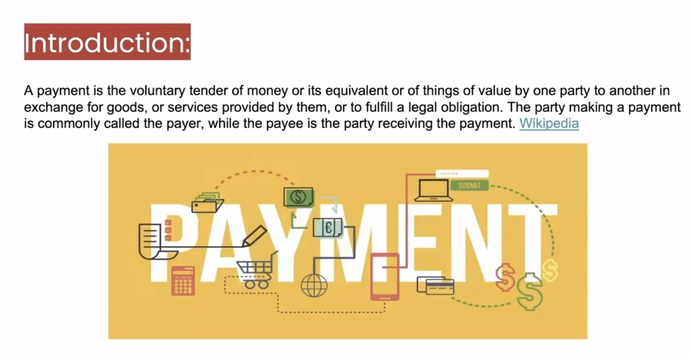

### Short mnemonic summary

- Payment means the voluntary transfer of money to complete a transaction.

- Payments are not new, but the way we pay has changed a lot. In the past, people used cash; today they use cards, phones, apps, QR codes, NFC or systems like UPI.

- Payments are growing quickly because almost every financial interaction involves a payment system in some way.

- Payments are critical, but they are still often underestimated. Many financial services have become more digital on the surface, but payment platforms still need deeper innovation.

- payment is the voluntary transfer / offer of money to complete a transaction by an entity
- we talk about payment regularly, what is changed? It's all about the way we interact with the platform services, systems, our customer behaviour. In the past 5Y ago you were looking for a change in your pocket to make a payment, while now you pull out card/swipe the card, UPI (NFC equivalent in India) is just: wave your phone and payment done; it is growing rapidly    
UPI makes payments extremely simple: you can pay directly from your phone, almost instantly - UPI rende il pagamento molto semplice: usi il telefono e paghi in modo immediato, senza contanti e senza carta fisica.
- payment is growing raply, everything in the financial sector evolves and revolves (ruota intorno a). You interact with the payment system, one way or another. Anything and everything you interact with payment system and that's why it is quite crtitical. We are calling it as an underdog -> reason: that is still lacking. What happened over the priod of time the financial services in the system, in the variety of interfaces, we have been quite focused around putting a digital lipstick around digitising channels. But the payment platform and services are still lacking innovation. Yes, there is a quite a lot of innovation happening, still not to the mark.

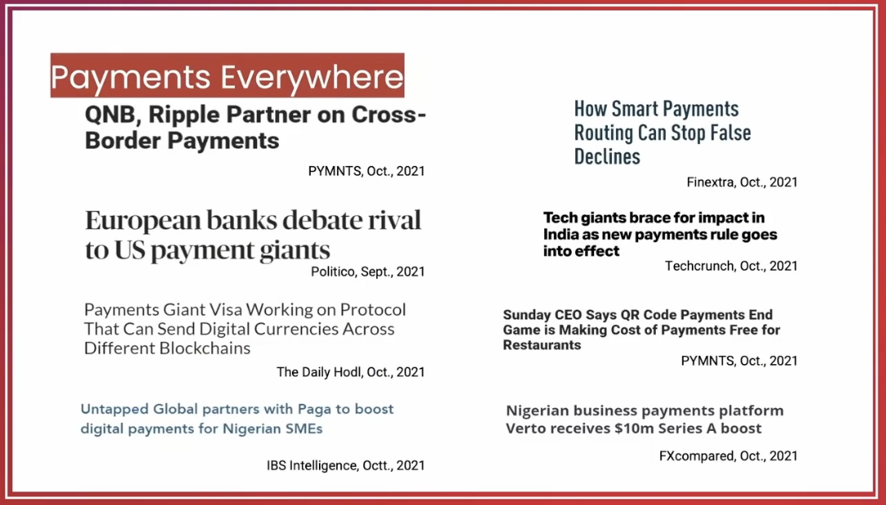

### Short mnemonic summary

- Payments are now everywhere in financial news, banking, fintech and digital innovation.

- The topic is no longer limited to traditional payments. It now includes crypto, digital assets and digital currencies.

- There is so much attention because payment infrastructure must evolve with business needs and customer expectations.

- Customers now expect fast, simple and frictionless payment experiences.

Payments everywhere. You look into any news, any media, Linkedin news, anyywhere. You talk about payment platform, payment services for index, and the innovation in the bancking and the platform. And that's not limited just to traditional payments. Now we are seeing quite a lot news around the kryptos, the digital assets, the digital currencies. So what's really happening,why there's so much buzz now than ever before, because it is a requirement of the time, the payment infrastructure neeeds to evolve. Because that's the requirement of the businesses and that's the customer requirement as well because our behaviour have changed. We are expecting a frictionless customer experience, we are expecting on tap services. But still, there's quite a lot happening in the payment landscape. And we will talk about that.             

## 2.Payments - The Hot Topic 

### Short mnemonic summary

- Payments have evolved over thousands of years.

- The journey started with the **barter system** (baratto - Barter is the exchange of goods or services without using money. Fabric Vs. tools), then moved to **precious metals**, **coins**, **paper money**, **cards**, **e-commerce**, **contactless payments**, **fintech solutions**, **digital assets**, **e-wallets**, and finally **real-time payments**.

- The biggest change in recent years is the speed of innovation: payments are becoming more digital, instant, mobile, and integrated into everyday services.

- Real-time payments are now a major transformation area, with systems like faster payments in the UK and FedNow in the US.

### Ultra-short version

Payments evolved from barter to real-time digital payments.
Each phase made money movement faster, easier, and more scalable.
Today, the focus is on instant, digital, mobile, and frictionless payments.

Yes it is. Look into what happened over the period of time.
- Barter system we have come from 9000 BC and then move on to Precious metal
- Precious metal 1000 BC 
- Coins and paper money 650-600 BC
- Paper money in the European market from 1600
- Then we have seen the advent of credit and debit cards 1946 - 1966. I was just speaking to one of our colleagues in the Nordics market and he very well we remember utilising the debit card at first time. 
- And we have seen the advent of E-commerce 1969, which has definitely transformed the payments landscape as well. And forget about all that the biggest transformation that we have seen from last decade. 
- It's about the contactless and the evolution of fintechs 2007.
- And the type of payments and the payment method have changed with the introduction of the digital assets like BitCoin in 2029
- And the evil wallets 2016
- And the RTP 2017, and the request for payments, and the E IPP and the EB BB, and it's never ending.
So it is growing at a rapid pace. We have come from the border system to the RTP. Today, and the real time payments, like UK has got the real time payments, the open market of the Fed now which is coming up in the US in 2023.
There's a huge transformation in the real time payments landscape as well and start stopping anywhere. 

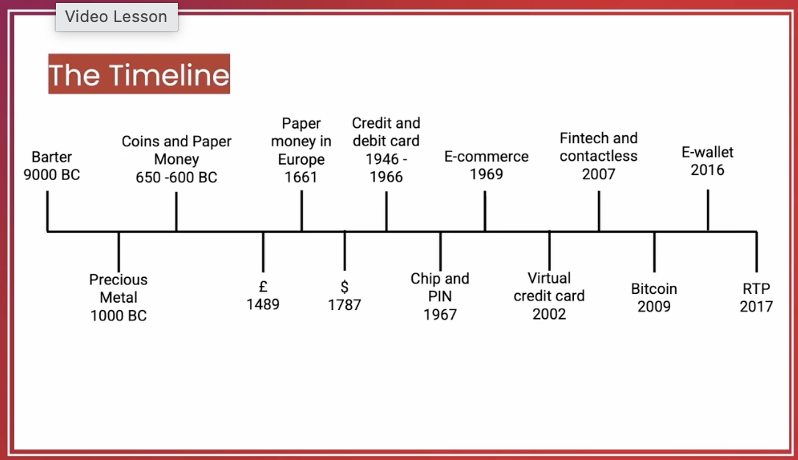

But when you talk about the payments and the underdog Yes, that is one of the main reason we call payments as an underdog. The cross border payments have been neglected, neglected for too long. In a yearly basis, our 100 and 30 million transact across the globe. And most of the payment transcations are related to cross border payments. They still are was one payment infrastructure, not up to the mark. Yes, we can argue about Swift GPI. And we can argue about the various payment infrasctructure, which are evolving. Yes, there is a lot of transformation. Today, if you have to make a payment, you are not relying on to your bank to provide you the FX rate. And you are not just relying on the bank because there are umpteen partners out there who are providing you the competitive services. And that's what the difference that we have seen in the cross border payment whether it's retail, or b2b.
In the cross border payment the another transformation that we are seeing, as of today, it's more about digitalization of the blockchain platforms as well. And that's great, it has caught a great potential. And I'm sure we are going to see that transformation sooner rather that later. But let's look into what is really happening into the cross border payment, and what are the challenges. 
 

### Short mnemonic summary

- Payments are called an **underdog** because some important areas, especially **cross-border payments**, have been neglected for a long time.

- Cross-border payments are still often slow, costly, and supported by infrastructure that is not fully modern.

- However, the market is changing. Customers and businesses no longer depend only on banks for **FX (Foreign Exchange)** rates and international payment services.

- New providers now offer more competitive solutions for both **retail** and **B2B (Business-to-Business)** cross-border payments.

- Another important transformation is the use of **blockchain platforms**, which may improve speed, transparency, and efficiency.

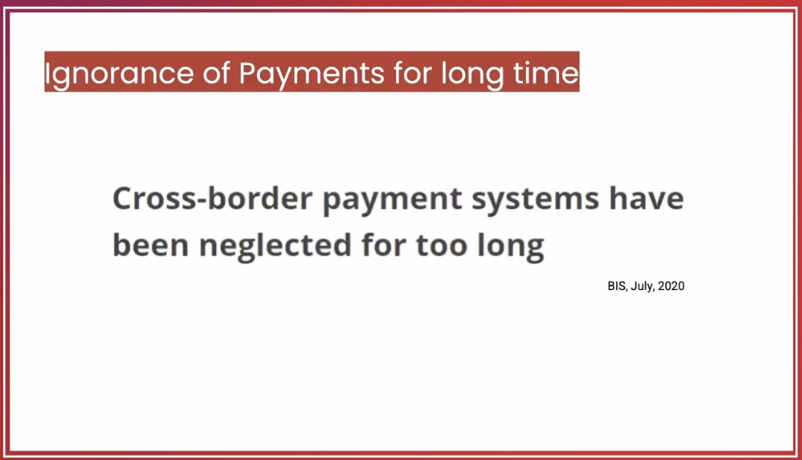

 But let's look into what is really happening into the cross border payment (pagamento internazionale, chi paga e chi riceve sono in paesi diversi), and what are the challenges. 
A cross-border payment is a payment where the payer and the receiver are located in different countries.
**Cross-border payment** significa **pagamento transfrontaliero**.
È un pagamento in cui **chi paga e chi riceve sono in Paesi diversi**.
Esempi semplici:
* mandi soldi dall’Italia a una persona in India;
* un’azienda italiana paga un fornitore negli Stati Uniti;
* compri online da un merchant inglese;
* una società paga stipendi o fatture a collaboratori esteri.
Di solito è più complesso di un pagamento domestico perché può coinvolgere:
* banche di Paesi diversi;
* valute diverse;
* cambio valuta, cioè **FX / Foreign Exchange**;
* commissioni;
* tempi di regolamento;
* controlli AML, cioè **Anti-Money Laundering**.

Frase per appunti:
> **A cross-border payment is a payment where the payer and the receiver are located in different countries.**

The infrastructure is the major hurdle in the transformation. We need an infrastructure that integrates both with regional and global payment methods. Because the requirements of a customer whether it's a b2c or b2b, or both, so you have to cater to both the customers in a more efficient way. It's all about the various payment methods. Because obviously, as a, as a merchant, as a service provider, you do not want to interact with the multiple platforms on the service, you are looking for the consolidation. And basically, with that consolidation, what you are looking at the language in which the platform can speak to each other. And you must have heard about ISO 20022. Yes, that is what going to make a difference as well. Because then the platform and services and the systems are going to speak into the same languages. And that is going to lead an efficient transactions, it will reduce the number of failed transactions in the overall payment structure. Now when we talk about the data management, it's one of the most critical part into the cross border payment. The reason is, when you are managing the various payment methods, you do not want to interact with the various platform services and the data. And that's where the data management plays a significant role in the cost of funds actions, or the overall payment infrastructure. At the same time, transparency and trust. Once you lose a customer, you're not going to get them back. So you got to be a bit more trasparent and trustworthy. And these are the fundamentals for a better infrastructure for payments. And that's where the input and that's where the cross border payment infrastructure is moving towards.      

### Short mnemonic summary

In **cross-border payments**, infrastructure is one of the main hurdles.

Payment systems need to connect with both **regional** and **global** payment methods, because customers can be **B2C (Business-to-Consumer)** or **B2B (Business-to-Business)**.

Merchants and service providers do not want to manage many separate platforms. They need consolidation, integration, and systems that can “speak the same language”.

**ISO 20022 (International Organization for Standardization 20022)** can help because it creates a common financial messaging standard between platforms, services, and systems.

Better standardization can improve efficiency and reduce failed transactions.

Data management is also critical, because cross-border payments involve many payment methods, platforms, services, and data flows.

Finally, transparency and trust are essential. If customers lose trust in a payment service, they may not come back.

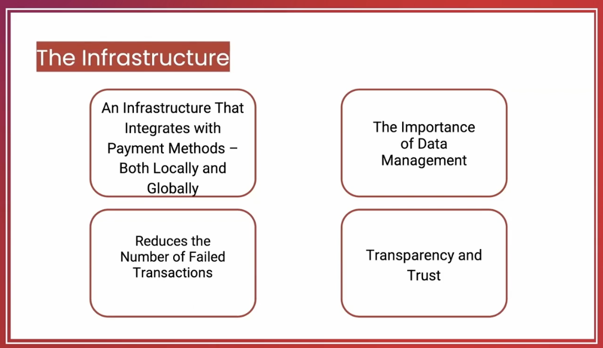

And what we have seen in the now Payment landscape specifically, there is a huge technology evolution. We have gone from the monolithic platform to the modern platform, which is like infrastructure code, it is an art and parcel. If you say all the platforms are, have adopted the cloud tehcnologies, that is not true. But we are looking into the future, where we will be looking at the container as a service, or even payments as a service. So, if you are a service provider, or if you are a financial institution or a bank, you don't need to build services, you can just get the payment as a service from the various service providers. And that's a major value stream. So the whole payment landscape is going though transformation.  

### Short mnemonic summary

The payment landscape is going through a major technology transformation.

Payment platforms are moving from **monolithic architectures** to more modern, modular and cloud-oriented platforms.

Not all payment platforms have already adopted cloud technologies, but the direction is clear: more flexible infrastructure, **IaC (Infrastructure as Code)**, containers, and service-based models.

In the future, banks, financial institutions and service providers may not need to build every payment capability internally.

They will be able to use **PaaS (Payments as a Service)** solutions provided by specialized payment providers.

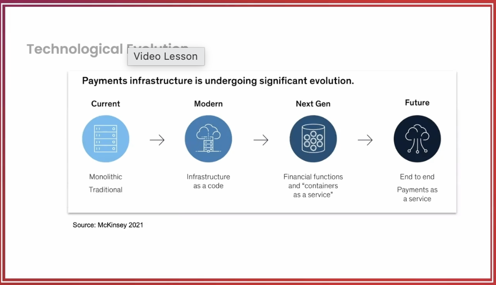

### Short mnemonic summary

The financial sector has changed significantly between **2010** and **2020**.

In 2010, the top financial institutions by **market cap (market capitalization)** were mainly traditional **US (United States)** and Chinese banks.

By 2020, several top players were no longer only traditional banks, but platform-based companies such as **Mastercard, PayPal, and Tencent**.

This shows a clear shift from traditional banking models to platform-based financial ecosystems.

Fintech companies have grown because they identified specific customer problems and solved them better, often serving both sides of the market: consumers and merchants, or users and service providers.

This applies to both payment platforms and open banking platforms.

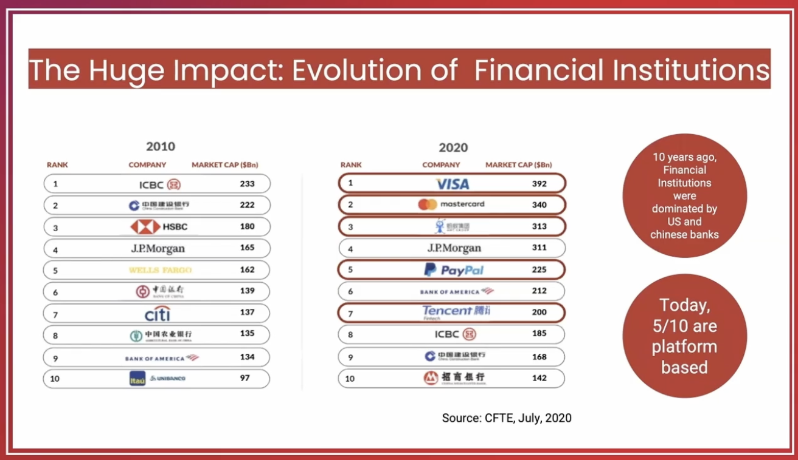

### Short mnemonic summary

Fintechs are changing the payment landscape in a major way.

Many leading fintech companies, such as **Stripe, Square, Coinbase and Grab**, are strongly connected to payments.

Their business models often revolve around making payments easier for businesses and customers.

Today, a business does not always need to build its own payment infrastructure. It can use payment services from specialized providers.

A simple card payment may look easy from the outside, but many actors work behind the scenes.

These actors include **issuers**, **acquirers**, **payment gateways**, **processors**, and other service providers.

### Ultra-short version

Fintechs are transforming payments by offering ready-to-use payment services.
Payments look simple for the customer, but many players operate behind the scenes.
The payment ecosystem includes issuers, acquirers, gateways, processors and other providers.

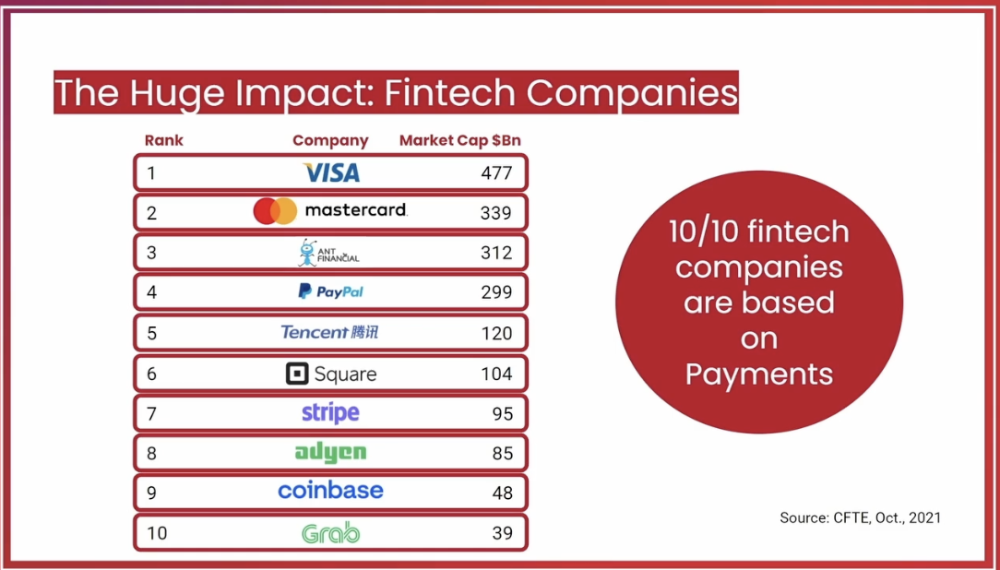

Specifically today, there's one thing which we hear quite a lot. It's about the digital asset and the advent of the digital asset from 2009. And that is bitcoin, Yes, we have seen a significant moment in Bitcoin from early days, until today, which is hovering around $64,000 per Bitcoin. Yes, it's a significantly volatile as well. The price movements are volatile, but it's all due to the regulatory and the compliance as well. The lack of regulatory and compliance is today making this market volatile. 

### Short mnemonic summary

A major topic in payments today is the rise of **digital assets**.

The most famous example is **Bitcoin**, introduced in **2009**.

Bitcoin has grown significantly over time, but its price is highly volatile.

One reason for this volatility is the uncertainty around regulation and compliance.

The digital asset market is still evolving, and clearer rules may help make it more stable.

### Ultra-short version
Digital assets became important after Bitcoin in 2009.
Bitcoin has grown a lot, but it remains highly volatile.
Regulatory and compliance uncertainty is one reason why this market is still unstable.

I'm sure you can argue about the SEC is going ahead the ETF for the Bitcoin. Yes, that is happening. And I'm sure that will have a positive impact on the digital assets in the near tearm. So again, it's a very interesting part, which I really want to talk about. When we talk about payments, generally people consider payments as a card transaction, as the retail or the b2b transactions. Let me give you a view on the Citi and that's Citibank. Citibank has got a business unit called treasury and trade solutions. It's a very well known as City TTS. TTS forms 30% of Citi's business in terms of the global revenue. And that takes away 22% of Citi's global profits. So you would imagine a bank, a global bank, that 22% revenue just comes from the Treasury and trade solution business. And that just evolves and revolves around payments, and that is not even your co banking. On the other hand, when we talk about card networks, like Visa, likes of MasterCard, or the other payment card companies or the card network, general assumption is these card networks, their major revenue comes from the transaction, but let me clarify, only 1/3 of their value is from the card foundations. As I said earlier, there are a multiple value streams in payment, and what card networks and the other payment business have realesed is that the market is disrupting. So this already started focusing on the multiple value streams. And an interesting fact, the best data is held by the payment companies.  

### Short mnemonic summary

Digital assets are becoming more relevant in the payment landscape, especially after the approval discussion around **Bitcoin ETF (Exchange-Traded Fund)** by the **SEC (Securities and Exchange Commission)**.

Payments are often seen only as card, retail, or **B2B (Business-to-Business)** transactions, but the payment business is much broader.

For large banks like Citi, **TTS (Treasury and Trade Solutions)** is a major business area linked to payments, cash management, and trade flows.

This shows that payments are not just a basic banking function: they can represent a significant part of bank revenue and profit.

Card networks such as Visa and Mastercard also do not rely only on card transactions. They are expanding into multiple payment value streams.

Payment companies are powerful because they sit close to transaction flows and hold very valuable data.

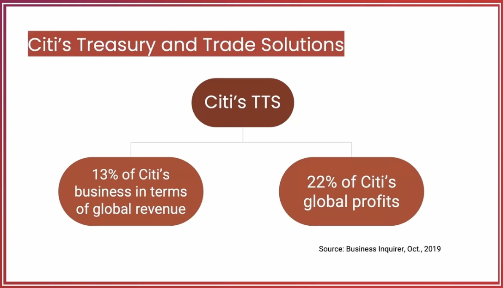

And an interesting fact, the best data is held by the payment companies. So when we look into the payments at banks, the card networks and i'm sure you herad quite a lot about the CBDCs. What does that really mean? Central Bank digital currency, because here at one hand, we talk about the Bitcoin and the multiple other digital currencies which are available in the market. So why central bank is after the digital currency, the reason is because central bank is focused around. We hear quite a lot about the central banks and their digital currencies. Central bank is focused on issuing the digital currency over the period of time, there are a lot many initiatives which are going on at the moment globally. 

One of such project is focused around the cross border payments, that's called project, quite a few central banks came together and they're working on a platform infrastructure for cross border payments. But like that, like the central bank is basically managing the money. Now there are two parts, they issue the bank notes, which is the cash which is in rotation in the b2c landscape, as well as they look after the digital currency as well, for the E money in terms of the deposits, which is into b2b environment. The cbdc is a union of both. Now, there's a big question about the central bank digital currency, that what will be the feature of banks after the central bank digital currency, whether an individual will have direct relationship with the central bank in the money management, or whether it will be distributed to the bank. And it's a very interesting topic. And I've got that covered. One of my goals, and I'll talk you through that.

### Short mnemonic summary

Payment companies hold very valuable data because they are close to transaction flows.

**CBDC (Central Bank Digital Currency)** means digital money issued by a central bank.

CBDCs are different from private digital assets like Bitcoin because they are issued and controlled by central banks.

Central banks are exploring CBDCs to modernize money, improve payment infrastructure, and support areas such as **cross-border payments**.

A CBDC could combine some features of cash used in **B2C (Business-to-Consumer)** payments and digital money used in **B2B (Business-to-Business)** environments.

One key open question is the future role of banks: people may either interact directly with the central bank, or CBDCs may be distributed through commercial banks.

### Ultra-short version

**CBDC (Central Bank Digital Currency)** is digital central bank money.
It is different from Bitcoin because it is official and issued by a central bank.
CBDCs may improve digital and cross-border payments.
The big question is whether banks will remain intermediaries or whether users will connect more directly with central banks.

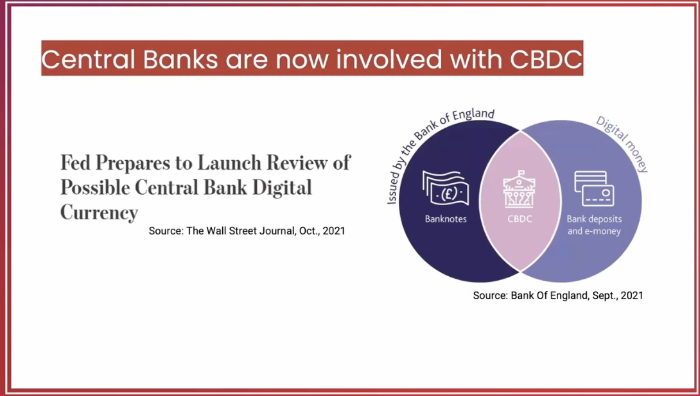

So, why central banks are involved with the dicital currency? Central banks are focues on the digital currencies for multiple reasons, they would like to build a payment landscape of very robust infrastructure. They want to avoid the risk of a private payments and the private money creation, which is in flow as of today to the various cryptocurrencies. They would like to create a competitive environment for the innovation payments and basically, they want to meet the need of the digital economy, in terms of the distribution, in terms of the availability, usability of the digital money, as well as they would like to address the declining and the cash in the market. We need to be really careful when we talk about the digital money and the cashless society of the payments. Just we are moving to worse the cashless society. But it's prudent to say, less cash society rather than cash less society. Because the product and services what we are building up today, it's not for the overall population, which is over 7 billion. These are mainly to cater a couple of billion population. So we got to be really careful about the digital exclusion as well. So the central bank, digital currency is going to play a significant role in the building blocks for the cross border payments as well. It's one of the most interesting topics that I love to talk about.  

### Short mnemonic summary
- Central banks are exploring **CBDCs (Central Bank Digital Currencies)** to build a stronger and more modern payment infrastructure.
- They want to reduce the risks linked to private money, private payment systems, and cryptocurrencies.
- They also want to support innovation, competition, and the needs of the digital economy.
- Another reason is the decline of cash, but the goal is not necessarily a fully cashless society.
- A better expression is **less-cash society**, because many people could still be excluded from fully digital payment systems.
- CBDCs may also become an important building block for **cross-border payments**.

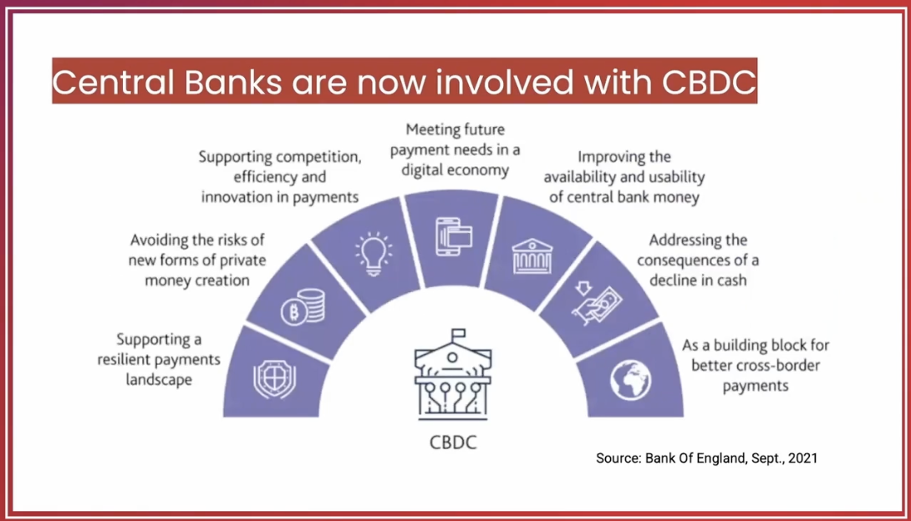

## 3.Reasons Behind the Growth 

## 4.Various Payment Methods

 

