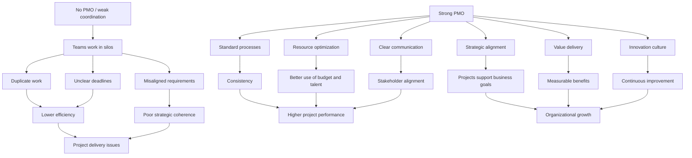

# What Is a PMO?

## 1. Core idea in one sentence

A **PMO (Project Management Office)** is the **central structure that creates order, alignment, control, and value across projects**, so teams do not work in **silos** and **organizational goals** are achieved more effectively. 

---

## 2. Ultra-short memory anchors

Use these as **mental hooks**:

* **PMO = backbone of project execution**
* **PMO = standards + coordination + strategic alignment**
* **Without PMO = silos, duplication, confusion**
* **With PMO = visibility, control, value**
* **A strong PMO does not only manage projects — it connects projects to business success** 

---

## 3. Smart synthesis

A PMO is not just an administrative layer. It is the **organizational engine** that ensures projects are managed using common standards, shared methods, and clear governance. Its purpose is to prevent fragmentation between teams and to create a single framework for execution. 

The content presents the PMO as a **centralized team or department** that maintains project management standards across the organization. In practical terms, this means the PMO makes project work more repeatable, more transparent, and easier to coordinate across functions such as IT, marketing, compliance, or operations. 

The module groups PMO characteristics into **two major dimensions**:

1. **Operational Efficiency and Control**
2. **Strategic Impact and Innovation** 

This is a very important distinction for interviews, because it shows that a PMO has a **dual role**:

* it improves the **way projects run**
* and it improves the **business results projects generate**

---

## 4. The two big pillars

| Pillar                               | Meaning                                                                                 | What to remember                                 |
| ------------------------------------ | --------------------------------------------------------------------------------------- | ------------------------------------------------ |
| **Operational Efficiency & Control** | The PMO makes execution more structured, efficient, and controlled                      | “Doing projects the right way”                   |
| **Strategic Impact & Innovation**    | The PMO ensures projects contribute to larger business goals and continuous improvement | “Doing the right projects for the right reasons” |

---

## 5. Pillar 1 — Operational Efficiency and Control

### Key idea

A high-performing PMO creates **discipline in execution**.

### Main components

| Component                  | Meaning                                                          | Practical effect                           |
| -------------------------- | ---------------------------------------------------------------- | ------------------------------------------ |
| **Standardized processes** | Common methods, procedures, and expectations                     | Teams work with consistency                |
| **Resource optimization**  | Efficient allocation of time, budget, and talent                 | Better use of limited resources            |
| **Clear communication**    | Shared channels for updates, alignment, and stakeholder feedback | Fewer misunderstandings and less isolation |

### Memory sentence

**Operational efficiency means fewer surprises, less waste, and better coordination.**

### Interview phrasing

You can say:

> “A PMO strengthens delivery by introducing standardized ways of working, improving resource allocation, and ensuring communication flows consistently across teams.”

---

## 6. Pillar 2 — Strategic Impact and Innovation

### Key idea

A high-performing PMO makes sure projects are not just completed, but are **meaningful for the organization**.

### Main components

| Component                | Meaning                                           | Practical effect                                                |
| ------------------------ | ------------------------------------------------- | --------------------------------------------------------------- |
| **Strategic alignment**  | Every project supports wider organizational goals | Projects are not disconnected from strategy                     |
| **Value delivery**       | Projects must generate measurable benefits        | Success is defined by outcomes, not just completion             |
| **Fostering innovation** | Encouraging improvement, creativity, and learning | The organization evolves instead of repeating the same patterns |

### Memory sentence

**Strategic impact means projects must create business value, not just activity.**

### Interview phrasing

You can say:

> “A mature PMO provides strategic visibility by connecting project outcomes to business priorities, measurable value, and continuous improvement.”

---

## 7. Cause-effect map



---

## 8. PMO logic in a simple schema

```text
PMO
= Standards
+ Coordination
+ Governance
+ Resource visibility
+ Strategic alignment
+ Value focus
+ Continuous improvement
```

---

## 9. What a successful PMO really does

| PMO function                | Why it matters                      |
| --------------------------- | ----------------------------------- |
| Creates common standards    | Reduces confusion and inconsistency |
| Coordinates teams           | Prevents siloed execution           |
| Tracks performance          | Makes progress visible              |
| Supports governance         | Improves control and accountability |
| Manages risks and resources | Protects delivery capability        |
| Aligns projects to strategy | Ensures business relevance          |
| Promotes innovation         | Keeps the organization adaptable    |

---

## 10. PMO in interview language

### Strong concise definition

> “A PMO is the organizational hub that standardizes project management practices, improves coordination across teams, and ensures projects deliver measurable value in line with strategic goals.”

### More senior version

> “A high-performing PMO operates as both a control mechanism and a strategic enabler: it creates execution discipline through standards and governance, while also ensuring that project portfolios remain aligned to business priorities and capable of delivering long-term value.”

### NLP-style persuasive phrasing

These expressions are useful in interviews:

* **create clarity across functions**
* **provide a common execution framework**
* **ensure line of sight between projects and strategy**
* **reduce fragmentation and improve decision quality**
* **translate delivery effort into business value**
* **build stakeholder confidence through governance and transparency**
* **enable consistency without blocking innovation**

---

## 11. How to map this to your own experience

Use this section to connect theory to your real work.

| PMO concept                | How you can map your experience                                                                           |
| -------------------------- | --------------------------------------------------------------------------------------------------------- |
| **Standardized processes** | Defining governance steps, release gates, compliance checkpoints, test/certification flows                |
| **Resource optimization**  | Prioritizing teams, aligning dependencies, managing timelines, balancing constrained resources            |
| **Clear communication**    | Coordinating across IT, Factory, Compliance, DWH, Network, external stakeholders                          |
| **Strategic alignment**    | Connecting operational initiatives to broader business targets, rollout plans, migration priorities       |
| **Value delivery**         | Focusing on business continuity, regulatory readiness, platform evolution, measurable outcomes            |
| **Innovation**             | Improving working methods, enabling better planning, refining governance, driving more scalable processes |

### Your interview bridge

You could say:

> “In my experience, PMO principles become especially important in cross-functional and regulated environments, where success depends not only on execution discipline, but also on alignment between technical teams, business priorities, compliance constraints, and stakeholder communication.”

---

## 12. What to remember before a colloquium

Memorize this sequence:

```text
PMO exists because complexity creates silos.
A strong PMO fixes silos with standards, coordination, and visibility.
Then it goes further:
it aligns projects to strategy,
drives measurable value,
and supports innovation.
```

---

## 13. 30-second recap

A PMO is the **central coordinating and governing body for projects**. It improves **how work is executed** through standards, communication, and resource discipline, and it improves **why work is executed** by aligning projects with strategy, value, and innovation. A strong PMO therefore supports both **consistency** and **growth**. 

---

## 14. Flashcards — Senior Level

### Flashcard 1

**Q:** What is the real difference between project coordination and PMO governance?
**A:** Coordination helps teams work together; PMO governance creates the standards, control mechanisms, and decision framework that make coordination scalable and repeatable.

### Flashcard 2

**Q:** Why is a PMO more than an administrative function?
**A:** Because it does not just track activities; it connects delivery execution to strategic goals, value realization, and organizational performance.

### Flashcard 3

**Q:** What are the two core dimensions of a high-performing PMO?
**A:** Operational efficiency and control; strategic impact and innovation.

### Flashcard 4

**Q:** What problem does standardization solve in a PMO context?
**A:** It reduces inconsistency, ambiguity, and duplication by giving teams a common framework for execution.

### Flashcard 5

**Q:** Why is resource optimization a PMO responsibility?
**A:** Because projects compete for limited time, budget, and talent, and the PMO helps allocate them where they create the most value.

### Flashcard 6

**Q:** Why is communication considered a PMO capability and not just a team responsibility?
**A:** Because the PMO creates structured communication channels that keep stakeholders aligned, informed, and engaged across projects.

### Flashcard 7

**Q:** What does strategic alignment mean in PMO terms?
**A:** It means each project must clearly support broader organizational goals rather than existing as an isolated initiative.

### Flashcard 8

**Q:** How should project success be evaluated according to the PMO perspective?
**A:** Not only by completion, but by measurable value delivered, such as savings, revenue, performance improvement, or strategic impact.

### Flashcard 9

**Q:** Why must a PMO foster innovation instead of focusing only on control?
**A:** Because long-term performance requires continuous improvement, adaptability, and better ways of working, not just compliance with existing processes.

### Flashcard 10

**Q:** What is a strong interview statement to describe PMO maturity?
**A:** A mature PMO creates disciplined execution, strategic visibility, and measurable business value while enabling cross-functional alignment and continuous improvement.

---

When you send the next file, I’ll keep exactly this structure so all your notes stay consistent in GitHub Markdown.
