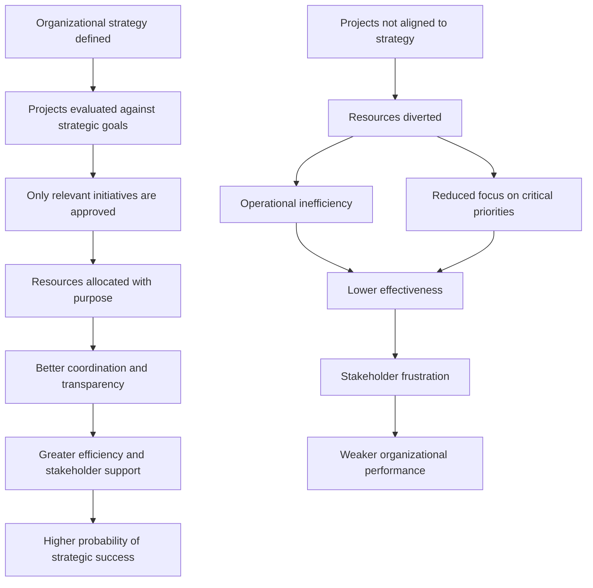

# Aligning projects with organizational strategy

## 1. Core idea in one sentence

**Projects create real value only when they are deliberately aligned with organizational strategy.**

---

## 2. Ultra-short memory anchors

Use these as fast mental hooks:

* **Strategy first, projects second**
* **Alignment turns effort into value**
* **Not every project is a good project**
* **A project without strategic fit consumes resources but weakens impact**
* **The PMO succeeds when it protects focus on strategically relevant work**

---

## 3. Smart synthesis

This paragraph explains a foundational idea: **project success is not only about delivery, but about relevance**. A project can be well executed, on time, and even appreciated by the team, but if it does not support the organization’s long-term direction, it may still represent wasted effort. The true role of project discipline is therefore not just to deliver work, but to deliver the **right work**.

The text introduces **organizational strategy** as the company’s comprehensive long-term plan. This strategy defines where the organization wants to go and how it intends to get there. It aligns **resources, processes, and actions** so that day-to-day efforts support the broader mission and future state. In other words, strategy is the **blueprint** that gives meaning and direction to projects. 

The TechInnovate example shows this clearly. In the past, projects were driven more by enthusiasm, opportunity, or isolated initiative. That created weak focus and poor alignment. Sarah changes this by introducing a more disciplined approval and evaluation approach. Because projects are screened against strategic goals before approval, the organization gains clearer leadership support, stronger resource commitment, more transparency, and better execution. This is a crucial lesson: **alignment improves both decision quality and delivery conditions**. 

The paragraph also explains why strategic alignment matters so much. When projects support strategy, resources are allocated more intelligently, waste is reduced, duplication is limited, and effort goes toward initiatives with real organizational value. This strengthens efficiency, improves coordination, and increases the chances of reaching strategic goals. In the TechInnovate case, alignment supports digital transformation, innovation, operational efficiency, customer satisfaction, adaptability, and long-term competitiveness. 

On the other side, the text warns about a common pitfall: pursuing projects that are not aligned with strategic goals. These projects may consume scarce resources, distract teams from more important work, create incoherence, and frustrate both teams and stakeholders because they fail to generate meaningful strategic value. This is why a mature PMO or governance function must not simply accelerate project execution; it must also act as a **filter**, ensuring that effort is invested where it matters most. 

---

## 4. The central logic

| Concept                        | Meaning                                                            | What to remember                                            |
| ------------------------------ | ------------------------------------------------------------------ | ----------------------------------------------------------- |
| **Organizational strategy**    | The long-term plan that defines direction, goals, and priorities   | **Strategy gives meaning to projects**                      |
| **Project alignment**          | Ensuring each project supports strategic objectives                | **Good projects are not just feasible — they are relevant** |
| **Evaluation before approval** | Screening projects before launch to confirm strategic fit          | **Selection quality shapes execution quality**              |
| **Misalignment risk**          | Projects consume resources without moving the organization forward | **Activity is not the same as value**                       |

---

## 5. Why alignment matters

### Key idea

**Alignment is the mechanism that transforms projects from isolated efforts into drivers of business success.**

### Main benefits

| Benefit                            | Meaning                                                   | Practical effect                         |
| ---------------------------------- | --------------------------------------------------------- | ---------------------------------------- |
| **Better resource utilization**    | Resources go to strategically valuable work               | Less waste, better prioritization        |
| **Higher efficiency**              | Processes are streamlined around relevant initiatives     | Fewer redundancies, clearer focus        |
| **Improved goal achievement**      | Projects actively contribute to organizational objectives | Greater probability of strategic success |
| **Stronger coordination**          | Projects fit into a broader organizational direction      | Better integration across teams          |
| **More effective risk management** | Work is aligned with strategic risk tolerance             | Better decisions, better control         |
| **Stakeholder satisfaction**       | People see a clear connection between effort and purpose  | Higher confidence and stronger support   |

### Memory sentence

**Alignment improves not only what the organization does, but also how confidently and efficiently it does it.**

---

## 6. Risks of non-aligned projects

### Key idea

**A project that does not support strategy is not neutral — it can actively damage organizational performance.**

| Risk                         | What it causes                                  | Why it matters                         |
| ---------------------------- | ----------------------------------------------- | -------------------------------------- |
| **Wasted time and budget**   | Resources are diverted from critical priorities | Opportunity cost increases             |
| **Operational inefficiency** | Teams work on low-value initiatives             | Focus weakens                          |
| **Strategic incoherence**    | Outcomes do not support long-term goals         | The portfolio loses direction          |
| **Lower morale**             | Teams feel effort is disconnected from value    | Motivation and trust decline           |
| **Stakeholder frustration**  | Sponsors see weak business impact               | Confidence in project governance drops |

### Memory sentence

**Misaligned projects create motion without progress.**

---

## 7. TechInnovate lesson in practical terms

| Before alignment                            | After alignment                                           |
| ------------------------------------------- | --------------------------------------------------------- |
| Projects driven by passion or opportunity   | Projects screened against strategic goals                 |
| Weak organizational focus                   | Clear prioritization                                      |
| Limited support and inconsistent engagement | Better leadership support and stronger team involvement   |
| Risk of scattered effort                    | Resource discipline and transparency                      |
| Lower strategic coherence                   | Stronger competitive position and clearer business impact |

### What to remember

**The difference is not only better execution. The difference is better selection.**

---

## 8. Cause-effect map



---

## 9. Simple schema to memorize

```text
Strategy
= long-term direction

Aligned projects
= strategy in action

No alignment
= effort without real impact
```

---

## 10. PMO interpretation

This paragraph is also very important for understanding what a PMO should really do.

| PMO responsibility            | Strategic meaning                                                   |
| ----------------------------- | ------------------------------------------------------------------- |
| **Project selection support** | Helps approve projects that fit the strategy                        |
| **Prioritization**            | Protects attention and resources for the most relevant initiatives  |
| **Transparency**              | Makes it easier for leadership to understand why projects matter    |
| **Governance discipline**     | Prevents low-value work from entering the portfolio                 |
| **Strategic focus**           | Ensures project delivery contributes to mission and long-term goals |

### Memory sentence

**A mature PMO is not just a delivery engine; it is a strategic filter.**

---

## 11. Interview language

### Strong concise definition

> “Strategic alignment means ensuring that projects are not only well managed, but also directly connected to the organization’s long-term objectives, so that execution effort translates into measurable business value.”

### More senior version

> “One of the most important responsibilities in project governance is making sure that the portfolio remains strategically coherent. A project may be technically sound, but if it does not support the company’s direction, it can still dilute value, consume scarce resources, and weaken execution focus.”

### NLP-style persuasive phrases

Use these in interviews:

* **create line of sight between projects and strategy**
* **translate project effort into strategic value**
* **protect the portfolio from low-value initiatives**
* **ensure resources are invested where they matter most**
* **improve decision quality upstream, before execution begins**
* **move from activity-based delivery to value-based delivery**
* **keep the organization focused on strategically relevant work**

---

## 12. How to map this to your own experience

This part helps you connect the concept to your real background.

| Concept from the paragraph             | How you can map your experience                                                                                                            |
| -------------------------------------- | ------------------------------------------------------------------------------------------------------------------------------------------ |
| **Strategic alignment**                | Linking platform initiatives to broader business priorities such as migration, regulatory readiness, business continuity, or rollout goals |
| **Project evaluation before approval** | Challenging requests, clarifying dependencies, and validating whether activities truly support strategic delivery                          |
| **Resource optimization**              | Prioritizing constrained teams, sequencing activities, protecting critical paths                                                           |
| **Transparency**                       | Creating visibility on risks, milestones, interdependencies, and decision points                                                           |
| **Stakeholder support**                | Gaining buy-in by showing why a project matters, not only what must be done                                                                |
| **Avoiding low-value initiatives**     | Identifying work that may consume effort without contributing to strategic outcomes                                                        |

### Interview bridge

You could say:

> “In my experience, one of the biggest value levers is not only how projects are managed, but how they are selected and prioritized. In complex and regulated environments, aligning initiatives with strategic goals is essential to protect resources, maintain focus, and ensure that delivery effort produces real business impact.”

---

## 13. What to remember before a colloquium

Memorize this flow:

```text
Strategy defines direction.
Projects must support that direction.
Alignment improves focus, efficiency, and stakeholder confidence.
Misalignment wastes resources and weakens impact.
A strong PMO protects strategic coherence.
```

---

## 14. 30-second recap

Organizational strategy is the long-term blueprint that guides the company’s actions and priorities. Projects should be approved and managed in a way that directly supports that strategy. When alignment is strong, resources are used more effectively, coordination improves, risks are managed more intelligently, and stakeholders see clearer value. When alignment is weak, projects consume effort but fail to move the organization forward. The PMO’s role is therefore not just to manage projects, but to ensure that the organization invests in the **right** projects. 

---

## 15. Flashcards — Senior Level

### Flashcard 1

**Q:** What is organizational strategy in project terms?
**A:** It is the long-term blueprint that defines which initiatives deserve resources because they support the organization’s mission, goals, and future direction.

### Flashcard 2

**Q:** Why is project alignment more important than simple project execution?
**A:** Because a well-executed project still creates limited value if it does not contribute to strategic objectives.

### Flashcard 3

**Q:** What is one of the main governance lessons from the TechInnovate example?
**A:** Strong project outcomes begin with disciplined project selection and evaluation before approval, not only with strong delivery after kickoff.

### Flashcard 4

**Q:** How does strategic alignment improve resource utilization?
**A:** It directs time, budget, and talent toward initiatives with the highest strategic relevance, reducing waste and opportunity cost.

### Flashcard 5

**Q:** What does waste mean in this context?
**A:** Misallocated effort, idle time, duplication, or investment in initiatives with low strategic value. 

### Flashcard 6

**Q:** Why do non-aligned projects damage morale?
**A:** Because teams and stakeholders may feel they are investing effort without meaningful business impact.

### Flashcard 7

**Q:** What is the PMO’s role in strategic alignment?
**A:** To act as a governance and prioritization layer that helps ensure projects support strategic goals before significant execution effort begins.

### Flashcard 8

**Q:** What is a strong senior-level phrase to describe project alignment?
**A:** “Creating clear line of sight between portfolio decisions and strategic outcomes.”

### Flashcard 9

**Q:** What is the difference between activity and value?
**A:** Activity means work is being done; value means the work contributes to the organization’s strategic progress.

### Flashcard 10

**Q:** What should a strong candidate say in an interview about misaligned projects?
**A:** That misaligned projects are not simply low priority; they can distort resource allocation, weaken portfolio coherence, and reduce the organization’s ability to achieve strategic goals.

