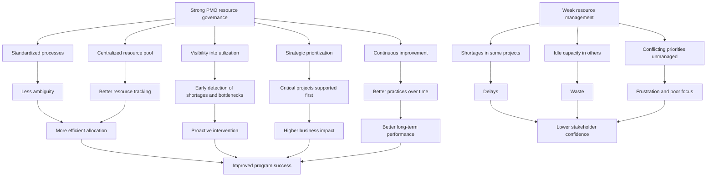

# Resource Management and Allocation in a PMO Context

## 1. Core idea in one sentence

**Effective resource management means placing the right resources in the right place, at the right time, in the right quantity, so strategy can become execution without waste.**

---

## 2. Ultra-short memory anchors

Use these as fast mental hooks:

* **Right resource, right time, right place**
* **PMO = visibility + balance + control**
* **Resources are limited, priorities are not**
* **Allocation is strategic, not administrative**
* **Optimization means less waste, more impact**

---

## 3. Smart synthesis

This paragraph explains that **resource management and allocation are not secondary operational tasks**. They are core levers of program success because even a strong strategy or a well-designed project plan can fail if the needed people, budget, tools, or assets are not available when required. Resource management is therefore about turning planning into feasible execution. 

The text defines resource management and allocation as the **strategic planning, scheduling, and deployment of resources** to ensure optimal utilization. Resources are not only human resources; they also include **financial, technological, and physical assets**. The objective is simple but powerful: maximize efficiency and minimize cost by ensuring availability in the correct timing, quantity, and context. 

The TechInnovate scenario shows why this matters in real life. A Program Manager oversees multiple concurrent projects, all competing for skilled people, budget, and technology. The PMO provides centralized support through a shared resource pool, common processes, and planning tools. Yet even with that support, imbalances still appear: some projects suffer shortages while others keep idle resources. This is the real challenge of resource management: **not just having resources, but distributing them intelligently across competing needs**. 

The paragraph then clarifies the PMO’s strategic role. A mature PMO improves resource management through five main contributions: **standardization and consistency, centralized resource oversight, enhanced visibility and control, strategic allocation, and continuous improvement**. This means the PMO helps create common rules, gives decision-makers a broader picture of utilization, protects critical priorities, and improves practices over time based on data and monitoring. In other words, the PMO is not simply a scheduler; it is a **resource governance engine**. 

The reading also highlights four essential activities: **planning, scheduling, allocation, and optimization**. Planning identifies what is needed. Scheduling decides when it is needed. Allocation assigns resources to actual work. Optimization ensures workloads are balanced and waste is minimized. These are closely connected, and weakness in one of them usually affects the others. If planning is weak, scheduling becomes reactive. If allocation is poor, optimization becomes damage control. 

A strong benefit of effective resource management is that it improves both **hard performance** and **soft outcomes**. On the hard side, it increases productivity, reduces cost, and improves the likelihood of success. On the soft side, it improves stakeholder confidence because projects are more likely to be delivered on time and within budget. It also reduces risk by exposing shortages, overloads, and bottlenecks earlier. 

Finally, the paragraph stresses that good resource management requires best practices: comprehensive planning, skill assessment, capacity planning, contingency thinking, monitoring, tool usage, collaboration, leveling and smoothing, regular review, and data-driven adjustment. It also acknowledges common obstacles: limited resources, conflicting priorities, dynamic project conditions, and human factors such as motivation and well-being. So the real message is this: **resource management is both analytical and human**. It requires data, structure, judgment, and leadership. 

---

## 4. The central logic

| Concept                 | Meaning                                                   | What to remember                                                   |
| ----------------------- | --------------------------------------------------------- | ------------------------------------------------------------------ |
| **Resource management** | Planning, scheduling, deploying, and optimizing resources | **Execution depends on availability**                              |
| **Resource allocation** | Assigning resources where they are most needed            | **Allocation is a prioritization decision**                        |
| **PMO role**            | Provides centralized visibility, rules, and control       | **PMO turns competition for resources into coordinated decisions** |
| **Optimization**        | Using resources efficiently while minimizing waste        | **Efficiency is not doing more, but using better**                 |

---

## 5. The PMO’s strategic value in resource management

### Key idea

**A PMO creates the structure that makes resource decisions consistent, visible, and strategically aligned.**

| PMO contribution                    | Meaning                                                 | Practical effect                    |
| ----------------------------------- | ------------------------------------------------------- | ----------------------------------- |
| **Standardization and consistency** | Common methods and processes for resource management    | Less ambiguity, better coordination |
| **Centralized resource pool**       | Shared oversight of availability, skills, and usage     | Smarter cross-project decisions     |
| **Enhanced visibility and control** | Better view of bottlenecks, shortages, and conflicts    | Earlier intervention                |
| **Strategic resource allocation**   | Resources directed to the most important priorities     | Better business impact              |
| **Continuous improvement**          | Monitoring performance and refining practices over time | Better long-term efficiency         |

### Memory sentence

**The PMO does not create resources; it creates clarity about how to use them.**

---

## 6. The four operational pillars

### Key idea

**Resource management works as a chain: plan, schedule, allocate, optimize.**

| Pillar                    | Meaning                                                       | Why it matters                         |
| ------------------------- | ------------------------------------------------------------- | -------------------------------------- |
| **Resource planning**     | Identify what resources are needed, in what quantity and type | Creates feasibility                    |
| **Resource scheduling**   | Match resources to timelines and task windows                 | Supports timing discipline             |
| **Resource allocation**   | Assign actual resources to work                               | Converts plans into execution          |
| **Resource optimization** | Balance workloads and reduce waste                            | Protects efficiency and sustainability |

### Memory sentence

**Plan what is needed, schedule when it is needed, allocate who or what will do it, optimize so nothing is wasted.**

---

## 7. Benefits of effective resource management

| Benefit                      | Meaning                                         | Business value                     |
| ---------------------------- | ----------------------------------------------- | ---------------------------------- |
| **Increased efficiency**     | Resources are used more productively            | Faster and smoother delivery       |
| **Cost reduction**           | Waste and underutilization are reduced          | Better budget performance          |
| **Higher program success**   | Critical work is properly supported             | Greater chance of delivery success |
| **Stakeholder satisfaction** | Projects progress on time and within budget     | More trust and confidence          |
| **Early risk mitigation**    | Bottlenecks and shortages are identified sooner | Fewer delays and surprises         |

### Memory sentence

**Good resource management protects time, money, and credibility.**

---

## 8. Best practices to remember

### Key idea

**Resource management becomes mature when it is proactive, visible, collaborative, and data-driven.**

| Best practice                       | What it means                                    | What to remember                            |
| ----------------------------------- | ------------------------------------------------ | ------------------------------------------- |
| **Comprehensive planning**          | Understand needs, skills, capacity, and risks    | Start with realism                          |
| **Skill assessment**                | Match competencies to project needs              | Right skill matters as much as headcount    |
| **Capacity planning**               | Estimate how much work resources can absorb      | Protect productivity                        |
| **Risk management**                 | Anticipate shortages and build contingencies     | Avoid reactive firefighting                 |
| **Monitoring and control**          | Track usage and correct deviations               | Resource plans must stay alive              |
| **Use of tools and software**       | Automate scheduling, tracking, and forecasting   | Better accuracy, faster decisions           |
| **Collaboration and communication** | Keep teams and stakeholders aligned              | Resource decisions need transparency        |
| **Leveling and smoothing**          | Balance over-allocation and workload fluctuation | Stability matters                           |
| **Continuous adjustment**           | Review and rebalance regularly                   | Static allocation fails in dynamic contexts |
| **Data-driven decisions**           | Use evidence and analytics                       | Reduce guesswork                            |

---

## 9. Main challenges

| Challenge                  | Meaning                                             | Leadership implication                        |
| -------------------------- | --------------------------------------------------- | --------------------------------------------- |
| **Resource constraints**   | Not enough skilled people, budget, or equipment     | Prioritize ruthlessly                         |
| **Conflicting priorities** | Multiple projects compete for the same resources    | Need governance and alignment                 |
| **Dynamic environments**   | Scope, timelines, and requirements change           | Flexibility is essential                      |
| **Human factors**          | Motivation, performance, fatigue, well-being matter | Resource management is also people management |

### Memory sentence

**The hardest part of resource management is not the spreadsheet — it is balancing scarcity, change, and people.**

---

## 10. Cause-effect map



---

## 11. Simple schema to memorize

```text
Resource Management
= Planning
+ Scheduling
+ Allocation
+ Optimization

PMO contribution
= Visibility
+ Consistency
+ Prioritization
+ Continuous improvement
```

---

## 12. PMO interpretation

This paragraph reinforces a very important PMO idea:

| PMO lens           | Strategic interpretation                                         |
| ------------------ | ---------------------------------------------------------------- |
| **Governance**     | Resource decisions should follow common rules                    |
| **Portfolio view** | Resources must be managed across projects, not in isolated silos |
| **Prioritization** | Not all demands deserve the same response                        |
| **Transparency**   | Leaders need a clear picture of constraints and utilization      |
| **Adaptability**   | Resource plans must evolve as projects change                    |

### Memory sentence

**A PMO adds value when it transforms resource allocation from local negotiation into enterprise-level decision-making.**

---

## 13. Interview language

### Strong concise definition

> “Resource management is the disciplined process of planning, allocating, and optimizing human, financial, technological, and physical resources so that project and program objectives can be achieved efficiently and sustainably.”

### More senior version

> “In a PMO context, resource management is not only about assigning people or budgets. It is a governance capability that creates visibility, resolves competing priorities, and ensures scarce resources are directed toward the initiatives with the highest strategic value.”

### NLP-style persuasive phrases

Use these in interviews:

* **ensure the right resources are available at the right time**
* **create enterprise-level visibility over resource demand and capacity**
* **balance competing priorities across multiple initiatives**
* **protect critical delivery paths through smarter allocation**
* **reduce waste while increasing utilization quality**
* **move from reactive staffing to strategic resource governance**
* **combine data-driven planning with human-centered leadership**

---

## 14. How to map this to your own experience

| Concept from the paragraph  | How you can map your experience                                                                     |
| --------------------------- | --------------------------------------------------------------------------------------------------- |
| **Centralized visibility**  | Tracking dependencies, constraints, and resource bottlenecks across multiple streams                |
| **Strategic allocation**    | Protecting critical milestones and prioritizing efforts on high-impact initiatives                  |
| **Planning and scheduling** | Coordinating timelines, sequencing activities, aligning teams and vendors                           |
| **Optimization**            | Rebalancing workloads, reducing delays, minimizing idle or duplicated effort                        |
| **Conflicting priorities**  | Managing competition between parallel projects, incidents, compliance needs, and delivery deadlines |
| **Human factors**           | Supporting teams under pressure, recognizing overload, keeping collaboration workable               |
| **Continuous adjustment**   | Revising plans based on risks, delays, changing scope, or new constraints                           |

### Interview bridge

You could say:

> “In my experience, resource management becomes truly strategic when you stop looking at resources as static assignments and start managing them as constrained capabilities that must be continuously prioritized, monitored, and rebalanced in line with delivery goals and business priorities.”

---

## 15. What to remember before a colloquium

Memorize this flow:

```text
Resources are limited.
Projects compete for them.
The PMO creates visibility and rules.
Planning, scheduling, allocation, and optimization keep work feasible.
Good resource management improves efficiency, cost control, and trust.
```

---

## 16. 30-second recap

Resource management and allocation mean planning, scheduling, assigning, and optimizing resources so that programs can succeed efficiently. The PMO plays a strategic role by standardizing processes, centralizing visibility, improving control, supporting prioritization, and enabling continuous improvement. When resource management is done well, organizations improve efficiency, reduce costs, strengthen stakeholder confidence, and increase success rates. When it is done poorly, shortages, waste, delays, and frustration appear quickly. 

---

## 17. Flashcards — Senior Level

### Flashcard 1

**Q:** What is the real purpose of resource management in a PMO environment?
**A:** To ensure that scarce resources are planned, allocated, and optimized in a way that supports execution efficiency and strategic priorities.

### Flashcard 2

**Q:** Why is resource allocation a strategic activity rather than a simple administrative one?
**A:** Because allocation determines which projects receive capacity, attention, and momentum, directly affecting portfolio outcomes.

### Flashcard 3

**Q:** What is the value of a centralized resource pool?
**A:** It improves visibility into availability, skills, and utilization, enabling more informed cross-project decisions.

### Flashcard 4

**Q:** What is the difference between resource planning and resource allocation?
**A:** Planning identifies what is needed; allocation assigns actual resources to the work.

### Flashcard 5

**Q:** Why is resource optimization necessary even after planning and allocation?
**A:** Because initial assignments often create overloads, underutilization, or imbalances that must be corrected to protect efficiency.

### Flashcard 6

**Q:** What do resource leveling and smoothing help achieve?
**A:** They help balance workloads, reduce over-allocation, and stabilize resource utilization over time. 

### Flashcard 7

**Q:** Why does effective resource management improve stakeholder satisfaction?
**A:** Because it increases the likelihood that projects will be completed on time, within budget, and with fewer disruptions.

### Flashcard 8

**Q:** What is one of the biggest hidden risks in resource management?
**A:** Treating resource decisions as static when project environments are dynamic and priorities change continuously.

### Flashcard 9

**Q:** Why are human factors part of resource management?
**A:** Because performance, motivation, overload, and well-being directly influence how effectively resources can be used.

### Flashcard 10

**Q:** What is a strong senior interview statement about resource management?
**A:** “Mature resource management is the ability to combine visibility, prioritization, and adaptability so that constrained capabilities are continuously aligned with the organization’s most important delivery goals.”

