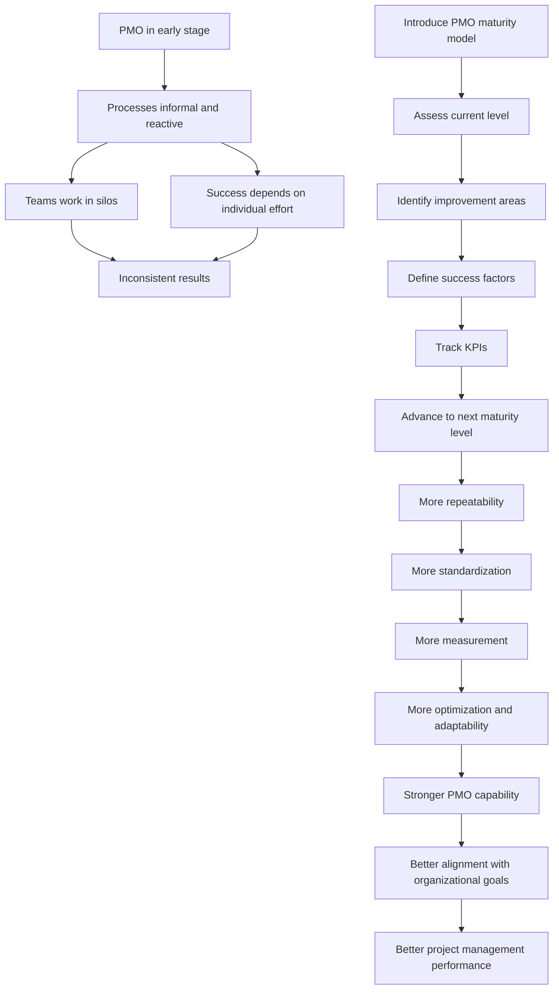

# PMO Maturity Models

## 1. Core idea in one sentence

**A PMO maturity model helps an organization understand how structured, consistent, measurable, and strategically effective its PMO really is — and what it must improve next.**

---

## 2. Ultra-short memory anchors

Use these as fast mental hooks:

* **Maturity = from reactive to optimized**
* **PMO growth is staged, not random**
* **Ad hoc → repeatable → standardized → measured → optimized**
* **Each level has success factors and KPIs**
* **A mature PMO is built, assessed, and refined**

---

## 3. Smart synthesis

This paragraph introduces an essential PMO concept: **maturity**. A PMO is not simply “present” or “absent.” It develops over time, and its value depends on how structured, repeatable, measurable, and adaptive its practices have become. A PMO maturity model gives organizations a way to assess where they currently stand and how to evolve in a disciplined way. 

The TechInnovate scenario makes this concrete. The PMO has been recently established. It is active, but still immature. Teams sometimes work in silos, and success depends too much on individual effort instead of reliable organizational processes. This is a common early-stage reality: project outcomes may still happen, but they are not yet consistently produced by a strong framework. That is exactly why a maturity model matters: it shifts success from **heroic effort** to **systemic capability**. 

The text defines PMO maturity models as frameworks used to assess the PMO’s development and effectiveness. Their purpose is threefold: understand current capabilities, identify areas for improvement, and provide a structured path for growth. The key message is that maturity is not just about adding more rules. It is about increasing the PMO’s ability to support predictable delivery, stronger governance, and alignment with organizational goals. 

The model presented uses a **five-level approach**. Level 1 is **Initial or Ad Hoc**, where processes are informal and reactive. Level 2 is **Repeatable or Basic**, where some processes can be reused across projects. Level 3 is **Defined or Standardized**, where common practices, tools, and templates are documented and adopted. Level 4 is **Managed or Measured**, where metrics and KPIs drive control and decision-making. Level 5 is **Optimized or Adaptive**, where the PMO operates at a high level of continuous improvement and adaptability. 

For each level, the paragraph highlights two important levers: **critical success factors** and **KPIs**. The success factors explain what must be built or strengthened to move forward. The KPIs show whether progress is actually happening. This is extremely important for interviews because it shows that PMO maturity is not theoretical. It must be translated into observable behaviors, management mechanisms, and measurable outcomes. 

A very useful insight here is that PMO maturity moves through three major evolutions. First, the PMO creates **basic order and repeatability**. Second, it creates **standardization and organizational discipline**. Third, it becomes **performance-driven and adaptive**. So maturity is not only a matter of documentation. It is the journey from informal coordination to data-driven governance and continuous optimization. 

---

## 4. The central logic

| Concept                      | Meaning                                            | What to remember                               |
| ---------------------------- | -------------------------------------------------- | ---------------------------------------------- |
| **PMO maturity model**       | A framework to assess PMO capability and evolution | **Maturity shows how solid the PMO really is** |
| **Maturity levels**          | Stages of development from informal to optimized   | **Growth happens step by step**                |
| **Critical success factors** | What must exist to move to the next level          | **Progress needs enablers**                    |
| **KPIs**                     | Measures of effectiveness and progress             | **Maturity must be visible and measurable**    |

---

## 5. The five maturity levels

### Key idea

**Each level represents a stronger form of control, consistency, and value delivery.**

| Level       | Name                   | Main characteristics                                      | Memory hook                         |
| ----------- | ---------------------- | --------------------------------------------------------- | ----------------------------------- |
| **Level 1** | Initial / Ad Hoc       | Informal, reactive, dependent on individual effort        | **Survival mode**                   |
| **Level 2** | Repeatable / Basic     | Basic processes exist and can be repeated                 | **Some consistency appears**        |
| **Level 3** | Defined / Standardized | Processes, tools, and templates are documented and shared | **One common way of working**       |
| **Level 4** | Managed / Measured     | KPIs and metrics guide decisions and control              | **Data starts driving performance** |
| **Level 5** | Optimized / Adaptive   | Continuous improvement and adaptability are embedded      | **The PMO learns and evolves**      |

### Memory sentence

**PMO maturity means moving from reactive effort to controlled, measured, and adaptive performance.**

---

## 6. Level-by-level logic

### Level 1 — Initial / Ad Hoc

| Element             | Meaning                                            |
| ------------------- | -------------------------------------------------- |
| **Context**         | PMO is new or immature                             |
| **Behavior**        | Processes are informal and reactive                |
| **Risk**            | Success depends on individuals, not systems        |
| **Success factors** | Establish basic processes, gain executive support  |
| **Typical KPIs**    | Number of projects completed, stakeholder feedback |

### Memory sentence

**At Level 1, work happens, but the system is still fragile.**

---

### Level 2 — Repeatable / Basic

| Element             | Meaning                                                                 |
| ------------------- | ----------------------------------------------------------------------- |
| **Context**         | Basic methods begin to be reused                                        |
| **Behavior**        | Some consistency emerges across projects                                |
| **Success factors** | Document processes, provide basic training, maintain executive support  |
| **Typical KPIs**    | Delivery consistency, fewer overruns, improved stakeholder satisfaction |

### Memory sentence

**At Level 2, success starts becoming repeatable, not accidental.**

---

### Level 3 — Defined / Standardized

| Element             | Meaning                                                                              |
| ------------------- | ------------------------------------------------------------------------------------ |
| **Context**         | The PMO introduces organization-wide standards                                       |
| **Behavior**        | Processes, templates, and tools are formalized                                       |
| **Success factors** | PMO charter, standard practices, common templates, compliance, PM software           |
| **Typical KPIs**    | % of projects using standard processes, reduced delivery time, improved success rate |

### Memory sentence

**At Level 3, the PMO creates one shared project language.**

---

### Level 4 — Managed / Measured

| Element             | Meaning                                                                        |
| ------------------- | ------------------------------------------------------------------------------ |
| **Context**         | Performance is actively measured and controlled                                |
| **Behavior**        | Decision-making becomes data-driven                                            |
| **Success factors** | Comprehensive KPIs, advanced tools, dashboards, reviews, audits                |
| **Typical KPIs**    | ROI, resource utilization, forecasting accuracy, risk management effectiveness |

### Memory sentence

**At Level 4, the PMO manages through evidence, not intuition alone.**

---

### Level 5 — Optimized / Adaptive

| Element             | Meaning                                                                           |
| ------------------- | --------------------------------------------------------------------------------- |
| **Context**         | PMO continuously improves and adapts                                              |
| **Behavior**        | Learning, optimization, and agility are embedded                                  |
| **Success factors** | Strong KPI system, advanced tooling, reviews, continuous improvement mindset      |
| **Typical KPIs**    | ROI, utilization, forecast accuracy, stronger mitigation and adaptive performance |

### Memory sentence

**At Level 5, the PMO is not just controlled — it is intelligent and evolving.**

---

## 7. The maturity journey in one view

| Phase of evolution    | What changes                                        |
| --------------------- | --------------------------------------------------- |
| **From Level 1 to 2** | From informal effort to basic repeatability         |
| **From Level 2 to 3** | From local practices to organization-wide standards |
| **From Level 3 to 4** | From standardization to performance measurement     |
| **From Level 4 to 5** | From measurement to optimization and adaptation     |

### What to remember

**Maturity is the conversion of project management from people-dependent execution to system-supported performance.**

---

## 8. Why PMO maturity matters

| Reason                       | Meaning                                         | Strategic value           |
| ---------------------------- | ----------------------------------------------- | ------------------------- |
| **Capability assessment**    | Shows the PMO’s real current state              | Avoids assumptions        |
| **Improvement path**         | Defines what to build next                      | Makes growth structured   |
| **Performance visibility**   | Links maturity to measurable results            | Supports governance       |
| **Organizational alignment** | Ensures PMO evolves in support of broader goals | Increases relevance       |
| **Sustained success**        | Helps PMO become more reliable over time        | Improves long-term impact |

### Memory sentence

**A maturity model makes PMO improvement intentional, not vague.**

---

## 9. Cause-effect map



---

## 10. Simple schema to memorize

```text id="09dm3z"
PMO Maturity
= Capability assessment
+ Structured growth
+ Success factors
+ KPIs
+ Continuous improvement

5 levels
= Ad Hoc
→ Repeatable
→ Standardized
→ Measured
→ Optimized
```

---

## 11. PMO interpretation

This paragraph reveals something very important:

| PMO lens         | Strategic meaning                                           |
| ---------------- | ----------------------------------------------------------- |
| **Maturity**     | PMO value depends on how developed its practices are        |
| **Governance**   | Mature PMOs rely less on improvisation                      |
| **Scalability**  | Standardization allows success to spread across projects    |
| **Measurement**  | KPIs turn PMO performance into something visible            |
| **Adaptability** | The best PMOs do not just control work; they evolve with it |

### Memory sentence

**A PMO becomes mature when success no longer depends on exceptional individuals, but on a strong organizational system.**

---

## 12. Interview language

### Strong concise definition

> “A PMO maturity model is a structured framework used to assess how developed and effective a PMO is, identify capability gaps, and guide its progression from informal execution support to standardized, measurable, and adaptive governance.”

### More senior version

> “PMO maturity is not simply about process documentation. It reflects the organization’s ability to move from reactive and person-dependent execution toward repeatable, data-driven, and continuously improving project governance aligned with strategic goals.”

### NLP-style persuasive phrases

Use these in interviews:

* **move from reactive execution to structured governance**
* **reduce dependency on individual effort**
* **build repeatable and scalable project management capability**
* **create a maturity path supported by KPIs**
* **translate PMO growth into measurable organizational value**
* **use standardization as a foundation for performance control**
* **embed continuous improvement into the PMO operating model**

---

## 13. How to map this to your own experience

| Concept from the paragraph   | How you can map your experience                                                                 |
| ---------------------------- | ----------------------------------------------------------------------------------------------- |
| **Early-stage PMO reality**  | Situations where outcomes depended heavily on individual coordination or informal relationships |
| **Standardization need**     | Creating structured governance, templates, checkpoints, or common flows                         |
| **Executive support**        | Securing leadership sponsorship to strengthen ways of working                                   |
| **Compliance and adherence** | Driving teams to follow shared methods and controls                                             |
| **Measurement culture**      | Introducing clearer indicators, dashboards, milestone tracking, or performance visibility       |
| **Continuous improvement**   | Refining practices based on issues, delays, risks, or repeated lessons learned                  |

### Interview bridge

You could say:

> “I see PMO maturity as the progression from effort-driven delivery to system-driven delivery. In practice, this means building common processes, increasing compliance and visibility, and progressively introducing metrics so that performance can be managed rather than simply observed.”

---

## 14. What to remember before a colloquium

Memorize this flow:

```text id="b5yhd3"
An immature PMO depends on people.
A growing PMO creates repeatability.
A mature PMO standardizes work.
An advanced PMO measures performance.
An optimized PMO continuously adapts and improves.
```

---

## 15. 30-second recap

A PMO maturity model helps an organization assess how developed and effective its PMO is and provides a structured path for improvement. The five levels move from **Initial/Ad Hoc** to **Repeatable**, **Defined**, **Managed**, and **Optimized**. Each level includes specific success factors and KPIs that show what must be strengthened and how progress can be measured. The overall goal is to transform the PMO from a reactive, person-dependent function into a standardized, data-driven, and continuously improving organizational capability. 

---

## 16. Flashcards — Senior Level

### Flashcard 1

**Q:** What is the main purpose of a PMO maturity model?
**A:** To assess current PMO capability, identify improvement areas, and provide a structured path for PMO growth.

### Flashcard 2

**Q:** Why is PMO maturity important for organizational success?
**A:** Because it increases consistency, governance quality, performance visibility, and alignment with organizational goals.

### Flashcard 3

**Q:** What is the defining weakness of a Level 1 PMO?
**A:** Success depends mainly on individual effort because processes are still informal and reactive.

### Flashcard 4

**Q:** What changes at Level 2 of PMO maturity?
**A:** Basic practices become repeatable across projects, creating early consistency.

### Flashcard 5

**Q:** What is the defining feature of a Level 3 PMO?
**A:** Processes, tools, and templates are standardized and commonly used across the organization.

### Flashcard 6

**Q:** Why are KPIs especially important from Level 4 onward?
**A:** Because they enable data-driven management, control, and performance improvement. 

### Flashcard 7

**Q:** What distinguishes Level 5 from Level 4?
**A:** Level 5 adds continuous improvement and adaptability, not just measurement and control.

### Flashcard 8

**Q:** What is a strong way to describe PMO maturity in an interview?
**A:** “PMO maturity reflects how far the organization has progressed from informal coordination toward standardized, measurable, and adaptive project governance.”

### Flashcard 9

**Q:** What role do critical success factors play in maturity models?
**A:** They identify what capabilities, structures, or behaviors must be built to progress to the next level.

### Flashcard 10

**Q:** What is the deeper organizational benefit of PMO maturity?
**A:** It makes project success more scalable and less dependent on individual heroics.
