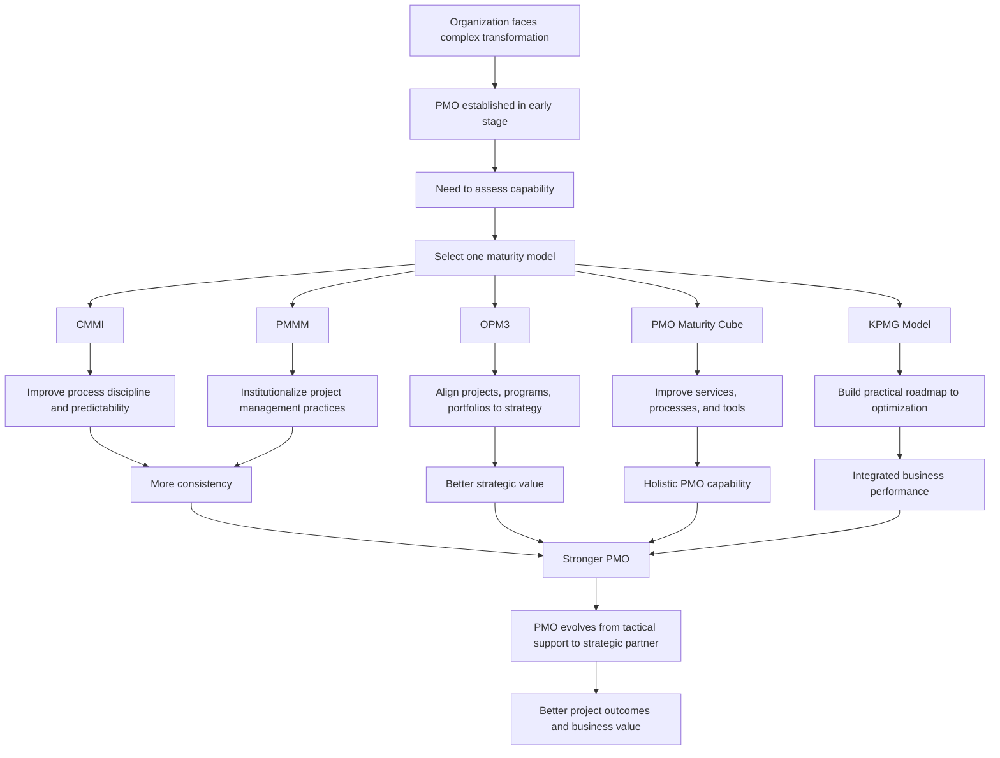

# PMO Maturity Models in Depth

## 1. Core idea in one sentence

**PMO maturity models are structured lenses that help an organization understand how its PMO should evolve from operational coordination into a strategic business enabler.**

---

## 2. Ultra-short memory anchors

Use these as fast mental hooks:

* **One PMO, many maturity lenses**
* **Models compare structure, control, and strategic value**
* **CMMI = process discipline**
* **OPM3 = project + program + portfolio alignment**
* **PMMM = staged PMO capability growth**
* **PMO Cube = services + processes + tools**
* **KPMG = practical maturity roadmap**
* **Choose one model, improve systematically**

---

## 3. Smart synthesis

This paragraph goes one step deeper than the previous one. It no longer explains only **what PMO maturity is**, but also shows that there are **different maturity models**, each offering a different angle for evaluating and strengthening a PMO. The central message is that PMO maturity is not assessed in only one universal way. Organizations can choose among different frameworks depending on what they want to improve most: processes, enterprise alignment, tools, governance, or practical delivery capability. 

The TechInnovate scenario remains the same: a large multinational company undergoing digital transformation, with a PMO still in its early stages. Because the transformation is complex and high-stakes, leadership wants to evaluate the PMO early rather than waiting for problems to accumulate. This is a very important mindset: **maturity assessment is not only corrective; it is preventive and developmental**. 

The text introduces five major PMO maturity models: **CMMI, OPM3, PM Solutions PMMM, PMI’s PMO Maturity Cube, and KPMG’s Project Management Maturity Model**. These frameworks assess different but related dimensions such as **process discipline, project/program/portfolio capability, PMO services, tools, and strategic alignment**. The paragraph also notes that organizations usually choose **one** model, because trying to integrate many models at once can become unnecessarily complex. That is a useful interview point: maturity improvement must be structured, but also pragmatic. 

The deeper lesson is that all these models share one ambition: to help the PMO move from a **tactical entity** to a **strategic partner**. In an immature state, a PMO may focus mostly on coordination and reporting. In a mature state, it shapes prioritization, enables governance, strengthens decision-making, aligns projects with business goals, and supports long-term value creation. So while the models differ in design, they all point toward the same transformation: **from activity management to strategic enablement**. 

Each model has its own emphasis. **CMMI** is strongly process-oriented and focuses on reducing variability through structured improvement. **OPM3** is broader and connects project, program, and portfolio management to strategic objectives. **PMMM** offers a staged path for institutionalizing project management practices. **PMO Maturity Cube** takes a multi-dimensional view through services, processes, and tools/technology. **KPMG’s model** provides a practical roadmap focused on integrating project management maturity with organizational performance and optimization. 

A good way to remember this paragraph is to see these models as **different diagnostic maps**. They do not replace good management judgment, but they help structure conversations about capability, gaps, priorities, and next steps. The value of the models lies not only in assessment, but in helping leadership build a PMO that evolves in line with organizational needs and strategic ambitions. 

---

## 4. The central logic

| Concept                 | Meaning                                                       | What to remember                                       |
| ----------------------- | ------------------------------------------------------------- | ------------------------------------------------------ |
| **PMO maturity model**  | A structured framework to evaluate and improve PMO capability | **Models help PMOs grow with direction**               |
| **Different models**    | Each framework emphasizes different maturity dimensions       | **Not all models look at the PMO the same way**        |
| **Strategic evolution** | PMO grows from tactical support to strategic partnership      | **Maturity is about business value, not only process** |
| **Model choice**        | Organizations usually adopt one main model                    | **Improvement must stay manageable**                   |

---

## 5. The five models at a glance

### Key idea

**Each model explains PMO maturity from a different angle, but all aim to increase consistency, control, and strategic value.**

| Model                     | Primary focus                               | Best memory hook                        |
| ------------------------- | ------------------------------------------- | --------------------------------------- |
| **CMMI**                  | Process improvement and predictability      | **Discipline through process maturity** |
| **OPM3**                  | Project, program, and portfolio capability  | **Enterprise-wide alignment**           |
| **PM Solutions PMMM**     | Staged project management capability growth | **Build maturity level by level**       |
| **PMI PMO Maturity Cube** | Services, processes, tools and technology   | **Three-dimensional PMO view**          |
| **KPMG model**            | Practical roadmap from ad hoc to optimized  | **Business-oriented maturity path**     |

### Memory sentence

**Different models, same goal: make the PMO stronger, smarter, and more strategic.**

---

## 6. Model-by-model synthesis

### CMMI — Capability Maturity Model Integration

| Element                   | Meaning                                                                        |
| ------------------------- | ------------------------------------------------------------------------------ |
| **Nature**                | Process-level improvement model                                                |
| **Focus**                 | Integrating and improving processes to increase consistency and predictability |
| **Strength**              | Reduces variability and builds disciplined execution                           |
| **TechInnovate use case** | Standardize planning and execution across departments                          |
| **Higher maturity value** | Use quantitative data for control and continuous improvement                   |

### What to remember

**CMMI is about making processes reliable, measurable, and continuously better.**

### Memory sentence

**CMMI turns project management from variable practice into controlled process performance.**

---

### OPM3 — Organizational Project Management Maturity Model

| Element                   | Meaning                                                                                       |
| ------------------------- | --------------------------------------------------------------------------------------------- |
| **Nature**                | PMI framework for organizational project management capability                                |
| **Domains**               | Project, Program, Portfolio                                                                   |
| **Focus**                 | Strategic alignment and enterprise-wide maturity                                              |
| **Strength**              | Connects execution with value and prioritization                                              |
| **TechInnovate use case** | Align digital transformation efforts with strategic objectives and better resource allocation |

### What to remember

**OPM3 looks beyond individual projects and asks whether the whole organization manages initiatives in a strategically coherent way.**

### Memory sentence

**OPM3 connects delivery capability to organizational strategy across all management layers.**

---

### PM Solutions PMMM

| Element                   | Meaning                                                                   |
| ------------------------- | ------------------------------------------------------------------------- |
| **Nature**                | Structured maturity model with five progressive levels                    |
| **Focus**                 | Institutionalizing project management practices                           |
| **Strength**              | Helps organizations move from informal practices to embedded standards    |
| **TechInnovate use case** | Build a mature PMO step by step, with more consistency across departments |
| **Higher maturity value** | Add metrics, tools, and continuous improvement                            |

### What to remember

**PMMM is a staged maturity journey centered on embedding project management discipline into the organization.**

### Memory sentence

**PMMM builds maturity by turning project practices into institutional habits.**

---

### PMI’s PMO Maturity Cube

| Element                   | Meaning                                                                                    |
| ------------------------- | ------------------------------------------------------------------------------------------ |
| **Nature**                | Multi-dimensional maturity framework                                                       |
| **Dimensions**            | PMO services, PMO processes, PMO tools and technology                                      |
| **Focus**                 | Holistic assessment of what the PMO offers and how it operates                             |
| **Strength**              | Reveals whether the PMO is balanced across support, execution, and enablement capabilities |
| **TechInnovate use case** | Improve training, streamline workflows, strengthen tool usage and analytics                |

### What to remember

**The PMO Cube does not look at maturity as a single ladder, but as a combination of dimensions that must all evolve.**

### Memory sentence

**PMO maturity is not only how structured the PMO is, but also how well it serves, operates, and equips the organization.**

---

### KPMG’s Project Management Maturity Model

| Element                   | Meaning                                                                               |
| ------------------------- | ------------------------------------------------------------------------------------- |
| **Nature**                | Practical maturity roadmap                                                            |
| **Levels**                | Ad Hoc, Defined, Managed, Integrated, Optimized                                       |
| **Focus**                 | Progressively integrating project management into organizational performance          |
| **Strength**              | Easy-to-apply business roadmap for maturity improvement                               |
| **TechInnovate use case** | Assess current state, build roadmap, improve predictability and strategic integration |
| **Higher maturity value** | Use data, analytics, and best practices to optimize performance                       |

### What to remember

**KPMG’s model is practical and business-facing, linking project management maturity to broader organizational agility and resilience.**

### Memory sentence

**KPMG’s model helps the PMO mature in a way that is visible, integrated, and outcome-oriented.**

---

## 7. Comparative table

| Model        | Main lens                  | Strongest contribution                                   | Possible limitation                                      |
| ------------ | -------------------------- | -------------------------------------------------------- | -------------------------------------------------------- |
| **CMMI**     | Process maturity           | Strong discipline and predictability                     | Can feel process-heavy if used rigidly                   |
| **OPM3**     | Organizational alignment   | Connects projects, programs, portfolios, and strategy    | Broader scope can be demanding                           |
| **PMMM**     | Capability progression     | Clear staged path for maturity building                  | May feel linear in complex environments                  |
| **PMO Cube** | Multi-dimensional PMO view | Holistic understanding of services, processes, and tools | Requires balanced assessment across dimensions           |
| **KPMG**     | Practical maturity roadmap | Business-friendly and action-oriented                    | Less detailed in some specialist areas than other models |

### What to remember

**The best model depends on what the organization needs most: process control, strategic alignment, PMO capability building, multidimensional assessment, or pragmatic transformation.**

---

## 8. The strategic pattern behind all models

| Shared principle          | Meaning                                            |
| ------------------------- | -------------------------------------------------- |
| **Assessment first**      | Understand current state before trying to improve  |
| **Structured evolution**  | Build maturity step by step                        |
| **Alignment matters**     | Maturity must support business goals               |
| **Measurement matters**   | Improvement should be visible and evidence-based   |
| **Continuous refinement** | The PMO must evolve as organizational needs evolve |

### Memory sentence

**All models say the same thing in different ways: maturity is intentional, measurable, and strategic.**

---

## 9. Cause-effect map



---

## 10. Simple schema to memorize

```text id="4ng2w5"
PMO maturity models
= Different frameworks
→ same destination

Destination
= Better processes
+ Better alignment
+ Better tools
+ Better governance
+ Better business value
```

---

## 11. PMO interpretation

This paragraph is especially useful for interviews because it expands the meaning of PMO maturity.

| PMO lens      | Strategic interpretation                                                               |
| ------------- | -------------------------------------------------------------------------------------- |
| **CMMI lens** | Is the PMO process-disciplined and predictable?                                        |
| **OPM3 lens** | Is the PMO aligned with enterprise priorities across project/program/portfolio levels? |
| **PMMM lens** | Has the PMO institutionalized consistent practices?                                    |
| **Cube lens** | Is the PMO strong in services, processes, and technology together?                     |
| **KPMG lens** | Does the PMO have a practical roadmap toward integrated optimization?                  |

### Memory sentence

**A mature PMO is not just organized; it is process-disciplined, strategically aligned, operationally equipped, and continuously improving.**

---

## 12. Interview language

### Strong concise definition

> “PMO maturity models are structured frameworks used to assess how developed a PMO is across dimensions such as process discipline, strategic alignment, governance capability, tools, and continuous improvement.”

### More senior version

> “Different maturity models provide different strategic lenses. Some emphasize process predictability, some enterprise-wide alignment, and some the PMO’s service and technology capability. What matters is selecting the framework that best supports the organization’s transformation priorities and then using it consistently.”

### NLP-style persuasive phrases

Use these in interviews:

* **select the maturity lens that fits the transformation challenge**
* **move the PMO from coordination to strategic enablement**
* **improve predictability without losing adaptability**
* **build a structured roadmap for PMO evolution**
* **institutionalize good practices across the organization**
* **create a PMO that is both operationally effective and strategically relevant**
* **translate maturity assessment into business-focused improvement**

---

## 13. How to map this to your own experience

| Concept from the paragraph       | How you can map your experience                                                                |
| -------------------------------- | ---------------------------------------------------------------------------------------------- |
| **Early-stage PMO growth**       | Working in environments where governance exists but is still evolving                          |
| **Process standardization**      | Creating or reinforcing common checkpoints, templates, release flows, or governance steps      |
| **Strategic alignment**          | Linking delivery activity to broader business priorities and transformation goals              |
| **Tool/process/service balance** | Supporting execution not only with governance, but also with tools, visibility, and enablement |
| **Roadmap thinking**             | Understanding that maturity improvement needs progression, not isolated fixes                  |
| **Continuous improvement**       | Using issues, delays, lessons learned, and repeated risks to refine practices                  |

### Interview bridge

You could say:

> “What I find useful about PMO maturity models is that they make PMO evolution more concrete. They help distinguish whether the real gap is in process discipline, strategic alignment, tool support, or broader organizational integration, and that makes improvement much more actionable.”

---

## 14. What to remember before a colloquium

Memorize this flow:

```text id="axwgza"
A PMO can be assessed through different models.
Each model emphasizes different maturity dimensions.
But all of them aim to strengthen consistency, control, and strategic value.
The end goal is the same:
a PMO that becomes a strategic partner, not just an administrative office.
```

---

## 15. 30-second recap

PMO maturity models help organizations evaluate and improve their PMO in a structured way. The five models presented are **CMMI, OPM3, PM Solutions PMMM, PMI’s PMO Maturity Cube, and KPMG’s model**. Each has a different focus: process improvement, enterprise alignment, staged capability growth, multidimensional PMO assessment, or practical maturity roadmapping. Despite these differences, they all support the same objective: helping the PMO evolve from a tactical coordination function into a strategic partner that improves project delivery, alignment, and business value. 

---

## 16. Flashcards — Senior Level

### Flashcard 1

**Q:** Why are there multiple PMO maturity models instead of just one?
**A:** Because organizations may need to assess different dimensions of PMO capability, such as processes, strategy alignment, services, tools, or enterprise integration.

### Flashcard 2

**Q:** What is the main strength of CMMI?
**A:** It strengthens process discipline, predictability, and continuous improvement through structured maturity levels.

### Flashcard 3

**Q:** What makes OPM3 different from narrower PMO maturity models?
**A:** It spans project, program, and portfolio management, linking maturity directly to organizational strategy.

### Flashcard 4

**Q:** What is the core logic of PM Solutions PMMM?
**A:** It helps organizations institutionalize project management practices progressively through maturity levels.

### Flashcard 5

**Q:** Why is PMI’s PMO Maturity Cube considered multidimensional?
**A:** Because it evaluates PMO maturity across services, processes, and tools/technology rather than through a single maturity ladder. 

### Flashcard 6

**Q:** What is the practical value of KPMG’s maturity model?
**A:** It provides a business-oriented roadmap that helps organizations move from ad hoc practice to integrated and optimized project management capability.

### Flashcard 7

**Q:** Why do organizations usually choose one maturity model rather than combining many?
**A:** Because managing multiple models at once can create unnecessary complexity and dilute focus. 

### Flashcard 8

**Q:** What common goal do all PMO maturity models share?
**A:** They help the PMO become more consistent, efficient, aligned, and strategically valuable.

### Flashcard 9

**Q:** What is a strong interview statement about PMO maturity models?
**A:** “Different models provide different diagnostic lenses, but they all help organizations structure PMO evolution and connect maturity improvement to business outcomes.”

### Flashcard 10

**Q:** What is the deepest strategic message of this paragraph?
**A:** That PMO maturity is not about bureaucracy; it is about building a PMO capable of acting as a strategic partner during complex transformation.
