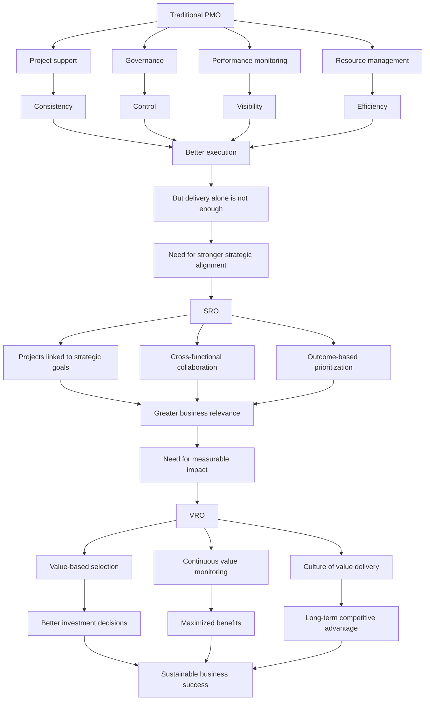

# From Traditional PMO to SRO and VRO

## 1. Core idea in one sentence

The PMO evolves from a **project control function** into a **strategic and value-driven capability**, moving from managing delivery to enabling strategy and maximizing measurable business value.

---

## 2. Ultra-short memory anchors

Use these as **mental hooks**:

* **Traditional PMO = execution discipline**
* **SRO = strategy alignment**
* **VRO = measurable value realization**
* **Evolution = from managing projects to driving business impact**
* **Mature PMO thinking = not only “Are we delivering?” but also “Why does this matter?”**

---

## 3. Smart synthesis

This paragraph explains that the PMO is not a static structure. It evolves as the organization becomes more mature and more strategically oriented.

The journey starts with the **traditional PMO**, whose main mission is to make projects run in a controlled and standardized way. It supports project teams, enforces governance, monitors performance, and manages resources. This model is useful, especially when an organization needs order, consistency, and execution discipline.

However, as organizations grow, this approach becomes insufficient. Why? Because delivering projects efficiently is not the same as delivering **strategic impact**. A PMO can complete projects on time and within budget and still fail to move the business forward.

This is where the **Strategy Realization Office (SRO)** enters. The SRO shifts attention from project execution alone to **alignment with strategic objectives**. Its role is to make sure that projects are not just well-managed, but also meaningful in relation to long-term business goals.

The evolution continues with the **Value Realization Office (VRO)**. The VRO goes one step further: it asks whether projects generate **tangible, measurable value**. In other words, the VRO does not stop at alignment; it focuses on outcomes, benefits, and business impact over time.

So the real message is this:

**PMO maturity means moving from control, to alignment, to value.**

This is a very strong interview concept because it shows an advanced understanding of how governance structures must evolve with organizational needs.

---

## 4. The three stages of evolution

| Stage | Main Focus | Key Question | What to remember |
|------|------------|-------------|------------------|
| **Traditional PMO** | Project execution, standards, control | “Are projects being delivered correctly?” | Delivery discipline |
| **SRO** | Strategic alignment | “Are projects aligned with business goals?” | Strategic relevance |
| **VRO** | Measurable value | “Are projects producing real business benefits?” | Value realization |

---

## 5. Stage 1 — Traditional PMO

### Key idea

The traditional PMO is built to create **order, control, consistency, and support** across projects.

### Main functions

| Function | Meaning | Practical effect |
|---------|---------|------------------|
| **Project support** | Provides tools, templates, and methods | More consistency across teams |
| **Governance** | Defines and enforces standards, policies, procedures | Better control and compliance |
| **Performance monitoring** | Tracks KPIs, timelines, budgets, scope | Better visibility on delivery status |
| **Resource management** | Allocates people, budget, technology | Improved execution efficiency |

### Memory sentence

**The traditional PMO helps the organization do projects in a structured and controlled way.**

### Interview phrasing

> “A traditional PMO creates execution discipline through governance, standardization, performance tracking, and resource coordination.”

---

## 6. Limits of the traditional PMO

### Key idea

The traditional PMO is useful, but over time it can become **too rigid, too bureaucratic, and too disconnected from strategy**.

### Main limitations

| Limitation | Meaning | Business consequence |
|-----------|---------|----------------------|
| **Rigidity** | Processes become too heavy and procedural | Slower decisions, less agility |
| **Bureaucracy** | Too much focus on process compliance | Innovation may be reduced |
| **Functional isolation** | Limited cross-department collaboration | Silos and inefficiencies |
| **Delivery bias** | Focus on time, cost, scope only | Weak connection to strategic outcomes |

### Memory sentence

**A PMO that controls everything but connects to nothing becomes an administrative machine, not a strategic enabler.**

### Interview phrasing

> “One limitation of a traditional PMO is that it may optimize execution without sufficiently questioning whether the work being delivered is strategically relevant or value-generating.”

---

## 7. Stage 2 — Strategy Realization Office (SRO)

### Key idea

The SRO ensures that projects and programs are selected, prioritized, and managed according to **strategic business objectives**.

### What changes

| From PMO logic | To SRO logic |
|---------------|--------------|
| Deliver projects well | Deliver the right projects |
| Focus on process and control | Focus on alignment and outcomes |
| Project-level view | Enterprise strategy view |

### Main benefits

| Benefit | Meaning | Practical effect |
|--------|---------|------------------|
| **Strategic alignment** | Projects support business goals | More relevant portfolios |
| **Collaboration** | Breaks down silos across functions | Better integrated delivery |
| **Outcome orientation** | Prioritizes strategic results, not just tasks | Better long-term impact |

### Memory sentence

**The SRO makes strategy visible inside project decisions.**

### Interview phrasing

> “The SRO represents a more mature governance model because it ensures that initiatives are not only well executed, but also directly connected to the organization’s long-term priorities.”

---

## 8. Stage 3 — Value Realization Office (VRO)

### Key idea

The VRO ensures that projects generate **real, measurable, and sustained value** for the organization.

### Core logic

The VRO asks:
* Which initiatives create the greatest impact?
* Are expected benefits actually being realized?
* What must be adjusted to maximize value over time?

### Main characteristics

| Characteristic | Meaning | Practical effect |
|---------------|---------|------------------|
| **Value-based prioritization** | Projects are selected based on expected impact | Better investment decisions |
| **Continuous value monitoring** | Outcomes are tracked beyond project delivery | Benefits are protected and optimized |
| **Value culture** | Teams think in terms of impact, not just completion | Stronger business mindset |

### Memory sentence

**The VRO turns project management into a value-generation engine.**

### Interview phrasing

> “A VRO goes beyond strategic alignment by embedding value realization into prioritization, governance, and continuous monitoring, ensuring that investments translate into measurable business benefits.”

---

## 9. Progression logic in one visual chain

```text
Traditional PMO → SRO → VRO
Control         → Alignment → Value
Execution       → Strategy  → Business impact
````

---

## 10. Cause-effect map



---

## 11. The maturity message you must remember

| Maturity level      | What success means                          |
| ------------------- | ------------------------------------------- |
| **Traditional PMO** | Projects are delivered efficiently          |
| **SRO**             | Projects are aligned with business strategy |
| **VRO**             | Projects generate measurable value          |

### Core memory formula

```text
PMO maturity =
Execution discipline
+ Strategic alignment
+ Value realization
```

---

## 12. PMO evolution in interview language

### Strong concise definition

> “The evolution from PMO to SRO to VRO reflects a shift from delivery control to strategic alignment and finally to measurable value realization.”

### More senior version

> “A mature project governance capability does not stop at ensuring projects are delivered on time and within budget. It progressively evolves to align investments with strategy and to verify that those investments produce tangible and sustainable business value.”

### NLP-style persuasive phrasing

Use these in interviews:

* **move from project oversight to strategic enablement**
* **create line of sight between initiatives and business priorities**
* **shift from output management to outcome realization**
* **prioritize investment based on measurable impact**
* **reduce bureaucracy while increasing strategic relevance**
* **embed value thinking into governance decisions**
* **transform the PMO from a control tower into a value engine**

---

## 13. How to map this to your own experience

This part is essential for interviews and personal storytelling.

| Concept                         | How you can map your experience                                                                                                                                 |
| ------------------------------- | --------------------------------------------------------------------------------------------------------------------------------------------------------------- |
| **Traditional PMO**             | Governance of releases, standards, checkpoints, monitoring, resource coordination, structured delivery                                                          |
| **SRO logic**                   | Connecting technical initiatives to strategic rollout goals, business continuity, platform transformation, compliance priorities                                |
| **VRO logic**                   | Prioritizing work based on impact, protecting critical timelines, maximizing business benefit, focusing on meaningful outcomes rather than only task completion |
| **Breaking silos**              | Coordinating across technical teams, operations, compliance, external vendors, support, and stakeholders                                                        |
| **Continuous value monitoring** | Following initiatives beyond delivery to verify impact, stability, adoption, readiness, and benefit realization                                                 |

### Your interview bridge

You could say:

> “In regulated and cross-functional environments, I have seen that project governance becomes truly effective only when it evolves beyond execution control. Standardization is essential, but the real turning point comes when initiatives are aligned to strategic priorities and monitored for actual business value.”

Or an even stronger version:

> “My experience has taught me that mature governance is not about controlling activity for its own sake. It is about ensuring that delivery effort translates into strategic progress and measurable organizational value.”

---

## 14. What to remember before a colloquium

Memorize this sequence:

```text
Traditional PMO creates control.
SRO creates strategic alignment.
VRO creates measurable value.

First: deliver correctly.
Then: deliver what matters.
Finally: prove that it created impact.
```

---

## 15. 30-second recap

The paragraph explains that PMOs evolve as organizations become more mature. A **traditional PMO** focuses on project support, governance, monitoring, and resource management. This creates discipline, but may become too rigid and too disconnected from business strategy. The **SRO** solves this by aligning projects with strategic objectives and improving collaboration across silos. The **VRO** goes even further by ensuring that projects generate measurable value and by continuously monitoring outcomes. The core idea is that modern governance must move from **execution**, to **alignment**, to **value**.

---

## 16. Flashcards — Senior Level

### Flashcard 1

**Q:** What is the main difference between a traditional PMO and an SRO?
**A:** A traditional PMO focuses on delivery governance and execution discipline, while an SRO ensures that projects are directly aligned with strategic business objectives.

### Flashcard 2

**Q:** Why can a traditional PMO become insufficient over time?
**A:** Because it may emphasize process compliance, deadlines, and budgets without ensuring that projects contribute meaningfully to strategic goals or business value.

### Flashcard 3

**Q:** What is the defining principle of a VRO?
**A:** The VRO focuses on measurable value realization, ensuring that projects produce tangible business benefits and that those benefits are continuously monitored.

### Flashcard 4

**Q:** What are the four core functions of a traditional PMO mentioned in the content?
**A:** Project support, governance, performance monitoring, and resource management.

### Flashcard 5

**Q:** What problem does the SRO solve that the traditional PMO often does not?
**A:** It solves strategic misalignment by ensuring that initiatives are prioritized and managed according to long-term organizational goals.

### Flashcard 6

**Q:** Why is collaboration emphasized in the SRO model?
**A:** Because breaking down departmental silos improves integration, reduces inefficiencies, and strengthens the strategic coherence of project outcomes.

### Flashcard 7

**Q:** How does the VRO improve investment decisions?
**A:** By selecting and prioritizing projects based on their expected measurable impact rather than only on delivery feasibility or operational urgency.

### Flashcard 8

**Q:** What does continuous value monitoring mean in a VRO context?
**A:** It means tracking whether expected benefits are actually being realized after and during delivery, and adjusting actions to maximize outcomes.

### Flashcard 9

**Q:** What is a strong executive-level way to describe PMO maturity?
**A:** PMO maturity is the progression from execution control to strategic alignment and ultimately to sustained value realization.

### Flashcard 10

**Q:** What is the strongest idea to bring into an interview from this paragraph?
**A:** That project governance is most effective when it evolves from managing activities to enabling strategy and proving measurable business value.

---

```
