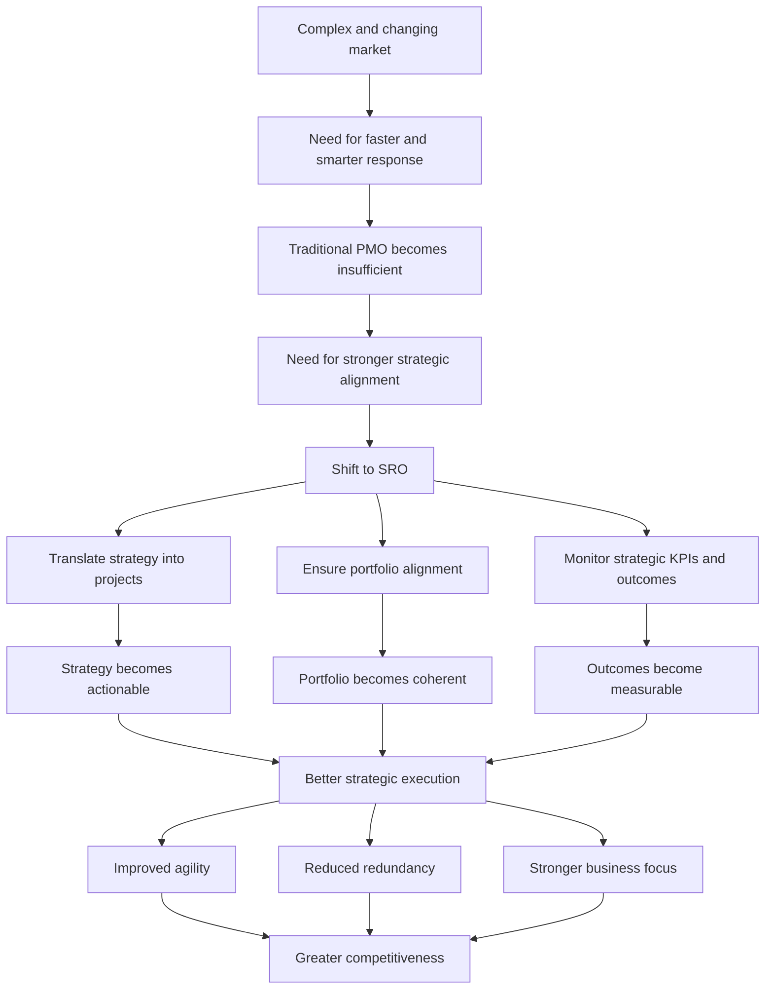

# The Shift from Traditional PMO to SRO

## 1. Core idea in one sentence

An **SRO (Strategy Realization Office)** transforms strategy into coordinated action by ensuring that projects, programs, and portfolio decisions remain tightly aligned with organizational goals and strategic outcomes.

---

## 2. Ultra-short memory anchors

Use these as **mental hooks**:

* **SRO = strategy in motion**
* **SRO = from managing projects to driving strategic execution**
* **SRO = translate, align, monitor**
* **Agility needs strategic governance**
* **An SRO does not ask only “What are we doing?” — it asks “Why are we doing it now?”**

---

## 3. Smart synthesis

This paragraph explains why organizations move from a traditional PMO to a **Strategy Realization Office (SRO)** when the external environment becomes more complex, faster, and more demanding.

The core reason is simple: in a volatile market, **good project management is no longer enough**. Organizations must ensure that every initiative is directly connected to strategic priorities and can adapt quickly when those priorities change.

The SRO is introduced as a centralized function whose purpose is not merely to support project execution, but to **turn business strategy into actionable and coordinated delivery**. This is the real shift: the organization moves from process-centered governance to **strategy-centered governance**.

The content identifies **three core functions** of the SRO:

1. **Translate strategy into actionable projects and programs**
2. **Ensure strategic alignment across the portfolio**
3. **Monitor strategic KPIs and outcomes**

These three functions are important because together they create a complete governance loop:

* strategy is **translated**
* execution is **aligned**
* results are **measured**

This is what makes the SRO more mature than a traditional PMO. The traditional PMO mainly protects consistency and delivery discipline. The SRO protects **strategic coherence** and helps the organization stay agile in changing market conditions.

The TechInnovate example is useful because it shows this shift in practical terms. If the business wants to expand into new markets, the SRO does not treat this as a vague intention. It breaks it into concrete initiatives such as market research, product development, and partnership building. In this way, strategy becomes executable.

Another key idea is that the SRO continuously reviews the portfolio to ensure projects support one another, avoid redundancy, and remain relevant as priorities evolve. This makes the SRO especially valuable in complex environments where the risk is not only project failure, but also **strategic dispersion**.

The final message is strong:

**The SRO exists to make sure organizational effort is not just active, but strategically focused.**

---

## 4. The three core functions of an SRO

| Core Function | Meaning | Key Question | What to remember |
|--------------|---------|--------------|------------------|
| **Translate strategy into projects** | Turn strategic goals into concrete initiatives | “How do we operationalize strategy?” | Strategy becomes actionable |
| **Ensure portfolio alignment** | Keep all projects coherent with strategic objectives | “Are all initiatives pulling in the same direction?” | Strategic coherence |
| **Monitor KPIs and outcomes** | Track whether projects are generating expected strategic results | “Are we achieving the intended impact?” | Strategy must be measurable |

---

## 5. Function 1 — Translate strategy into actionable projects and programs

### Key idea

The SRO converts **high-level strategic intent** into **specific, executable initiatives**.

### What it means

Strategy often starts at a broad level: expand, grow, innovate, enter new markets, improve customer experience. These ideas are directionally important, but not operationally sufficient. The SRO bridges this gap by turning strategic intent into a portfolio of real projects and programs.

### Example logic

| Strategic objective | SRO translation into action |
|--------------------|-----------------------------|
| Expand into new markets | Market research, localization, partnerships, product adaptation |
| Strengthen innovation | R&D initiatives, pilot programs, capability development |
| Improve customer satisfaction | Service redesign, digital tools, feedback-driven improvements |

### Memory sentence

**The SRO turns strategy from ambition into execution.**

### Interview phrasing

> “A core SRO capability is translating high-level strategic intent into a structured portfolio of actionable projects and programs.”

---

## 6. Function 2 — Ensure strategic alignment across the portfolio

### Key idea

The SRO ensures that all projects are **coherent, complementary, and strategically connected**.

### What it means

Projects should not exist as isolated efforts. Each initiative must support broader organizational priorities, and the portfolio as a whole must make strategic sense. The SRO reviews the portfolio continuously to ensure that initiatives do not duplicate work, compete destructively, or drift away from the company’s direction.

### Practical implications

| Alignment activity | Why it matters |
|-------------------|----------------|
| Review project relevance | Prevents misaligned investments |
| Check coherence between projects | Avoids duplication and fragmentation |
| Reassess strategic fit over time | Keeps the portfolio current |
| Coordinate across functions | Strengthens enterprise-wide execution |

### Memory sentence

**Strategic alignment means every project must have a reason that connects to the bigger picture.**

### Interview phrasing

> “The SRO plays a critical role in maintaining portfolio coherence by ensuring that projects remain aligned with enterprise priorities and reinforce rather than dilute strategic intent.”

---

## 7. Function 3 — Monitor strategic KPIs and outcomes

### Key idea

The SRO tracks whether projects are delivering the **strategic results** they were meant to generate.

### What it means

The SRO does not stop at launching projects. It follows outcomes through KPIs and performance indicators linked to strategic success. This creates a more mature governance model because it connects delivery to evidence.

### Examples of strategic KPIs

| KPI type | Example |
|---------|---------|
| **Growth** | Market share increase |
| **Customer value** | Customer satisfaction improvement |
| **Innovation** | Number of new products, innovation benchmarks |
| **Strategic performance** | Entry into target markets, capability maturity |

### Decision value of KPI monitoring

Monitoring KPIs allows the SRO to:
* adjust underperforming initiatives
* scale promising ones
* stop projects that are not producing the intended impact

### Memory sentence

**If strategy is not measured, it remains intention, not realization.**

### Interview phrasing

> “Monitoring strategic KPIs allows the SRO to move from activity tracking to outcome governance, enabling informed decisions about continuation, adjustment, or termination.”

---

## 8. Why agility matters in a complex market

### Key idea

In a fast-changing environment, organizations must adapt their portfolio quickly, and the SRO enables this agility.

Traditional PMOs can become slower because they are often centered on process consistency and established routines. The SRO is more agile because it is anchored in strategic priorities rather than procedural stability.

This means that when a new opportunity or threat emerges, the SRO can help the organization **recalibrate quickly**.

### Example from the content

If a new technological trend appears, the SRO can realign the portfolio so the company can respond rapidly and remain competitive.

### Comparison logic

| Traditional PMO | SRO |
|-----------------|-----|
| Process-centered | Strategy-centered |
| Focus on consistency | Focus on relevance |
| Can be slower to pivot | Better equipped to realign |
| Measures delivery discipline | Measures strategic movement |

### Memory sentence

**Agility is not chaos; it is the disciplined ability to realign quickly around strategy.**

### Interview phrasing

> “In complex markets, the value of the SRO lies in its ability to maintain strategic agility by continuously aligning the portfolio with evolving priorities.”

---

## 9. Progression logic in one visual chain

```text
Traditional PMO → SRO
Project process → Strategic execution
Control         → Alignment
Delivery focus  → Outcome focus
````

---

## 10. Cause-effect map



---

## 11. The SRO operating model in one simple schema

```text
SRO
= Strategy translation
+ Portfolio alignment
+ KPI and outcome monitoring
+ Agile response to change
```

---

## 12. What makes the SRO different from the traditional PMO

| Dimension            | Traditional PMO              | SRO                                   |
| -------------------- | ---------------------------- | ------------------------------------- |
| **Primary focus**    | Project management processes | Strategic execution                   |
| **Main value**       | Standardization and control  | Alignment and outcome realization     |
| **Portfolio logic**  | Manage projects consistently | Manage projects strategically         |
| **Performance lens** | Time, budget, scope          | Strategic KPIs and business outcomes  |
| **Adaptability**     | May be slower to pivot       | Designed to support agile realignment |

### Core memory formula

```text
SRO maturity =
Strategy translated into action
+ Portfolio coherence
+ KPI-driven outcome monitoring
+ Agile realignment
```

---

## 13. SRO in interview language

### Strong concise definition

> “An SRO is a strategic governance function that translates business priorities into actionable initiatives, aligns the portfolio to those priorities, and monitors whether expected strategic outcomes are actually being achieved.”

### More senior version

> “The SRO represents a shift from project administration to strategic execution. It ensures that organizational effort is not fragmented, but concentrated on initiatives that support long-term objectives and generate measurable strategic results.”

### NLP-style persuasive phrasing

Use these expressions in interviews:

* **translate strategic intent into execution**
* **create strategic coherence across the portfolio**
* **provide line of sight between projects and enterprise goals**
* **move from activity management to outcome realization**
* **enable disciplined agility in changing environments**
* **continuously recalibrate the portfolio against strategic priorities**
* **protect focus in a complex market**

---

## 14. How to map this to your own experience

This is the most useful part for interviews and self-positioning.

| SRO concept                        | How you can map your experience                                                                                                     |
| ---------------------------------- | ----------------------------------------------------------------------------------------------------------------------------------- |
| **Translate strategy into action** | Breaking high-level business goals into initiatives, release tracks, delivery plans, and cross-functional workstreams               |
| **Strategic alignment**            | Ensuring projects support broader priorities such as transformation, compliance, migration, platform evolution, business continuity |
| **Portfolio coherence**            | Checking dependencies, removing overlap, coordinating multiple stakeholders, sequencing initiatives logically                       |
| **KPI / outcome monitoring**       | Following milestones, benefits, operational metrics, risk trends, quality outcomes, and strategic readiness                         |
| **Agility in complexity**          | Reprioritizing when constraints change, reacting to new risks, adapting plans to market, technology, or governance needs            |

### Your interview bridge

You could say:

> “In my experience, governance becomes much more effective when it is connected to strategy. Managing projects well is essential, but the real value comes from ensuring that initiatives are aligned, coordinated, and continuously assessed against the outcomes the business is trying to achieve.”

Or:

> “I relate strongly to the SRO model because in complex environments I often work at the point where strategy needs to be translated into structured execution, while also ensuring alignment across multiple stakeholders and evolving priorities.”

---

## 15. What to remember before a colloquium

Memorize this sequence:

```text
Strategy alone is not enough.
It must be translated into projects.
Projects must stay aligned with each other.
Their outcomes must be monitored.
That is the role of the SRO.
```

Or even shorter:

```text
Translate.
Align.
Monitor.
Adapt.
```

---

## 16. 30-second recap

The SRO is a more mature evolution of the traditional PMO. Instead of focusing mainly on project processes, it ensures that projects and programs are directly connected to strategic goals. Its three core functions are to **translate strategy into actionable initiatives**, **align the portfolio around strategic priorities**, and **monitor KPIs and outcomes** to verify that expected results are being achieved. In complex markets, the SRO also improves agility by helping the organization realign quickly when priorities shift.

---

## 17. Flashcards — Senior Level

### Flashcard 1

**Q:** What is the main purpose of an SRO?
**A:** To ensure that projects and programs are directly aligned with strategic goals and capable of delivering intended business outcomes.

### Flashcard 2

**Q:** What are the three core functions of an SRO?
**A:** Translating strategy into actionable projects, ensuring strategic alignment across the portfolio, and monitoring strategic KPIs and outcomes.

### Flashcard 3

**Q:** Why is strategy translation a critical SRO capability?
**A:** Because strategic goals are often too broad to execute directly, so they must be broken down into concrete, coordinated initiatives.

### Flashcard 4

**Q:** What does portfolio alignment mean in an SRO context?
**A:** It means ensuring that all initiatives are coherent, mutually supportive, and clearly linked to the organization’s strategic priorities.

### Flashcard 5

**Q:** Why does the SRO monitor strategic KPIs rather than only project KPIs?
**A:** Because the goal is not only to track execution performance, but to verify whether strategic outcomes are actually being achieved.

### Flashcard 6

**Q:** How does the SRO support organizational agility?
**A:** By continuously aligning the portfolio with evolving strategic priorities and enabling faster response to market changes or emerging opportunities.

### Flashcard 7

**Q:** What is one major advantage of the SRO over a traditional PMO?
**A:** The SRO is more focused on strategic relevance and outcome realization, while a traditional PMO may remain more process-centered.

### Flashcard 8

**Q:** Why is avoiding redundancy an SRO responsibility?
**A:** Because strategic governance requires portfolio coherence, and redundant initiatives dilute focus, waste resources, and weaken impact.

### Flashcard 9

**Q:** What is a strong executive-level statement to describe the SRO?
**A:** The SRO is the function that converts business strategy into coordinated execution and validates progress through measurable strategic outcomes.

### Flashcard 10

**Q:** What is the strongest concept to bring into an interview from this paragraph?
**A:** That effective governance is not just about managing projects efficiently, but about ensuring that all organizational effort is strategically focused, measurable, and adaptable.

---
