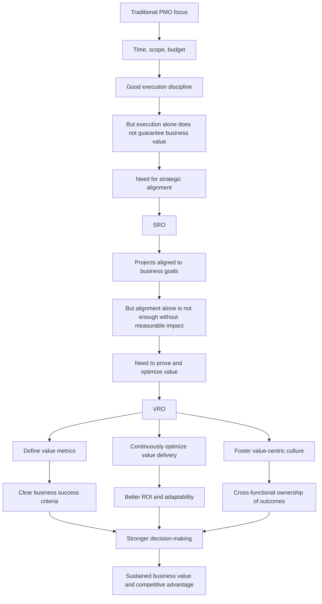

# From Strategy Alignment to Value Realization: The VRO

## 1. Core idea in one sentence

A **VRO (Value Realization Office)** ensures that projects and programs do not just get delivered, but generate **measurable business value**, optimize returns over time, and build a culture focused on outcomes.

---

## 2. Ultra-short memory anchors

Use these as **mental hooks**:

* **VRO = value over activity**
* **VRO = outcomes, impact, optimization**
* **PMO manages delivery**
* **SRO aligns to strategy**
* **VRO proves business value**
* **A project is not truly successful unless it creates value**

---

## 3. Smart synthesis

This paragraph introduces the **Value Realization Office (VRO)** as the most mature step in the evolution from traditional PMO to SRO to a fully value-driven governance model.

The key idea is that organizations no longer compete only by delivering projects efficiently. They compete by ensuring that every investment in projects and programs creates **real business benefits**. This is why the VRO emerges: to shift the focus from execution to **value realization**.

A traditional PMO mainly tracks whether a project respects time, budget, and scope. An SRO goes further by ensuring that projects align with strategy. The VRO takes the final step: it asks whether those strategically aligned projects are actually producing **tangible outcomes** such as higher customer satisfaction, stronger market position, better ROI, or improved employee experience.

The VRO is therefore not just a governance office. It is a **business performance enabler**. It treats projects as investments whose value must be defined, measured, optimized, and protected across the full lifecycle.

The content highlights **three core functions** of the VRO:

1. **Defining and measuring value metrics**
2. **Ensuring continuous value delivery and optimization**
3. **Fostering a value-centric culture**

These three functions matter because they transform project governance into a continuous value loop:

* value is **defined**
* value is **tracked and optimized**
* value is **embedded culturally**

This is a powerful idea for interviews, because it shows that mature governance is not satisfied with project completion. It is concerned with whether the organization is getting the outcomes it actually needs.

The TechInnovate example helps make the concept practical. At first, the company focused mainly on execution. But as the market became more uncertain and dynamic, execution alone was no longer enough. The company needed to ensure that projects not only aligned with strategy, but also produced measurable benefits. That is the logic of the VRO: **turn strategic execution into sustained value creation**.

---

## 4. The three core functions of a VRO

| Core Function | Meaning | Key Question | What to remember |
|--------------|---------|--------------|------------------|
| **Define and measure value metrics** | Identify how value will be recognized and quantified | “What value should this initiative create?” | Value must be explicit |
| **Ensure continuous value delivery and optimization** | Monitor and adjust initiatives to maximize outcomes | “Are we still on track to generate the intended value?” | Value must be protected and improved |
| **Foster a value-centric culture** | Build organizational habits focused on impact, not just completion | “Do people think in terms of long-term value?” | Value must become cultural |

---

## 5. Function 1 — Define and measure value metrics

### Key idea

The VRO makes value **visible and measurable**.

### What it means

A VRO does not rely only on traditional delivery metrics like schedule, cost, and scope. Those still matter, but they are not enough. The VRO broadens the definition of success by asking which business outcomes matter most.

### Examples of value metrics from the content

| Traditional delivery metrics | Broader value metrics |
|-----------------------------|-----------------------|
| Time | Customer satisfaction |
| Scope | Market share growth |
| Budget | ROI |
| Delivery milestones | Employee satisfaction |

### Why this matters

Once value metrics are defined, the organization can prioritize initiatives more intelligently. Projects are no longer selected only because they are feasible or urgent, but because they have the highest potential to create meaningful results.

### Memory sentence

**What gets measured for value gets managed for impact.**

### Interview phrasing

> “A VRO expands success criteria beyond time, cost, and scope by defining value metrics that reflect business outcomes such as ROI, customer impact, growth, and organizational effectiveness.”

---

## 6. Function 2 — Ensure continuous value delivery and optimization

### Key idea

The VRO does not assume value will happen automatically. It continuously checks, adjusts, and optimizes.

### What it means

Projects may begin with strong intentions, but conditions change. Assumptions become outdated, markets shift, and expected benefits may weaken. The VRO responds by reviewing initiatives regularly and intervening when value is at risk.

### Typical optimization actions

| Action | Why it is done |
|--------|----------------|
| Re-evaluate project goals | To restore alignment with strategic value |
| Reallocate resources | To invest where impact is highest |
| Adjust scope | To protect or improve expected outcomes |
| Review underperformance | To avoid continuing low-value work |

### Strategic meaning

This proactive monitoring makes the organization more agile and more disciplined. Instead of waiting until a project ends to evaluate success, the VRO manages value as a living objective throughout the lifecycle.

### Memory sentence

**Value realization is not a one-time check; it is an ongoing management discipline.**

### Interview phrasing

> “A VRO continuously optimizes the portfolio by monitoring whether initiatives are delivering expected value and by making timely adjustments to goals, resources, or scope when needed.”

---

## 7. Function 3 — Foster a value-centric culture

### Key idea

The VRO builds a mindset in which teams think beyond delivery and focus on **long-term impact**.

### What it means

A value-centric culture is one where people understand that finishing a project is not the endpoint. The real endpoint is the benefit the project creates.

This requires education, communication, and consistent reinforcement. Teams must understand value metrics, see how their work contributes to organizational goals, and collaborate across departments to maximize impact.

### Cultural mechanisms mentioned in the content

| Mechanism | Purpose |
|----------|---------|
| Educate teams on value realization | Build awareness and ownership |
| Embed value metrics in every stage | Make value part of daily execution |
| Encourage long-term thinking | Shift focus from output to impact |
| Promote cross-functional collaboration | Align departments around shared outcomes |
| Support continuous improvement and innovation | Sustain value creation over time |

### Memory sentence

**A mature organization does not just deliver projects; it thinks in terms of value at every level.**

### Interview phrasing

> “The VRO helps institutionalize value realization by embedding outcome thinking into project governance, team behavior, and cross-functional collaboration.”

---

## 8. Why the VRO emerges

### Key idea

The VRO emerges because in a complex and unpredictable business environment, delivery alone does not guarantee competitiveness.

Organizations need a model that ensures investments generate real returns and remain relevant over time. The VRO answers this need by focusing on impact, adaptability, and sustained benefit realization.

### Evolution logic

| Governance model | Main question |
|------------------|--------------|
| **Traditional PMO** | Are we delivering correctly? |
| **SRO** | Are we aligned with strategy? |
| **VRO** | Are we creating measurable business value? |

### Memory sentence

**The VRO appears when the organization realizes that activity is not value, and alignment is not enough without impact.**

---

## 9. Progression logic in one visual chain

```text
Traditional PMO → SRO → VRO
Execution       → Alignment → Value
Control         → Strategy  → Business impact
Project success → Strategic fit → Measurable outcomes
````

---

## 10. Cause-effect map



---

## 11. The VRO operating model in one simple schema

```text id="vro-schema"
VRO
= Value metrics
+ Continuous optimization
+ Outcome monitoring
+ Cross-functional value mindset
+ Long-term business impact
```

---

## 12. What makes the VRO different

| Dimension               | Traditional PMO          | SRO                          | VRO                                  |
| ----------------------- | ------------------------ | ---------------------------- | ------------------------------------ |
| **Primary focus**       | Delivery execution       | Strategic alignment          | Measurable value realization         |
| **Main success lens**   | Time, budget, scope      | Strategic fit                | Outcomes, ROI, impact                |
| **Governance role**     | Control and support      | Align and coordinate         | Optimize and maximize value          |
| **Portfolio decisions** | Based on execution needs | Based on strategic relevance | Based on expected and realized value |
| **Cultural effect**     | Process discipline       | Strategic focus              | Value mindset                        |

### Core memory formula

```text id="vro-formula"
VRO maturity =
Value defined
+ Value tracked
+ Value optimized
+ Value embedded in culture
```

---

## 13. VRO in interview language

### Strong concise definition

> “A VRO is a governance model focused on ensuring that project and program investments generate measurable business value through defined metrics, continuous optimization, and an organization-wide focus on outcomes.”

### More senior version

> “The VRO represents the most mature evolution of project governance: it moves beyond execution control and strategic alignment to actively manage whether initiatives are delivering tangible, sustainable value to the business.”

### NLP-style persuasive phrasing

Use these expressions in interviews:

* **shift from project completion to value realization**
* **treat initiatives as investments, not just activities**
* **expand success criteria beyond time, cost, and scope**
* **continuously protect and optimize business outcomes**
* **embed value thinking into project decision-making**
* **create a culture where impact matters more than output**
* **translate delivery effort into measurable returns**

---

## 14. How to map this to your own experience

This is the part you can reuse in interviews and storytelling.

| VRO concept                            | How you can map your experience                                                                                    |
| -------------------------------------- | ------------------------------------------------------------------------------------------------------------------ |
| **Defining value metrics**             | Clarifying expected outcomes, identifying business benefit, linking initiatives to operational or strategic KPIs   |
| **Continuous optimization**            | Reassessing priorities, reallocating effort, adjusting scope, protecting value when conditions change              |
| **Outcome thinking**                   | Looking beyond project completion to effectiveness, adoption, benefit, resilience, or business continuity          |
| **Cross-functional value realization** | Coordinating multiple teams so delivery creates integrated business impact rather than isolated outputs            |
| **Value-centric culture**              | Encouraging stakeholders to think in terms of benefit, purpose, and long-term effect rather than just task closure |

### Your interview bridge

You could say:

> “What resonates with me in the VRO model is the idea that governance should not stop at delivery. In complex environments, real maturity comes from making sure that initiatives produce measurable value and from adjusting decisions when expected benefits are not materializing.”

Or:

> “I increasingly see projects as business investments. Execution matters, but the real question is whether the initiative is delivering the outcomes the organization actually needs.”

---

## 15. What to remember before a colloquium

Memorize this sequence:

```text id="vro-memory"
First, define value.
Then, monitor value.
Then, optimize value.
Finally, make value a shared culture.
```

Or even shorter:

```text id="vro-4words"
Define.
Track.
Optimize.
Embed.
```

---

## 16. 30-second recap

The VRO is the most advanced evolution of project governance because it focuses on **realizing measurable business value**. Instead of evaluating success only through delivery metrics or strategic alignment, it defines value metrics such as ROI, customer satisfaction, market growth, and employee satisfaction. It continuously reviews and optimizes projects to protect intended benefits and builds a value-centric culture across the organization. The main message is that projects are not truly successful unless they create meaningful and sustained business impact.

---

## 17. Flashcards — Senior Level

### Flashcard 1

**Q:** What is the main purpose of a VRO?
**A:** To ensure that investments in projects and programs generate measurable and optimized business value over time.

### Flashcard 2

**Q:** How is a VRO different from a traditional PMO?
**A:** A traditional PMO focuses mainly on execution and delivery, while a VRO focuses on outcomes, impact, and value realization.

### Flashcard 3

**Q:** How is a VRO different from an SRO?
**A:** The SRO ensures strategic alignment, while the VRO ensures that strategically aligned initiatives also produce measurable business value.

### Flashcard 4

**Q:** What are the three core functions of a VRO?
**A:** Defining and measuring value metrics, ensuring continuous value delivery and optimization, and fostering a value-centric culture.

### Flashcard 5

**Q:** Why are traditional metrics like time, scope, and budget not enough for a VRO?
**A:** Because they indicate delivery efficiency, but not whether the initiative produced meaningful business outcomes.

### Flashcard 6

**Q:** Why is continuous optimization central to the VRO model?
**A:** Because expected value can change over time, so initiatives must be adjusted proactively to protect ROI and strategic benefit.

### Flashcard 7

**Q:** What does a value-centric culture mean?
**A:** It means teams and stakeholders think beyond completion and focus on long-term impact, benefits, and continuous improvement.

### Flashcard 8

**Q:** How does the VRO improve decision-making?
**A:** By using value metrics to prioritize investments, monitor performance, and determine when to continue, adapt, or stop initiatives.

### Flashcard 9

**Q:** What is a strong executive-level definition of a VRO?
**A:** A VRO is the function that governs projects as business investments by defining, tracking, optimizing, and institutionalizing value realization.

### Flashcard 10

**Q:** What is the strongest concept to bring into an interview from this paragraph?
**A:** That mature governance is not about delivering more activity, but about ensuring that organizational effort turns into measurable and sustainable business value.

---
