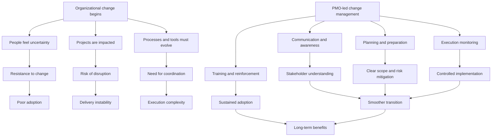

# Change Management Fundamentals in a PMO

## 1. Core idea in one sentence

**Change management in a PMO is the structured discipline that helps people, projects, and the organization transition effectively through change while protecting alignment, continuity, and long-term value.**

---

## 2. Ultra-short memory anchors

Use these as fast mental hooks:

* **Change = moving from current state to future state**
* **Change management = structure for transition**
* **PMO = enabler of organized change**
* **Without change management = resistance, confusion, disruption**
* **With change management = alignment, adoption, sustainability**
* **A strong PMO does not only manage projects — it helps people adapt to transformation**

---

## 3. Smart synthesis

This paragraph introduces a central idea: **change is unavoidable**, but successful change is rarely spontaneous. It must be **managed deliberately**.

The content starts from a familiar reality: when organizations introduce something new — for example software, tools, structures, or ways of working — people often react with hesitation or resistance. That resistance is not necessarily irrational; it usually comes from uncertainty, fear of disruption, or concern about capability and adaptation. This is why **change management matters**.

In business terms, **change** means any meaningful shift in how the organization operates. It may affect structures, processes, strategies, technologies, culture, or even the company’s response to external pressures such as competition or economic shifts. So change is not only internal transformation; it is also adaptation to the external environment. 

**Change management** is then defined as a **structured approach** for guiding individuals, teams, and organizations through that transition. The key point is that change management is not just about launching change; it is about ensuring **smooth implementation** and **lasting benefits**. In other words, success is not the announcement of the change, but its adoption and sustainability. 

Within a **PMO context**, change management becomes broader and more strategic. It is not limited to one project. It means overseeing how organizational transformation affects **projects, resources, and stakeholders**, and ensuring these elements adapt in line with new strategies, technologies, or processes. This makes the PMO a **bridge between transformation and execution**. 

The paragraph then clarifies the **role of the PMO**: PMOs act as **facilitators of change**. They ensure that project management tools, methods, and processes evolve consistently with the organization’s strategic direction. Their job is not only to control delivery, but to provide the **structure, communication, resources, risk oversight, and training support** needed for change to succeed. 

A very important interview insight here is this:

**The PMO is not a passive observer of transformation. It is an active mechanism that translates strategic change into operational adoption.**

---

## 4. The real logic of change management

| Element               | Meaning                                                            | What to remember                                    |
| --------------------- | ------------------------------------------------------------------ | --------------------------------------------------- |
| **Change**            | A shift from the current state to a different future state         | Organizations must adapt to survive and improve     |
| **Change Management** | A structured way to guide people and operations through transition | Change must be managed, not improvised              |
| **PMO Role**          | Coordinates and supports change across projects and stakeholders   | PMO turns strategic change into organized execution |
| **Goal**              | Smooth implementation plus sustainable benefits                    | Adoption matters more than announcement             |

---

## 5. Why change management matters

### Key idea

A change is only successful when people, processes, and projects are able to **move together** without losing clarity, performance, or strategic direction.

### Main reasons it matters

| Reason                            | Explanation                                       | Practical implication                     |
| --------------------------------- | ------------------------------------------------- | ----------------------------------------- |
| **Minimizes disruption**          | Reduces operational instability during transition | Less chaos during implementation          |
| **Improves engagement**           | Helps employees understand and accept the change  | Higher adoption and lower resistance      |
| **Supports alignment**            | Keeps change connected to strategic goals         | Transformation stays purposeful           |
| **Increases success probability** | Provides a roadmap, not just an announcement      | Better outcomes for projects and business |

### Memory sentence

**Change management turns uncertainty into guided transition.**

### Interview phrasing

> “Change management is essential because organizational change affects not only systems and processes, but also people, project execution, and strategic continuity. A PMO helps make that transition structured, understandable, and sustainable.”

---

## 6. PMO’s role in change management

### Key idea

The PMO acts as the **organizational stabilizer** during transformation.

### Main responsibilities

| PMO responsibility        | Meaning                                                             | Practical effect                   |
| ------------------------- | ------------------------------------------------------------------- | ---------------------------------- |
| **Strategic alignment**   | Ensures change initiatives support business goals                   | Change is relevant, not random     |
| **Communication support** | Keeps stakeholders informed and engaged                             | Reduces confusion and resistance   |
| **Risk oversight**        | Identifies and mitigates issues linked to change                    | Fewer surprises and better control |
| **Training support**      | Helps employees build the skills required by the new reality        | Better adoption and confidence     |
| **Project support**       | Gives project managers structure and resources to handle transition | Smoother execution                 |

### Memory sentence

**The PMO makes change navigable.**

### Interview phrasing

> “In change management, the PMO plays a facilitative role: it aligns change with strategy, equips project teams with structure and resources, and ensures communication, risk management, and capability-building are in place.”

---

## 7. The four key phases of the change management process

This paragraph introduces a very important sequence.

| Phase                                   | PMO contribution                                                                        | What to remember                    |
| --------------------------------------- | --------------------------------------------------------------------------------------- | ----------------------------------- |
| **1. Awareness and Communication**      | Explains why change is needed, what benefits it brings, and what outcomes are expected  | People support what they understand |
| **2. Planning and Preparation**         | Defines scope, assesses impact, allocates resources, and prepares mitigation strategies | Change needs a real plan            |
| **3. Implementation and Execution**     | Coordinates rollout, monitors progress, and makes adjustments                           | Execution must stay controlled      |
| **4. Sustainability and Reinforcement** | Embeds new ways of working through training, monitoring, and reinforcement              | Change must last, not fade          |

### Memory sentence

**Explain → Prepare → Execute → Reinforce**

That sequence is very useful for recall in interviews.

---

## 8. Types of changes PMOs may manage

The module groups change into four broad categories:

| Type of change            | Meaning                                            | Example logic                     |
| ------------------------- | -------------------------------------------------- | --------------------------------- |
| **Process change**        | Changes in methods, workflows, or procedures       | New project delivery methodology  |
| **Technology change**     | Introduction of new systems or tools               | New software platform             |
| **Organizational change** | Restructuring teams, roles, or responsibilities    | New reporting lines or team setup |
| **Strategic change**      | Shifts in priorities, direction, or business goals | Portfolio reprioritization        |

### Memory sentence

**PMOs manage change in how work is done, what tools are used, who does the work, and why the work matters.**

---

## 9. Common challenges and how to overcome them

### Key idea

Change is not difficult only because it is complex. It is difficult because it affects human behavior, limited resources, and coordination quality.

| Challenge                    | Why it happens                                                     | PMO response                                                  |
| ---------------------------- | ------------------------------------------------------------------ | ------------------------------------------------------------- |
| **Resistance to change**     | Fear, uncertainty, habit, concern about impact                     | Clear communication, leadership support, employee involvement |
| **Resource constraints**     | Change needs time, money, and people in parallel with ongoing work | Prioritization and resource balancing                         |
| **Communication breakdowns** | Information becomes fragmented or inconsistent                     | Clear and stable communication channels                       |

### Memory sentence

**Most change problems are people, priority, and communication problems.**

### Interview phrasing

> “The main barriers to change are usually resistance, resource pressure, and communication gaps. The PMO helps reduce these by creating structure, prioritization, and clear stakeholder engagement.”

---

## 10. Cause-effect map



---

## 11. PMO logic in one compact schema

```text
Change Management in a PMO
= Strategic alignment
+ Stakeholder communication
+ Planning and preparation
+ Controlled implementation
+ Risk mitigation
+ Training and capability building
+ Reinforcement and sustainability
```

---

## 12. PMO interview language

### Strong concise definition

> “Change management in a PMO is the structured coordination of organizational transition so that projects, people, and resources can adapt effectively while remaining aligned with strategic objectives.”

### More senior version

> “A mature PMO does not treat change as a one-time event, but as a managed transition that requires communication, planning, execution discipline, risk oversight, and reinforcement to deliver sustainable business outcomes.”

### NLP-style persuasive phrasing

Useful expressions for interviews:

* **guide the organization through transition**
* **translate strategic change into operational adoption**
* **create clarity during transformation**
* **reduce resistance through communication and engagement**
* **protect delivery continuity while enabling change**
* **embed new ways of working**
* **turn change into sustainable value**
* **maintain alignment between transformation and execution**

---

## 13. How to map this to your own experience

This section is especially useful for your interviews.

| Concept                              | How you can map your experience                                                                                  |
| ------------------------------------ | ---------------------------------------------------------------------------------------------------------------- |
| **Awareness and communication**      | Explaining the rationale behind platform, compliance, certification, or migration changes to stakeholders        |
| **Planning and preparation**         | Defining impact, dependencies, resources, and mitigation actions before rollout                                  |
| **Implementation and execution**     | Coordinating cross-functional teams during releases, migrations, or operational changes                          |
| **Sustainability and reinforcement** | Ensuring new processes are stabilized, monitored, and understood after go-live                                   |
| **Resistance to change**             | Managing tensions across teams when priorities, tools, or governance models evolve                               |
| **Strategic alignment**              | Connecting operational changes to regulatory needs, business continuity, delivery targets, and platform strategy |
| **Training and support**             | Helping teams understand new controls, flows, responsibilities, or systems                                       |

### Your interview bridge

> “In regulated and cross-functional environments, change management is not optional. I’ve seen that successful transformation depends on making the reason for change clear, preparing teams early, coordinating execution carefully, and reinforcing adoption so the change becomes part of stable operations.”

---

## 14. What to remember before a colloquium

Memorize this chain:

```text
Change creates uncertainty.
Uncertainty creates resistance and disruption.
Change management provides structure.
The PMO provides that structure across projects, people, and stakeholders.
Its goal is not just to launch change,
but to make change understood, adopted, and sustainable.
```

---

## 15. 30-second recap

Change management is the structured approach used to help individuals, teams, and organizations move successfully through transformation. In a PMO context, it means coordinating how change affects projects, resources, and stakeholders, while keeping everything aligned with strategic objectives. The PMO supports this through communication, planning, risk management, implementation control, and reinforcement. The real aim is not simply change itself, but **successful and lasting adoption**. 

---

## 16. Flashcards — Senior Level

### Flashcard 1

**Q:** Why is change management essential in a PMO context?
**A:** Because organizational change affects projects, stakeholders, and resources simultaneously, and the PMO provides the structure needed to coordinate that transition effectively.

### Flashcard 2

**Q:** What is the difference between change and change management?
**A:** Change is the shift itself; change management is the structured approach used to guide people and operations through that shift successfully.

### Flashcard 3

**Q:** Why is communication the first phase of change management?
**A:** Because stakeholders are more likely to support a change when they understand why it is needed, what benefits it brings, and what outcomes are expected.

### Flashcard 4

**Q:** What makes PMO-led change management strategic rather than administrative?
**A:** It aligns transformation with business goals and ensures projects, tools, and methodologies evolve consistently with organizational direction.

### Flashcard 5

**Q:** Why is planning and preparation critical in change management?
**A:** Because change affects scope, resources, risks, and project priorities, and without preparation disruption becomes much more likely.

### Flashcard 6

**Q:** What is the purpose of the sustainability and reinforcement phase?
**A:** To make the change stick through training, monitoring, and continued support, so adoption becomes durable rather than temporary.

### Flashcard 7

**Q:** What types of change may a PMO need to manage?
**A:** Process, technology, organizational, and strategic changes.

### Flashcard 8

**Q:** What are the most common obstacles in managing change?
**A:** Resistance to change, resource constraints, and communication breakdowns.

### Flashcard 9

**Q:** How does a PMO reduce resistance to change?
**A:** By combining clear communication, leadership support, employee engagement, and practical support such as training and guidance.

### Flashcard 10

**Q:** What is a strong interview statement about PMO and change management?
**A:** A PMO enables successful transformation by translating strategic change into structured execution, stakeholder adoption, and sustainable business value.

