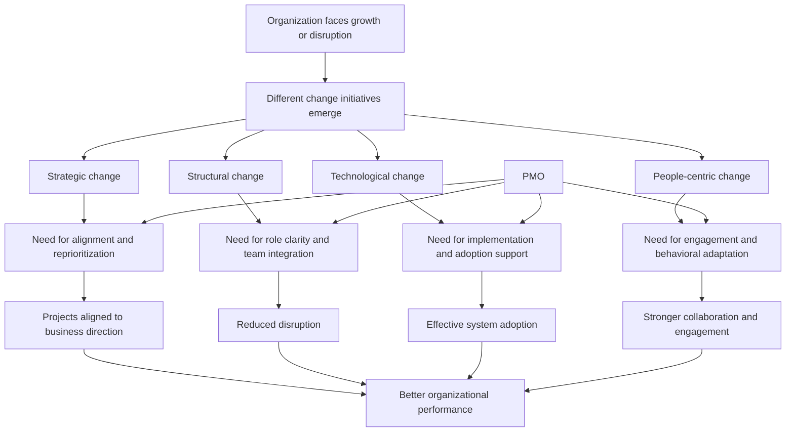

# Types of Organizational Change and the PMO’s Role

## 1. Core idea in one sentence

**A PMO helps organizations manage four major types of change—strategic, structural, technological, and people-centric—by aligning them with business goals, reducing disruption, and supporting adoption.**

---

## 2. Ultra-short memory anchors

Use these as mental hooks:

* **4 change types = strategy, structure, technology, people**
* **Each change type = different risk, different support**
* **PMO = integrator across all change dimensions**
* **No structured change = confusion, resistance, misalignment**
* **PMO = clarity + prioritization + adoption**
* **A mature PMO does not treat change as one generic event — it tailors the response to the type of change**

---

## 3. Smart synthesis

This paragraph expands the previous concept of change management by introducing a more practical and strategic lens: **not all change is the same**. Organizations may face different categories of transformation, and each one requires a different response from the PMO. 

The module identifies **four main types of change initiatives**:

1. **Strategic change**
2. **Structural change**
3. **Technological change**
4. **People-centric change** 

This classification is extremely important because it helps you reason like a PMO professional rather than just memorize theory. A strong PMO does not apply one identical method to every transformation. Instead, it recognizes **what is changing**, **where the impact falls**, **which stakeholders are affected**, and **what support mechanisms are needed**.

The TechInnovate scenario is useful because it shows that organizations often experience **multiple change types at the same time**. For example, TechInnovate is restructuring management hierarchy, adopting advanced software, and shifting toward a more collaborative culture—all under the umbrella of strategic growth. This means change management is often **multi-layered**, not isolated. 

The PMO’s role across these changes is to act as a **coordinating intelligence layer**. It ensures that change is not fragmented across departments, but instead remains aligned to broader business priorities. In practice, this means prioritizing initiatives, managing transitions, supporting communication, coordinating stakeholders, enabling training, and monitoring adoption. 

A senior insight to remember:

**The PMO is not only managing projects during change. It is managing the organization’s capacity to absorb change without losing performance or direction.**

---

## 4. The four types of organizational change

| Type of change            | Meaning                                                      | What to remember                             |
| ------------------------- | ------------------------------------------------------------ | -------------------------------------------- |
| **Strategic change**      | Shifts in long-term goals, mission, or direction             | Changes **where the organization is going**  |
| **Structural change**     | Changes in roles, reporting lines, or organizational setup   | Changes **how the organization is arranged** |
| **Technological change**  | Introduction of new tools, systems, or automation            | Changes **how work is done**                 |
| **People-centric change** | Changes in culture, collaboration, well-being, or engagement | Changes **how people behave and interact**   |

### Memory sentence

**Strategy sets direction, structure organizes power, technology changes execution, and people-centric change transforms behavior.**

---

## 5. Strategic change

### Key idea

Strategic change redefines the organization’s direction, and the PMO ensures projects follow that direction instead of continuing by inertia.

### How the PMO supports strategic change

| PMO action                                        | Meaning                                               | Practical effect                   |
| ------------------------------------------------- | ----------------------------------------------------- | ---------------------------------- |
| **Aligning projects with strategic goals**        | Evaluates projects against the new business direction | Portfolio stays relevant           |
| **Prioritizing high-impact initiatives**          | Focuses resources on initiatives that matter most     | Better strategic return            |
| **Facilitating cross-departmental collaboration** | Connects functions and stakeholders during change     | Stronger enterprise-wide alignment |

### Challenges in strategic change

| Challenge                   | Why it matters                                                              |
| --------------------------- | --------------------------------------------------------------------------- |
| **Departmental resistance** | Teams may resist new priorities that disrupt established ways of working    |
| **Lack of clarity**         | If strategy is vague, teams cannot connect their work to business direction |

### Memory sentence

**Strategic change fails when priorities are unclear and projects keep moving in the old direction.**

### Interview phrasing

> “In strategic change, the PMO ensures the portfolio reflects the new business direction by realigning initiatives, reprioritizing investments, and creating cross-functional alignment.”

---

## 6. Structural change

### Key idea

Structural change alters roles, teams, and decision paths, so the PMO helps preserve clarity and continuity during reorganization.

### How the PMO supports structural change

| PMO action                                | Meaning                                                            | Practical effect              |
| ----------------------------------------- | ------------------------------------------------------------------ | ----------------------------- |
| **Redefining roles and responsibilities** | Works with leaders to clarify new duties                           | Reduces ambiguity             |
| **Supporting team integration**           | Coordinates transitions when teams merge or are reshaped           | Limits operational disruption |
| **Managing change resistance**            | Explains the benefits of the new structure and supports adaptation | Improves acceptance           |

### Challenges in structural change

| Challenge                | Why it matters                                       |
| ------------------------ | ---------------------------------------------------- |
| **Workflow disruption**  | New structures can temporarily slow coordination     |
| **Employee uncertainty** | People may worry about their role, status, or future |

### Memory sentence

**Structural change creates uncertainty unless roles, interfaces, and expectations are made visible quickly.**

### Interview phrasing

> “In structural change, the PMO helps stabilize the transition by clarifying responsibilities, coordinating team integration, and reducing disruption through communication and support.”

---

## 7. Technological change

### Key idea

Technological change introduces new tools or systems, and the PMO ensures implementation is not just technical, but usable and adopted.

### How the PMO supports technological change

| PMO action                             | Meaning                                                  | Practical effect          |
| -------------------------------------- | -------------------------------------------------------- | ------------------------- |
| **Facilitating system implementation** | Coordinates rollout with relevant teams such as IT       | More organized deployment |
| **Monitoring the transition**          | Tracks usage, issues, and performance after introduction | Faster issue resolution   |
| **Providing training and support**     | Helps employees learn and use new tools effectively      | Better adoption           |

### Challenges in technological change

| Challenge            | Why it matters                                           |
| -------------------- | -------------------------------------------------------- |
| **Technical issues** | Bugs or implementation problems can undermine confidence |
| **User adoption**    | Employees may remain attached to old tools and habits    |

### Memory sentence

**A new system is not a success when it is installed; it is a success when it is adopted.**

### Interview phrasing

> “For technological change, the PMO creates the bridge between implementation and adoption by coordinating deployment, monitoring early usage, and ensuring training and support are in place.”

---

## 8. People-centric change

### Key idea

People-centric change focuses on culture, collaboration, engagement, and behavior, which makes it the most human and often the most delicate type of change.

### How the PMO supports people-centric change

| PMO action                            | Meaning                                                          | Practical effect    |
| ------------------------------------- | ---------------------------------------------------------------- | ------------------- |
| **Fostering a collaborative culture** | Enables cross-functional work and smoother interaction           | Better teamwork     |
| **Encouraging employee engagement**   | Supports initiatives that improve motivation and growth          | Stronger commitment |
| **Addressing resistance**             | Communicates benefits and provides support during the transition | Higher acceptance   |

### Challenges in people-centric change

| Challenge                    | Why it matters                                           |
| ---------------------------- | -------------------------------------------------------- |
| **Cultural resistance**      | People may not identify with the new values or behaviors |
| **Maintaining productivity** | Behavioral adaptation can temporarily reduce efficiency  |

### Memory sentence

**People-centric change is not only about new behaviors; it is about making those behaviors feel meaningful, safe, and sustainable.**

### Interview phrasing

> “In people-centric change, the PMO supports the human side of transformation by enabling collaboration, reinforcing engagement, and helping teams adapt to cultural shifts without losing momentum.”

---

## 9. One comparative table to fix the concepts

| Change type        | Main focus                    | Typical PMO contribution                                 | Main risk                                 |
| ------------------ | ----------------------------- | -------------------------------------------------------- | ----------------------------------------- |
| **Strategic**      | Direction and priorities      | Alignment, prioritization, cross-functional coordination | Misalignment and unclear priorities       |
| **Structural**     | Roles and organization design | Role clarity, transition support, team integration       | Confusion and workflow disruption         |
| **Technological**  | Tools and systems             | Rollout coordination, training, monitoring               | Low adoption and technical issues         |
| **People-centric** | Culture and behavior          | Engagement, collaboration, communication support         | Cultural resistance and productivity drop |

---

## 10. Best practices for integrating change management into PMO processes

The reading closes with a practical framework for PMO maturity. These are not isolated tips; together, they form a repeatable model. 

| Best practice                                          | Meaning                                               | Why it matters                      |
| ------------------------------------------------------ | ----------------------------------------------------- | ----------------------------------- |
| **Align change initiatives with strategic objectives** | Evaluate every change against long-term goals         | Prevents low-value effort           |
| **Develop a clear change management plan**             | Define objectives, timelines, resources, KPIs         | Creates structure and measurability |
| **Engage stakeholders early**                          | Involve leadership and impacted groups from the start | Builds buy-in                       |
| **Provide adequate training and support**              | Equip people to adapt to new tools or processes       | Supports adoption                   |
| **Monitor and adjust as necessary**                    | Use feedback and performance data to course-correct   | Keeps change on track               |

### Memory sentence

**Align, plan, engage, train, monitor.**

That 5-word sequence is worth memorizing.

---

## 11. Cause-effect map



---

## 12. PMO logic in one compact schema

```text id="m4s8v1"
PMO-led change management
= Understand the type of change
+ identify the affected stakeholders
+ tailor the support model
+ align with strategy
+ communicate clearly
+ enable adoption
+ monitor outcomes
```

---

## 13. PMO interview language

### Strong concise definition

> “A PMO supports organizational change by tailoring governance, coordination, and adoption mechanisms to the specific type of transformation involved—strategic, structural, technological, or people-centric.”

### More senior version

> “A mature PMO recognizes that different categories of change create different organizational risks, and it responds by combining strategic alignment, stakeholder coordination, capability-building, and execution control to ensure sustainable transformation.”

### NLP-style persuasive phrasing

Useful expressions for interviews:

* **tailor the change approach to the nature of the transformation**
* **maintain alignment between change initiatives and long-term objectives**
* **create role clarity during reorganization**
* **support adoption, not just implementation**
* **strengthen organizational capacity to absorb change**
* **enable cross-functional transitions with minimal disruption**
* **translate change into operational stability and business value**

---

## 14. How to map this to your own experience

This section is where the theory becomes interview-ready.

| Concept                       | How you can map your experience                                                                                          |
| ----------------------------- | ------------------------------------------------------------------------------------------------------------------------ |
| **Strategic change**          | Reprioritizing initiatives based on business continuity, regulatory priorities, rollout strategy, or migration direction |
| **Structural change**         | Coordinating changes in responsibilities, governance flows, escalation paths, or team interfaces                         |
| **Technological change**      | Supporting rollout of platforms, tools, environments, integrations, or upgraded systems                                  |
| **People-centric change**     | Helping teams adapt to new processes, compliance expectations, ways of working, or cross-functional collaboration        |
| **Stakeholder engagement**    | Aligning IT, business, operations, external partners, and support functions around transformation goals                  |
| **Training and support**      | Explaining new processes, controls, tools, or operating models so adoption becomes smoother                              |
| **Monitoring and adjustment** | Tracking issues during transition and correcting course when resistance or disruption emerges                            |

### Your interview bridge

> “What I find most relevant is that organizational change is rarely only one thing. In real environments, strategy, structure, technology, and people often shift together. The PMO’s value is to keep these layers coordinated, aligned, and implementable.”

---

## 15. What to remember before a colloquium

Memorize this sequence:

```text id="t8kq21"
Not all change is the same.
There are four major types:
strategic, structural, technological, people-centric.
Each one affects the organization differently.
The PMO adds value by recognizing those differences
and adapting governance, communication, and support accordingly.
```

---

## 16. 30-second recap

Organizations typically face four main types of change: strategic, structural, technological, and people-centric. Each one affects the business in a different way and creates different challenges. The PMO helps manage all four by aligning them with business goals, clarifying roles, supporting implementation, enabling adoption, and monitoring outcomes. The deeper lesson is that PMO effectiveness depends not only on managing change, but on managing the **right type of change in the right way**. 

---

## 17. Flashcards — Senior Level

### Flashcard 1

**Q:** What are the four main types of organizational change discussed in the module?
**A:** Strategic, structural, technological, and people-centric change.

### Flashcard 2

**Q:** Why is it important for a PMO to distinguish between types of change?
**A:** Because each type affects different parts of the organization and requires different support mechanisms, risks controls, and stakeholder strategies.

### Flashcard 3

**Q:** What is the PMO’s role in strategic change?
**A:** To align projects with the new direction, prioritize high-impact initiatives, and support cross-departmental collaboration.

### Flashcard 4

**Q:** What is the main PMO contribution during structural change?
**A:** Providing clarity around roles, responsibilities, and team integration while reducing disruption during reorganization.

### Flashcard 5

**Q:** Why is technological change not just an IT issue?
**A:** Because successful technological change depends not only on deployment, but also on training, adoption, and ongoing support.

### Flashcard 6

**Q:** What makes people-centric change especially complex?
**A:** It affects behaviors, culture, engagement, and collaboration, which are less visible and harder to standardize than process or system changes.

### Flashcard 7

**Q:** What are the main risks of strategic change?
**A:** Resistance from departments and lack of clarity about the new direction.

### Flashcard 8

**Q:** What are the main risks of structural change?
**A:** Workflow disruption and employee uncertainty.

### Flashcard 9

**Q:** What are the main risks of technological change?
**A:** Technical issues and slow user adoption.

### Flashcard 10

**Q:** What are the main risks of people-centric change?
**A:** Cultural resistance and temporary drops in productivity.

### Flashcard 11

**Q:** What are the key best practices for integrating change management into PMO processes?
**A:** Align with strategy, build a clear plan, engage stakeholders early, provide training and support, and monitor and adjust continuously.

### Flashcard 12

**Q:** What is a strong senior-level statement about PMO and organizational change?
**A:** A mature PMO increases transformation success by recognizing the specific nature of each change initiative and tailoring governance, communication, and support to ensure sustainable adoption.
