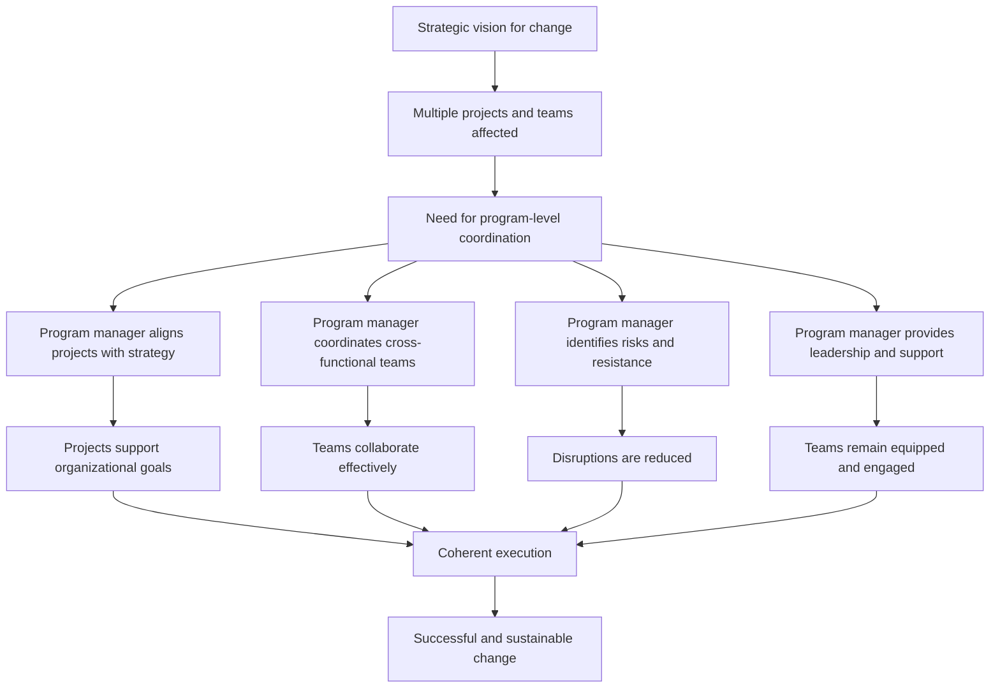

# The Role of Program Managers in Change Management

## 1. Core idea in one sentence

**Program managers make organizational change executable by translating strategic intent into coordinated action across multiple projects, teams, and stakeholders.**

---

## 2. Ultra-short memory anchors

Use these as fast mental hooks:

* **Program manager = bridge between vision and execution**
* **Change across many projects = program leadership needed**
* **Program manager = alignment + coordination + support**
* **No program oversight = fragmented change**
* **Program manager = roadmap, buy-in, risk control, continuity**
* **A strong program manager does not only track delivery — they make transformation workable across the organization**

---

## 3. Smart synthesis

This paragraph shifts the focus from the **PMO as a structure** to the **program manager as a change leader**. The key idea is that when change becomes large, cross-functional, and multi-project, someone must convert the high-level vision into an organized path that teams can actually follow. That person is the **program manager**. 

The transcript defines change management as a structured approach for moving individuals, teams, and organizations from a current state to a desired future state with minimal disruption. In that context, the program manager’s role is to oversee the execution of complex initiatives that involve major changes to processes, technologies, or structures. Their mission is not limited to one project; they must ensure that **all projects within the program are aligned with the change objectives** and that teams are supported during the transition. 

This makes the program manager a **connector across levels**. They sit between senior leadership, project managers, and operational teams. Leadership defines the vision, project managers handle individual execution streams, and teams perform the work. The program manager ensures these layers do not drift apart. In practical terms, they make sure the vision is clearly communicated, operationalized, monitored, and adjusted when reality creates friction. 

The paragraph highlights four major dimensions of the program manager’s role in change:

1. **Aligning change initiatives with strategic objectives**
2. **Coordinating cross-functional teams**
3. **Handling risks and reducing resistance**
4. **Providing leadership and support** 

That combination is important. It shows that program managers are not just planners. They are also **navigators of organizational complexity**. They protect alignment, maintain communication across functions, identify risks early, and ensure teams have the resources and support needed to move forward.

A strong interview insight here is:

**A program manager does not simply manage a group of projects; they manage the organization’s ability to execute change coherently at scale.**

---

## 4. Program manager logic in change management

| Element                            | Meaning                                                                   | What to remember                      |
| ---------------------------------- | ------------------------------------------------------------------------- | ------------------------------------- |
| **Strategic alignment**            | Ensures projects contribute to the intended change and business direction | Change must support long-term goals   |
| **Cross-functional coordination**  | Connects teams across departments and functions                           | Change must be synchronized           |
| **Risk and resistance management** | Anticipates issues before they destabilize the initiative                 | Problems must be managed early        |
| **Leadership and support**         | Helps project managers and teams stay equipped and engaged                | Change needs guidance, not only plans |

### Memory sentence

**The program manager turns change from a broad ambition into a coordinated operating reality.**

---

## 5. Why program managers are central to change

### Key idea

Program managers become essential when change affects **many projects, multiple departments, and shared business outcomes** at the same time.

### Why their role matters

| Reason                                       | Explanation                                                        | Practical implication                               |
| -------------------------------------------- | ------------------------------------------------------------------ | --------------------------------------------------- |
| **Change spans multiple projects**           | Individual projects cannot optimize the whole transformation alone | Someone must manage the bigger picture              |
| **Stakeholders operate at different levels** | Leadership, project managers, and teams need alignment             | Communication must flow vertically and horizontally |
| **Dependencies create complexity**           | Risks, resources, and timelines interact across projects           | Coordination becomes critical                       |
| **Resistance and uncertainty emerge**        | Teams may push back or struggle to adapt                           | Support and mitigation must be built in             |

### Memory sentence

**The larger the change, the more the organization needs program-level coordination.**

### Interview phrasing

> “Program managers are especially valuable in large-scale change because they integrate multiple projects into one coherent transition path, ensuring alignment, dependency management, and stakeholder coordination.”

---

## 6. Core role of the program manager during change

### Key idea

The program manager acts as the **execution architect** of change.

### Main role areas

| Role area                               | Meaning                                             | Practical effect              |
| --------------------------------------- | --------------------------------------------------- | ----------------------------- |
| **Aligning projects with strategy**     | Keeps all projects linked to organizational goals   | Prevents fragmented effort    |
| **Coordinating cross-functional teams** | Connects departments and stakeholders               | Improves cohesion             |
| **Managing risks and resistance**       | Detects issues early and defines mitigation actions | Protects momentum             |
| **Providing leadership and support**    | Ensures teams have tools, resources, and guidance   | Increases delivery confidence |

### Memory sentence

**Align, coordinate, protect, support.**

That 4-word sequence is excellent for memory.

---

## 7. Responsibilities of program managers managing change

This paragraph gives a practical operating model.

| Responsibility                                   | Meaning                                                    | Why it matters                 |
| ------------------------------------------------ | ---------------------------------------------------------- | ------------------------------ |
| **Developing a change management plan**          | Defines scope, milestones, timelines, resources, and risks | Provides a roadmap             |
| **Engaging stakeholders early and continuously** | Builds support among leaders and managers                  | Increases buy-in               |
| **Monitoring progress and adjusting**            | Reviews timelines and resources, then adapts when needed   | Keeps the initiative on track  |
| **Communicating the vision for change**          | Explains the purpose of change and expected behaviors      | Creates clarity and commitment |

### Memory sentence

**Plan the change, secure support, track reality, explain the vision.**

### Interview phrasing

> “A program manager managing change needs to combine planning discipline with active stakeholder engagement, continuous monitoring, and clear communication of the transformation vision.”

---

## 8. Key strategies for successful change implementation

The module then shifts from responsibilities to actionable strategies.

| Strategy                                        | Meaning                                                   | Practical value              |
| ----------------------------------------------- | --------------------------------------------------------- | ---------------------------- |
| **Engage stakeholders early**                   | Secure support before resistance hardens                  | Reduces friction             |
| **Communicate regularly**                       | Keep teams informed about progress and next steps         | Sustains alignment           |
| **Provide training and development**            | Equip people with new capabilities                        | Improves readiness           |
| **Identify risks early**                        | Detect issues such as resource gaps or technical problems | Enables proactive mitigation |
| **Ensure ongoing support after implementation** | Reinforce the change with follow-up help                  | Makes change sustainable     |

### Memory sentence

**Early buy-in, steady communication, capability building, proactive mitigation, ongoing reinforcement.**

---

## 9. What makes program managers different from project managers here

This distinction is useful for interviews, even if the module does not state it explicitly in a table.

| Project manager focus             | Program manager focus                                      |
| --------------------------------- | ---------------------------------------------------------- |
| Delivery of an individual project | Coherence across multiple related projects                 |
| Local execution and scope control | Strategic alignment and integration                        |
| Managing one team or stream       | Coordinating many teams and stakeholders                   |
| Project-level risks               | Cross-project risks, resistance, and organizational impact |

### Memory sentence

**Project managers deliver parts of the change; program managers make the parts work together.**

---

## 10. Common risk areas the program manager must watch

The transcript mentions several examples that are highly practical. 

| Risk area                                 | Example from the logic of the paragraph                      | Program manager response                           |
| ----------------------------------------- | ------------------------------------------------------------ | -------------------------------------------------- |
| **Resource limitations**                  | Not enough people, time, or budget to support the transition | Rebalance priorities or timelines                  |
| **Technical problems**                    | New systems or processes create implementation issues        | Escalate, coordinate, and mitigate early           |
| **Team resistance**                       | Pushback from teams affected by the change                   | Involve key stakeholders and improve communication |
| **Loss of momentum after implementation** | Change is introduced but not sustained                       | Provide continued support and reinforcement        |

---

## 11. Cause-effect map



---

## 12. Program manager logic in one compact schema

```text id="sq8u2d"
Program manager in change management
= translate vision into roadmap
+ align projects to strategy
+ coordinate departments
+ manage cross-project risks
+ engage stakeholders
+ communicate continuously
+ reinforce adoption
```

---

## 13. Program manager interview language

### Strong concise definition

> “A program manager enables successful change by coordinating multiple projects, aligning them with strategic objectives, and supporting teams through implementation with clear communication, risk management, and stakeholder engagement.”

### More senior version

> “In large-scale transformation, the program manager acts as the integrator between strategic intent and operational reality, ensuring that change is sequenced, understood, resourced, and sustained across the full program landscape.”

### NLP-style persuasive phrasing

Useful expressions for interviews:

* **translate strategic intent into executable steps**
* **create coherence across multiple change streams**
* **align delivery with transformation objectives**
* **reduce fragmentation during large-scale change**
* **sustain momentum across teams and stakeholders**
* **anticipate resistance and mitigate it early**
* **provide the structure that makes change adoptable**
* **connect leadership vision to frontline execution**

---

## 14. How to map this to your own experience

This part is especially valuable for your interview positioning.

| Concept                               | How you can map your experience                                                                                   |
| ------------------------------------- | ----------------------------------------------------------------------------------------------------------------- |
| **Multi-project coordination**        | Coordinating parallel workstreams, releases, certifications, migrations, or dependencies across teams             |
| **Strategic alignment**               | Connecting initiatives to broader rollout goals, regulatory deadlines, business continuity, or platform evolution |
| **Cross-functional collaboration**    | Aligning IT, operations, compliance, business, support, and external stakeholders                                 |
| **Risk and resistance handling**      | Anticipating blockers, resource issues, sequencing conflicts, or stakeholder pushback                             |
| **Change plan development**           | Structuring milestones, impact assessments, dependencies, and mitigation actions                                  |
| **Ongoing support and reinforcement** | Following through after go-live or implementation to stabilize processes and ensure adoption                      |
| **Communication of vision**           | Explaining not only what is changing, but why it matters and what outcomes are expected                           |

### Your interview bridge

> “What resonates with me is that large-scale change is rarely successful through isolated project control alone. It needs program-level coordination to align multiple streams, manage dependencies, keep stakeholders engaged, and maintain focus on the intended business outcome.”

---

## 15. What to remember before a colloquium

Memorize this sequence:

```text id="f6w2ma"
Big change affects many projects.
Many projects create dependency and communication risk.
The program manager connects strategy, teams, and execution.
They plan the transition,
engage stakeholders,
monitor progress,
manage risks,
and sustain support.
```

---

## 16. 30-second recap

Program managers play a central role in change management when transformation spans multiple projects or teams. They align projects with strategic goals, coordinate cross-functional collaboration, manage risks and resistance, and provide support to project managers and teams. Their responsibilities include building the change plan, engaging stakeholders, monitoring progress, communicating the vision, and reinforcing the change after implementation. Their real value is making complex change executable, coherent, and sustainable. 

---

## 17. Flashcards — Senior Level

### Flashcard 1

**Q:** Why are program managers especially important in large-scale change initiatives?
**A:** Because they coordinate multiple related projects and ensure the full transformation remains aligned, integrated, and manageable across teams and stakeholders.

### Flashcard 2

**Q:** What is the core role of a program manager in change management?
**A:** To oversee complex multi-project transformation and ensure all projects align with change objectives while teams are supported through the transition.

### Flashcard 3

**Q:** Why is strategic alignment a central responsibility of program managers during change?
**A:** Because change initiatives create value only when projects support the organization’s broader goals and long-term direction.

### Flashcard 4

**Q:** What does it mean that a program manager is a bridge between leadership and execution?
**A:** It means they translate strategic vision into coordinated actions that project managers and teams can implement effectively.

### Flashcard 5

**Q:** Why is cross-functional coordination so critical in change programs?
**A:** Because transformation usually affects multiple departments, and without coordination the organization risks fragmentation, delays, and conflicting priorities.

### Flashcard 6

**Q:** What are the main components of a program manager’s change management plan?
**A:** Scope, milestones, timelines, resource allocation, and risk assessment.

### Flashcard 7

**Q:** Why must stakeholders be engaged early and continuously?
**A:** Because early buy-in reduces resistance, strengthens sponsorship, and improves the probability of sustained support.

### Flashcard 8

**Q:** What kinds of risks must program managers identify early in a change initiative?
**A:** Resource constraints, technical issues, stakeholder resistance, and any factor that could disrupt implementation.

### Flashcard 9

**Q:** Why is ongoing support after implementation still part of change management?
**A:** Because change is not complete at go-live; it must be reinforced so teams can adopt and sustain the new way of working.

### Flashcard 10

**Q:** What is a strong senior-level statement about program managers and change?
**A:** A program manager enables enterprise change by integrating strategy, projects, stakeholders, and risk management into one coordinated transition path.
