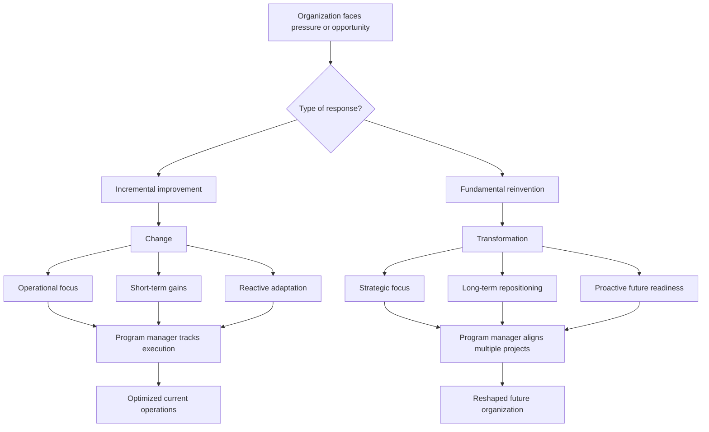

# Change vs Transformation in Program Management

## 1. Core idea in one sentence

**In program management, change improves the existing organization step by step, while transformation reshapes the organization more fundamentally for long-term strategic success.**

---

## 2. Ultra-short memory anchors

Use these as fast mental hooks:

* **Change = improve**
* **Transformation = reimagine**
* **Change = incremental + operational + short-term**
* **Transformation = fundamental + strategic + long-term**
* **Change solves current problems**
* **Transformation prepares the future**
* **Program manager must know whether the initiative is optimization or reinvention**

---

## 3. Smart synthesis

This paragraph introduces a distinction that is extremely important for interviews and for PMO/program thinking: **change and transformation are related, but they are not the same thing**. Confusing them leads to wrong expectations, wrong governance, and wrong success criteria. 

The module explains that **change** means making smaller, incremental improvements to improve how things currently work. Its purpose is usually to solve operational problems, remove inefficiencies, or improve performance. It is generally narrower in scope, shorter in time horizon, and more immediate in visible benefits. Updating software, refining workflows, or reducing delays are classic examples of change. 

**Transformation**, by contrast, is not about optimizing the current model. It is about **rethinking the model itself**. It redefines how the business operates, often touching strategy, culture, operating model, decision-making, and market positioning. Transformation is therefore broader, deeper, and more future-oriented. It prepares the organization for a new context, not just for better performance inside the old one. 

The TechInnovate examples make this distinction concrete. Upgrading project management software is a **change**, because it improves workflow efficiency without altering the company’s overall strategy or structure. Moving from a traditional project management model to an agile framework is a **transformation**, because it changes collaboration patterns, governance logic, and delivery philosophy across the organization. 

This paragraph also sharpens the role of the **program manager**. In change initiatives, the program manager focuses on operational improvement: aligning projects to short-term targets, allocating resources, tracking progress, and ensuring delivery. In transformation, the program manager operates on a different altitude: coordinating multiple projects, aligning them with long-term strategic goals, engaging a wider stakeholder ecosystem, and helping the organization adapt to new ways of working and thinking. 

A senior-level takeaway:

**Change asks: “How can we improve what we do now?”
Transformation asks: “How must we become different to succeed in the future?”**

---

## 4. The core distinction at a glance

| Dimension           | Change                               | Transformation                          |
| ------------------- | ------------------------------------ | --------------------------------------- |
| **Scope**           | Incremental improvement              | Fundamental reinvention                 |
| **Purpose**         | Fix or optimize current operations   | Redefine the organization’s future      |
| **Focus**           | Operational                          | Strategic                               |
| **Time horizon**    | Short-term                           | Long-term                               |
| **Typical trigger** | Reaction to pressure or inefficiency | Proactive response to future disruption |
| **Impact**          | Local or limited                     | Enterprise-wide and deep                |

### Memory sentence

**Change improves the current system; transformation redesigns the system.**

---

## 5. What change really means

### Key idea

Change is about **improving performance without changing the core identity of the organization**.

### Key characteristics of change

| Characteristic        | Meaning                                                    | What to remember              |
| --------------------- | ---------------------------------------------------------- | ----------------------------- |
| **Incremental**       | Built through small step-by-step improvements              | Optimization, not reinvention |
| **Operational focus** | Aims to improve efficiency, workflows, or technology usage | Better execution              |
| **Short-term impact** | Benefits appear relatively quickly                         | Fast problem-solving          |
| **Reactive response** | Often triggered by internal or external pressure           | Adaptation to current needs   |

### Example logic

* upgrading software
* refining workflows
* reducing delays
* improving productivity
* solving immediate operational issues

### Memory sentence

**Change fine-tunes the machine.**

### Interview phrasing

> “Change initiatives are typically incremental and operational in nature. They focus on improving current performance, solving efficiency gaps, and delivering measurable short-term benefits.”

---

## 6. What transformation really means

### Key idea

Transformation is about **changing the logic of the organization itself** so it can thrive in a different future.

### Key characteristics of transformation

| Characteristic         | Meaning                                          | What to remember               |
| ---------------------- | ------------------------------------------------ | ------------------------------ |
| **Fundamental shift**  | Redefines strategy, processes, and culture       | The organization changes shape |
| **Strategic focus**    | Driven by long-term goals and future positioning | Future readiness               |
| **Long-term impact**   | Benefits unfold over time and reshape direction  | Sustainable strategic change   |
| **Proactive approach** | Anticipates disruption and prepares for it       | Forward-looking adaptation     |

### Example logic

* changing the business model
* moving to a new delivery philosophy
* shifting organizational culture
* repositioning in the market
* restructuring how decisions are made

### Memory sentence

**Transformation redesigns the machine.**

### Interview phrasing

> “Transformation goes beyond operational improvement. It is a strategic reconfiguration of how the organization works, competes, and creates value over the long term.”

---

## 7. Change vs transformation — the practical comparison

| Area                        | Change                                 | Transformation                                           |
| --------------------------- | -------------------------------------- | -------------------------------------------------------- |
| **Question it answers**     | How can we improve current operations? | How must we evolve for future success?                   |
| **What usually changes**    | Processes, systems, workflows          | Strategy, culture, operating model                       |
| **Leadership pattern**      | Often managed closer to delivery       | Led by senior leadership and coordinated across programs |
| **Program manager posture** | Execution and optimization             | Orchestration and strategic steering                     |
| **Success measure**         | Efficiency, speed, cost, productivity  | Strategic readiness, adoption, long-term business impact |

---

## 8. Role of the program manager in change

### Key idea

In change initiatives, the program manager ensures **targeted improvements happen in a controlled and efficient way**.

### Main responsibilities in change

| Responsibility                                   | Meaning                                                 | Practical effect        |
| ------------------------------------------------ | ------------------------------------------------------- | ----------------------- |
| **Aligning projects with short-term objectives** | Keeps initiatives linked to immediate operational goals | Better relevance        |
| **Coordinating resources**                       | Ensures teams have what they need                       | Smoother execution      |
| **Tracking progress and adjusting**              | Monitors results and intervenes when needed             | Keeps delivery on track |

### Memory sentence

**In change, the program manager optimizes execution.**

### Interview phrasing

> “When managing change, the program manager focuses on ensuring that improvement initiatives are well-resourced, aligned to immediate goals, and monitored closely for timely delivery.”

---

## 9. Role of the program manager in transformation

### Key idea

In transformation, the program manager helps the organization **navigate a long, complex, strategic journey**.

### Main responsibilities in transformation

| Responsibility                                    | Meaning                                                 | Practical effect          |
| ------------------------------------------------- | ------------------------------------------------------- | ------------------------- |
| **Aligning projects with long-term goals**        | Ensures all projects contribute to the future direction | Strategic coherence       |
| **Coordinating across the organization**          | Connects leadership, departments, and external partners | Enterprise-wide alignment |
| **Supporting cultural and behavioral adaptation** | Helps teams adjust to new ways of working and thinking  | Stronger adoption         |

### Memory sentence

**In transformation, the program manager orchestrates evolution.**

### Interview phrasing

> “In transformation programs, the program manager’s role becomes more strategic: they integrate multiple projects, align them with long-term business goals, and help the organization absorb new operating models and behaviors.”

---

## 10. The deepest conceptual difference

This is the distinction to remember for interviews:

```text id="twf7gc"
Change = better performance inside the current model
Transformation = a new model for future performance
```

That is the sharpest summary of the whole paragraph.

---

## 11. Cause-effect map



---

## 12. Program manager logic in one compact schema

```text id="4s93md"
If the initiative improves current performance = change
If the initiative redefines future direction = transformation

Program manager in change
= align short-term goals
+ resource coordination
+ progress monitoring

Program manager in transformation
= align long-term strategy
+ orchestrate cross-functional programs
+ support cultural adaptation
```

---

## 13. PMO / program interview language

### Strong concise definition

> “Change and transformation differ mainly in scale and intent: change improves existing operations, while transformation redefines the organization’s future direction and operating model.”

### More senior version

> “From a program perspective, change is typically an execution-centered response to current operational needs, whereas transformation is a strategic redesign of how the organization creates value, competes, and works over time.”

### NLP-style persuasive phrasing

Useful expressions for interviews:

* **distinguish optimization from reinvention**
* **improve within the current operating model**
* **reshape the organization for future relevance**
* **move from short-term fixes to long-term repositioning**
* **protect delivery while enabling evolution**
* **orchestrate enterprise-wide transformation**
* **align immediate execution with future strategic intent**

---

## 14. How to map this to your own experience

This section is crucial for making the concept usable in interviews.

| Concept                   | How you can map your experience                                                                                                       |
| ------------------------- | ------------------------------------------------------------------------------------------------------------------------------------- |
| **Change**                | Software updates, process refinements, compliance improvements, release optimizations, issue resolution                               |
| **Transformation**        | Platform migration, operating model redesign, new governance approaches, strategic rollout shifts, broader cross-functional evolution |
| **Short-term alignment**  | Driving initiatives linked to immediate delivery, efficiency, or regulatory targets                                                   |
| **Long-term alignment**   | Supporting programs that reshape platform direction, organizational coordination, or strategic capability                             |
| **Resource coordination** | Balancing teams, milestones, dependencies, and constraints during implementation                                                      |
| **Cultural adaptation**   | Helping teams move toward new ways of working, new governance expectations, or broader collaboration models                           |

### Your interview bridge

> “In practice, I find it useful to distinguish whether an initiative is improving the current environment or redefining the future one. That distinction changes governance, stakeholder engagement, timelines, and how success should be measured.”

---

## 15. What to remember before a colloquium

Memorize this chain:

```text id="s42pqz"
Change is incremental.
Transformation is fundamental.

Change improves how the organization works today.
Transformation redesigns how the organization will work tomorrow.

Change is operational, shorter-term, and often reactive.
Transformation is strategic, longer-term, and often proactive.
```

---

## 16. 30-second recap

Change and transformation are different in scope, purpose, and impact. Change is incremental, operational, short-term, and usually focused on improving existing processes or systems. Transformation is broader, strategic, long-term, and aimed at redefining how the organization operates and competes. For program managers, this distinction matters because change requires strong execution control, while transformation requires strategic orchestration across multiple projects, stakeholders, and cultural shifts. 

---

## 17. Flashcards — Senior Level

### Flashcard 1

**Q:** What is the main difference between change and transformation?
**A:** Change improves the current state incrementally, while transformation fundamentally redefines the organization for future success.

### Flashcard 2

**Q:** Why is this distinction important for program managers?
**A:** Because each requires different governance, timelines, stakeholder engagement, and success metrics.

### Flashcard 3

**Q:** What are the core characteristics of change?
**A:** Incremental, operationally focused, short-term in impact, and often reactive.

### Flashcard 4

**Q:** What are the core characteristics of transformation?
**A:** Fundamental, strategically focused, long-term in impact, and proactive.

### Flashcard 5

**Q:** Why is upgrading project management software considered change rather than transformation?
**A:** Because it improves workflow efficiency without redefining the organization’s overall strategy, structure, or culture.

### Flashcard 6

**Q:** Why is moving from a traditional model to an agile framework considered transformation?
**A:** Because it changes collaboration, decision-making, delivery logic, and often organizational culture.

### Flashcard 7

**Q:** What is the role of the program manager in change initiatives?
**A:** To align projects with short-term objectives, coordinate resources, track progress, and ensure operational improvements are implemented effectively.

### Flashcard 8

**Q:** What is the role of the program manager in transformation initiatives?
**A:** To coordinate multiple projects around long-term strategic goals, engage diverse stakeholders, and support organizational adaptation.

### Flashcard 9

**Q:** What kind of organizational focus does change usually have?
**A:** It focuses on efficiency, performance improvement, and immediate operational gains.

### Flashcard 10

**Q:** What kind of organizational focus does transformation usually have?
**A:** It focuses on future readiness, long-term competitiveness, and strategic repositioning.

### Flashcard 11

**Q:** What is a strong interview statement to distinguish change from transformation?
**A:** Change improves performance within the current operating model, while transformation redesigns the operating model itself for future success.

### Flashcard 12

**Q:** What is the most useful mental shortcut to remember this paragraph?
**A:** Change fine-tunes the machine; transformation redesigns the machine.
