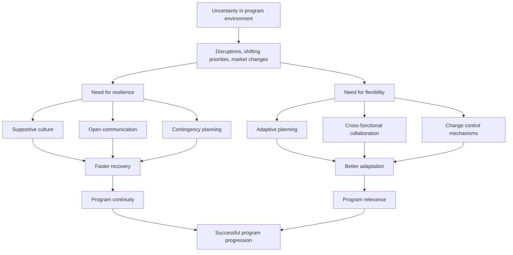

# Resilience and Flexibility in Program Management

## 1. Core idea in one sentence

**Resilience and flexibility enable program managers to absorb disruptions, adapt to change, and keep programs moving toward their objectives without losing strategic direction.**

---

## 2. Ultra-short memory anchors

Use these as fast mental hooks:

* **Resilience = recover**
* **Flexibility = adjust**
* **Resilience protects momentum**
* **Flexibility protects relevance**
* **No resilience = disruption stops progress**
* **No flexibility = rigid plans fail in changing conditions**
* **A strong program manager stays steady under pressure and adaptable in execution**

---

## 3. Smart synthesis

This paragraph introduces two essential leadership capabilities in program management: **resilience** and **flexibility**. The key message is simple but powerful: even the best-designed program will face uncertainty, so success depends not only on planning, but also on the ability to recover and adapt without losing focus. 

The module defines **resilience** as the ability to recover from disruptions, while **flexibility** is the ability to adjust plans, resources, or actions in response to changing circumstances. These two traits are complementary. Resilience is what helps the program continue after a setback; flexibility is what helps the program adapt before rigidity becomes failure. 

In the TechInnovate scenario, the program manager plays a visible role in modeling these behaviors. This matters because resilience and flexibility are not only technical operating principles; they are also cultural signals. When the program manager leads calmly, adapts intelligently, and creates a supportive environment, those behaviors spread through the team. In that sense, resilience and flexibility are both **execution capabilities** and **leadership multipliers**. 

The paragraph then separates the two ideas more clearly:

* **Building resilience** means preparing the program and the people to recover quickly from disruptions.
* **Building flexibility** means designing the program so it can adjust to changing needs, priorities, or market conditions. 

To build resilience, the module highlights:

* fostering a supportive culture,
* maintaining effective communication,
* and developing robust contingency plans. 

To build flexibility, it highlights:

* adaptive planning,
* cross-functional collaboration,
* and change control mechanisms. 

It then adds practical tools such as:

* risk assessment and mitigation,
* simulation exercises,
* dashboards and KPIs,
* integrated change control,
* and configuration management. 

A strong senior insight is this:

**Resilience helps a program survive disruption.
Flexibility helps a program stay aligned with reality.**

---

## 4. The core distinction at a glance

| Dimension             | Resilience                      | Flexibility                                   |
| --------------------- | ------------------------------- | --------------------------------------------- |
| **Main meaning**      | Recover from disruption         | Adjust to changing conditions                 |
| **Primary value**     | Protect continuity and momentum | Protect relevance and responsiveness          |
| **Typical focus**     | Recovery capacity               | Adaptation capacity                           |
| **Leadership signal** | Calm persistence under pressure | Intelligent adjustment without losing control |
| **Program outcome**   | Setbacks do not stop progress   | Plans do not become obsolete                  |

### Memory sentence

**Resilience keeps the program standing; flexibility keeps the program moving in the right direction.**

---

## 5. What resilience means in program management

### Key idea

Resilience is the program’s ability to **withstand shocks and recover quickly without losing momentum or purpose**.

### Key strategies for building resilience

| Strategy                           | Meaning                                                     | Practical effect                      |
| ---------------------------------- | ----------------------------------------------------------- | ------------------------------------- |
| **Fostering a supportive culture** | Encourages teams to see setbacks as learning opportunities  | Faster psychological recovery         |
| **Effective communication**        | Makes it easier to surface issues early and respond quickly | Better coordination during disruption |
| **Robust contingency planning**    | Prepares backup paths for critical milestones               | Less delay when problems occur        |

### Memory sentence

**Resilience is planned recovery, not passive endurance.**

### Interview phrasing

> “In program management, resilience means building the conditions for fast recovery from disruption through supportive leadership, open communication, and contingency planning.”

---

## 6. What flexibility means in program management

### Key idea

Flexibility is the program’s ability to **adapt intelligently when assumptions, priorities, or conditions change**.

### Key strategies for building flexibility

| Strategy                           | Meaning                                                 | Practical effect            |
| ---------------------------------- | ------------------------------------------------------- | --------------------------- |
| **Adaptive planning**              | Plans are designed to evolve as new information appears | Less rigidity               |
| **Cross-functional collaboration** | Teams can shift priorities or resources more easily     | Faster coordinated response |
| **Change control mechanisms**      | Adjustments are managed in a disciplined way            | Adaptation without chaos    |

### Memory sentence

**Flexibility is controlled adaptation, not improvisation.**

### Interview phrasing

> “Flexibility in program management means designing plans and governance so the program can respond to changing conditions without undermining its core objectives.”

---

## 7. Why both are essential during change and transformation

### Key idea

Programs dealing with change and transformation operate in uncertainty, so they need both the capacity to **recover** and the capacity to **adjust**.

| Why needed                       | Resilience contribution                   | Flexibility contribution              |
| -------------------------------- | ----------------------------------------- | ------------------------------------- |
| **Shifting priorities**          | Helps the team stay composed and continue | Allows reprioritization               |
| **Market changes**               | Prevents loss of momentum                 | Supports strategic adjustment         |
| **Unexpected setbacks**          | Enables recovery from disruption          | Enables redesign of next steps        |
| **Long transformation journeys** | Sustains energy and continuity            | Keeps the approach relevant over time |

### Memory sentence

**In unstable environments, resilience protects continuity and flexibility protects fit.**

---

## 8. Practical tools for resilience and flexibility

The paragraph gives concrete tools that are useful for recall and interviews. 

| Tool                               | Purpose                                                             | Why it matters                          |
| ---------------------------------- | ------------------------------------------------------------------- | --------------------------------------- |
| **Risk assessment and mitigation** | Identify disruptions early and prepare responses                    | Reduces surprise                        |
| **Simulation exercises**           | Test contingency plans in controlled conditions                     | Reveals weaknesses before real crises   |
| **Progress monitoring tools**      | Use dashboards and KPIs to track execution health                   | Enables proactive intervention          |
| **Integrated change control**      | Manage changes to scope, timeline, or resources in a structured way | Supports disciplined adaptation         |
| **Configuration management**       | Maintain consistency across changing program components             | Prevents conflict and loss of integrity |

### Memory sentence

**Good program management does not wait for disruption; it anticipates, tests, tracks, and controls it.**

---

## 9. Rolling-wave planning and why it matters

One particularly useful concept here is **rolling-wave planning**. The paragraph mentions it as a way to support adaptive planning. 

### Simple meaning

Rolling-wave planning means planning the **near term in detail** while keeping the **farther future at a higher level**, so the plan can evolve as reality becomes clearer.

### Why it is powerful

| Benefit                         | Explanation                                             |
| ------------------------------- | ------------------------------------------------------- |
| **Keeps execution concrete**    | Immediate actions are clear                             |
| **Preserves adaptability**      | Later steps can be refined when new information emerges |
| **Fits uncertain environments** | Useful when transformation is still evolving            |

### Memory sentence

**Detail what is near, stay flexible on what is far.**

---

## 10. Integrated change control and configuration management

These two concepts are easy to confuse, so it is useful to separate them clearly.

| Concept                       | Meaning                                                        | What to remember                                |
| ----------------------------- | -------------------------------------------------------------- | ----------------------------------------------- |
| **Integrated change control** | Evaluates and manages changes to scope, timeline, or resources | Controls how change is approved and introduced  |
| **Configuration management**  | Ensures changes remain consistent across components            | Protects coherence after changes are introduced |

### Memory sentence

**Change control decides the change; configuration management keeps the system coherent after the change.**

---

## 11. Cause-effect map



---

## 12. Program manager logic in one compact schema

```text id="r2mv8x"
Resilience
= recover from disruption
+ maintain momentum
+ support people through setbacks

Flexibility
= adapt plans and resources
+ respond to new conditions
+ preserve alignment with objectives

Together
= continuity + adaptability
```

---

## 13. Program manager interview language

### Strong concise definition

> “Resilience and flexibility are essential in program management because they allow teams to recover from setbacks and adapt to changing conditions without losing alignment to strategic goals.”

### More senior version

> “A resilient and flexible program does not rely on static planning alone; it combines recovery capability, adaptive governance, and disciplined change control to remain effective under uncertainty.”

### NLP-style persuasive phrasing

Useful expressions for interviews:

* **maintain momentum under uncertainty**
* **recover quickly from disruption**
* **adapt without losing strategic focus**
* **build recovery capability into program design**
* **enable controlled responsiveness**
* **keep execution aligned with evolving realities**
* **turn setbacks into learning and adjustment**
* **protect program integrity while adapting delivery**

---

## 14. How to map this to your own experience

This is where the concept becomes useful in interviews.

| Concept                  | How you can map your experience                                                                        |
| ------------------------ | ------------------------------------------------------------------------------------------------------ |
| **Resilience**           | Recovering from blockers, delays, issues, or changing conditions while keeping the program progressing |
| **Flexibility**          | Adjusting priorities, sequencing, dependencies, timelines, or resource usage when realities shift      |
| **Supportive culture**   | Helping teams remain constructive under pressure and treating setbacks as manageable, not paralyzing   |
| **Open communication**   | Keeping stakeholders informed when issues arise and enabling fast alignment                            |
| **Contingency planning** | Preparing fallback paths, mitigations, or alternative sequencing                                       |
| **Adaptive planning**    | Managing near-term detail while keeping longer-term paths adjustable                                   |
| **Change control**       | Ensuring modifications are evaluated and introduced in a structured way                                |
| **Progress monitoring**  | Using dashboards, checkpoints, KPIs, or regular governance to detect risk early                        |

### Your interview bridge

> “What I find especially true in complex programs is that planning alone is never enough. Real program leadership requires both resilience—the ability to recover from disruption—and flexibility—the ability to adapt the path while keeping the destination clear.”

---

## 15. What to remember before a colloquium

Memorize this chain:

```text id="x8q2uj"
Unexpected things will happen.
Resilience helps the program recover.
Flexibility helps the program adapt.
Together they prevent disruption from becoming failure.
The program manager builds both through culture, planning, communication, and control.
```

---

## 16. 30-second recap

Resilience and flexibility are critical in program management because uncertainty is unavoidable during change and transformation. Resilience helps teams recover from setbacks and maintain momentum, while flexibility helps programs adapt to shifting priorities, market conditions, and new requirements. Program managers build these capabilities through supportive culture, effective communication, contingency planning, adaptive planning, cross-functional collaboration, and disciplined change control. Together, these capabilities keep programs both stable and adaptable. 

---

## 17. Flashcards — Senior Level

### Flashcard 1

**Q:** What is resilience in program management?
**A:** The ability to recover from disruptions without losing momentum or overall direction.

### Flashcard 2

**Q:** What is flexibility in program management?
**A:** The ability to adjust plans, resources, or objectives in response to changing conditions while preserving core goals.

### Flashcard 3

**Q:** Why are resilience and flexibility both necessary?
**A:** Because programs must survive setbacks and also adapt to evolving realities; recovery without adaptation is insufficient, and adaptation without stability is chaotic.

### Flashcard 4

**Q:** What are the key strategies for building resilience?
**A:** Fostering a supportive culture, maintaining effective communication, and preparing contingency plans.

### Flashcard 5

**Q:** What are the key strategies for building flexibility?
**A:** Adaptive planning, cross-functional collaboration, and structured change control mechanisms.

### Flashcard 6

**Q:** What is rolling-wave planning and why is it useful?
**A:** It is a planning method that defines near-term work in detail and future work at a higher level, enabling adaptability as conditions evolve.

### Flashcard 7

**Q:** Why are simulation exercises useful in resilient program management?
**A:** Because they test contingency plans before real disruptions occur and reveal weaknesses that can be corrected early.

### Flashcard 8

**Q:** What is the role of dashboards and KPIs in resilience and flexibility?
**A:** They help monitor progress continuously so the program manager can detect issues early and respond proactively.

### Flashcard 9

**Q:** What is integrated change control?
**A:** The structured management of changes to scope, timelines, or resources so the program can adapt without losing control.

### Flashcard 10

**Q:** What is configuration management?
**A:** The discipline of ensuring that changes remain consistent across program components and do not create conflicts.

### Flashcard 11

**Q:** What is a strong senior-level statement about resilience and flexibility?
**A:** Strong program management combines resilience to absorb disruption and flexibility to adapt intelligently, ensuring continuity and alignment under uncertainty.

### Flashcard 12

**Q:** What is the best mental shortcut to remember this paragraph?
**A:** Resilience recovers; flexibility adjusts.
