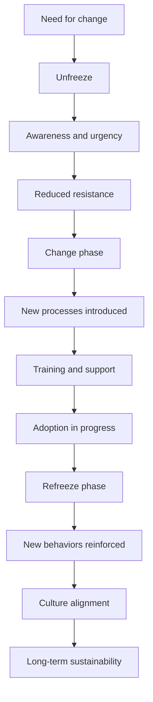

# Lewin’s Change Management Model

## 1. Core idea in one sentence

**Lewin’s Change Management Model structures transformation into three essential phases: prepare the organization, implement the change, and stabilize it for long-term success.**

---

## 2. Ultra-short memory anchors

Use these as **mental hooks**:

* **Lewin = 3 phases**
* **Unfreeze = break the status quo**
* **Change = introduce new ways**
* **Refreeze = make it stick**
* **Change is not complete until it is stabilized**
* **Preparation and reinforcement are as important as execution**

---

## 3. Smart synthesis

This paragraph introduces **Lewin’s Change Management Model**, one of the earliest and most foundational frameworks in change management. Its power lies in its **simplicity and completeness**: it does not only focus on implementing change but emphasizes that organizations must first **prepare people** and then **stabilize new behaviors**. 

The model is built around three phases:

1. **Unfreeze** → challenge the current state
2. **Change** → implement new processes and behaviors
3. **Refreeze** → embed the change into culture

The deeper insight is critical:

**Most transformations fail not because change is introduced, but because people are not prepared before it or because the change is not reinforced after it.**

---

## 4. The core logic of the model

| Phase        | Purpose                               | Outcome                          |
| ------------ | ------------------------------------- | -------------------------------- |
| **Unfreeze** | Prepare the organization for change   | Readiness and reduced resistance |
| **Change**   | Implement new processes and behaviors | Transition in progress           |
| **Refreeze** | Stabilize and embed change            | Long-term adoption               |

### Memory sentence

**Lewin works because it treats change as a journey: preparation → transition → stabilization.**

---

## 5. Why Lewin is powerful

| Strength           | Explanation                              |
| ------------------ | ---------------------------------------- |
| **Clarity**        | Simple and easy to communicate           |
| **Completeness**   | Covers before, during, and after change  |
| **Human focus**    | Addresses resistance and adaptation      |
| **Sustainability** | Emphasizes embedding change into culture |

### Memory sentence

**Lewin is simple, but it captures the full lifecycle of change.**

---

## 6. The 3 phases at a glance

| Phase        | Core purpose                            | Best remembered as         |
| ------------ | --------------------------------------- | -------------------------- |
| **Unfreeze** | Prepare and challenge the current state | **Break old habits**       |
| **Change**   | Implement new ways of working           | **Move to the new state**  |
| **Refreeze** | Stabilize and reinforce change          | **Lock in the new normal** |

---

## 7. Phase 1 — Unfreeze

### Key idea

The organization must **let go of the current way of working** before adopting a new one.

In the TechInnovate scenario, leadership highlights:

* slow response to technological change
* increasing competition
* need for agile practices (AI, IoT, digital transformation)

They present data and involve stakeholders to create urgency and reduce resistance. 

### What to remember

* Challenge the status quo
* Create awareness of the need for change
* Address fears and resistance early
* Engage key stakeholders

### Memory sentence

**No one changes if they still believe the current way works.**

### Interview phrasing

> “The unfreeze phase is critical because it prepares both the organization and its people by making the need for change visible and credible.”

---

## 8. Phase 2 — Change

### Key idea

This is where the organization **moves to the new way of working**.

At TechInnovate:

* Agile frameworks (Scrum, Kanban) are introduced
* Teams shift to iterative delivery (sprints)
* Training and workshops support adoption
* Leadership provides continuous coaching and support 

### What to remember

* Change is both technical and behavioral
* Training and support are essential
* Iteration and feedback accelerate adaptation
* Leadership must stay actively involved

### Memory sentence

**Change is not just introducing tools — it is enabling new behaviors.**

### Interview phrasing

> “During the change phase, success depends on how effectively the organization supports people with training, tools, and continuous guidance.”

---

## 9. Phase 3 — Refreeze

### Key idea

The goal is to **make the change permanent**.

At TechInnovate:

* Agile practices become part of daily operations
* New KPIs focus on speed, collaboration, innovation
* Leadership models new behaviors
* Reward systems reinforce desired outcomes 

### What to remember

* Reinforcement is essential
* Culture absorbs the change
* Systems and metrics must align
* Recognition and rewards strengthen adoption

### Memory sentence

**If you don’t reinforce change, people revert to old habits.**

### Interview phrasing

> “Refreezing ensures that change becomes part of the organizational culture, supported by systems, behaviors, and performance metrics.”

---

## 10. Cause-effect map



---

## 11. Simple schema to memorize

```text
Lewin
= Unfreeze (prepare)
+ Change (implement)
+ Refreeze (stabilize)
```

---

## 12. What this paragraph is really teaching

| Surface concept      | Deeper meaning                               |
| -------------------- | -------------------------------------------- |
| Three phases         | Change must follow a sequence                |
| Unfreeze matters     | People must accept the need for change       |
| Change phase matters | Execution needs support and structure        |
| Refreeze matters     | Sustainability depends on reinforcement      |
| Leadership role      | Leaders guide, support, and reinforce change |

---

## 13. NLP-style phrases for interviews

Use these to sound more senior:

* **challenge the status quo**
* **create readiness for change**
* **support behavioral transition**
* **enable adoption through training and coaching**
* **reinforce change through systems and incentives**
* **embed new practices into organizational culture**
* **align performance metrics with new behaviors**
* **prevent regression to legacy practices**

---

## 14. How to map this to your own experience

| Lewin phase               | Experience mapping                                                          |
| ------------------------- | --------------------------------------------------------------------------- |
| **Unfreeze**              | Explaining why a transformation (platform, compliance, migration) is needed |
| **Change**                | Implementing new tools, processes, or delivery models                       |
| **Refreeze**              | Embedding governance, KPIs, and operational routines                        |
| **Resistance management** | Handling stakeholder concerns and adoption challenges                       |
| **Training & enablement** | Supporting teams through transition                                         |
| **Cultural shift**        | Moving from legacy to modern ways of working                                |

### Interview bridge

> “What I find valuable in Lewin’s model is the emphasis on preparation and reinforcement. In my experience, change initiatives succeed when people are prepared before the transition and supported until the new way becomes standard.”

### Stronger senior bridge

> “Lewin’s model reflects a key reality of transformation: execution alone is not enough. Organizations must first create readiness and then institutionalize the change through culture, metrics, and leadership behavior.”

---

## 15. What to remember before a colloquium

Memorize this sequence:

```text
First, people must understand why change is needed.
Then, they must be supported through the transition.
Finally, the new way must become the norm.
```

---

## 16. 30-second recap

Lewin’s Change Management Model is a simple but powerful framework based on three phases: **Unfreeze, Change, and Refreeze**. It starts by preparing the organization and challenging the current state, then moves into implementing new processes and behaviors, and finally stabilizes the change by embedding it into culture, systems, and performance metrics. Its strength lies in addressing not just execution, but also preparation and long-term sustainability. 

---

## 17. Flashcards — Senior Level

### Flashcard 1

**Q:** Why is the Unfreeze phase critical in Lewin’s model?
**A:** Because without readiness and awareness, employees resist change and remain attached to the status quo.

### Flashcard 2

**Q:** What is the biggest risk of skipping the Unfreeze phase?
**A:** Implementing change in an organization that is not psychologically or operationally prepared.

### Flashcard 3

**Q:** What differentiates the Change phase from simple implementation?
**A:** It includes support mechanisms like training, coaching, and continuous feedback.

### Flashcard 4

**Q:** Why is the Refreeze phase often underestimated?
**A:** Because organizations focus on rollout but fail to reinforce and stabilize new behaviors.

### Flashcard 5

**Q:** What mechanisms help “refreeze” change effectively?
**A:** KPIs, governance, leadership behavior, reward systems, and cultural reinforcement.

### Flashcard 6

**Q:** What is the main strength of Lewin’s model compared to more complex frameworks?
**A:** Its simplicity makes it easy to apply and communicate while still covering the full change lifecycle.

### Flashcard 7

**Q:** How does Lewin address resistance to change?
**A:** By preparing the organization early and involving stakeholders during the Unfreeze phase.

### Flashcard 8

**Q:** Why is Lewin still relevant in modern agile environments?
**A:** Because even fast-paced organizations need structured preparation and reinforcement for sustainable change.

### Flashcard 9

**Q:** In practical terms, what does “refreezing” look like?
**A:** Embedding new practices into daily routines, systems, and organizational culture.

### Flashcard 10

**Q:** What is the strongest insight behind Lewin’s model?
**A:** Change is successful only when people are prepared before it and supported until it becomes the new normal.

---

Vai avanti con il prossimo file e manteniamo questa qualità 🔥
