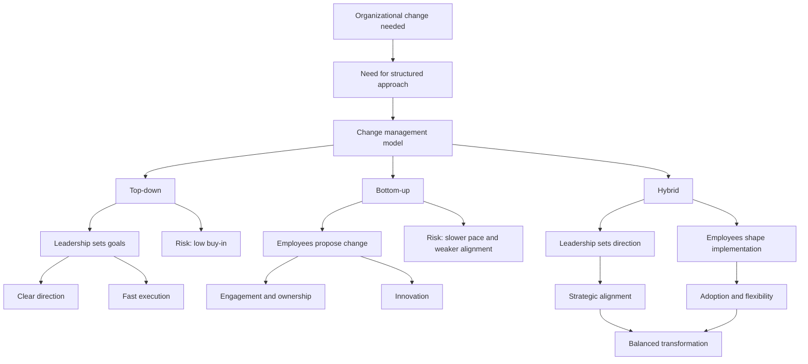

# Change Management Models: Top-Down, Bottom-Up, and Hybrid Approaches

## 1. Core idea in one sentence

**Change management models are structured frameworks that help organizations plan, implement, and stabilize change so transitions become clearer, less risky, and more sustainable.**

---

## 2. Ultra-short memory anchors

Use these as fast **mental hooks**:

* **Change model = roadmap for transition**
* **Top-down = direction from leadership**
* **Bottom-up = ideas from employees**
* **Hybrid = strategy + engagement**
* **Best change is not only imposed — it is also adopted**
* **Sustainable transformation needs both alignment and ownership**

---

## 3. Smart synthesis

This paragraph introduces **change management models** as practical frameworks that help organizations move from a current state to a desired future state in a more controlled and effective way. The point is not only to “make change happen,” but to make it happen in a way that is **structured, understandable, and sustainable**.

The content emphasizes that these models matter because organizations rarely fail only because of strategy. Very often, they fail because change is poorly introduced, weakly communicated, resisted by employees, or not stabilized over time. A change model reduces that risk by giving leaders and teams a **clear method** to follow.

The module organizes change management approaches into **two broad families**:

1. **Top-down change**
2. **Bottom-up change**

And then it shows that, in real organizational life, a **hybrid approach** is often the most effective because it combines the strengths of both.

This is the key interview insight:
**change succeeds when leadership provides direction and employees provide adoption, realism, and innovation.**

---

## 4. Why change management models matter

| Function of the model | Meaning                                       | Why it matters        |
| --------------------- | --------------------------------------------- | --------------------- |
| **Planning**          | Creates a structured path for change          | Reduces confusion     |
| **Implementation**    | Guides execution of the change initiative     | Improves coordination |
| **Stabilization**     | Helps the organization make the change stick  | Prevents regression   |
| **Risk reduction**    | Anticipates resistance and operational issues | Protects outcomes     |
| **Sustainability**    | Supports long-term adoption                   | Ensures change lasts  |

### Memory sentence

**A change model is valuable because it turns change from disruption into a managed transition.**

---

## 5. The two major approaches

| Approach      | Core logic                                                    | Main strength                      | Main risk                      |
| ------------- | ------------------------------------------------------------- | ---------------------------------- | ------------------------------ |
| **Top-down**  | Leaders define the change and employees execute it            | Clear direction and speed          | Low buy-in                     |
| **Bottom-up** | Employees identify improvements and leadership supports them  | Ownership and innovation           | Weak alignment / slower pace   |
| **Hybrid**    | Leaders define direction while employees shape implementation | Balance of strategy and engagement | Requires stronger coordination |

---

## 6. Top-down approach

### Key idea

In a **top-down model**, change is initiated and guided by senior leadership. Leaders define the vision, strategic goals, and execution path.

### What to remember

* Leadership sets the direction
* The organization aligns around common goals
* It works well for **large-scale or urgent transformation**
* It is useful when consistency and speed matter

### Typical associated models

* **Kotter’s Eight-Step Change Model**
* **Lewin’s Change Management Model**

### Benefits

| Benefit                  | Explanation                                                    |
| ------------------------ | -------------------------------------------------------------- |
| **Clear direction**      | Everyone understands where the organization is going           |
| **Strategic alignment**  | Departments move toward common objectives                      |
| **Quick implementation** | Decision-making is faster because leadership drives the change |

### Challenges

| Challenge                       | Explanation                                                      |
| ------------------------------- | ---------------------------------------------------------------- |
| **Lack of employee buy-in**     | Employees may feel change is imposed on them                     |
| **Disengagement**               | People may comply formally without fully supporting the change   |
| **Over-reliance on leadership** | Important operational insight from frontline teams may be missed |

### Memory sentence

**Top-down change is strong on direction, but weaker on emotional adoption.**

### Interview phrasing

> “A top-down model is particularly effective when an organization needs speed, coherence, and strategic alignment, but it must be supported by communication and engagement to avoid resistance.”

---

## 7. Bottom-up approach

### Key idea

In a **bottom-up model**, change emerges from employees or teams who identify problems, propose improvements, and contribute ideas that leadership then supports.

### What to remember

* Ideas come from operational reality
* Employees participate actively in shaping change
* This increases commitment and ownership
* It is often strong in innovative or adaptive environments

### Benefits

| Benefit                       | Explanation                                                              |
| ----------------------------- | ------------------------------------------------------------------------ |
| **Employee engagement**       | People feel involved in the process                                      |
| **Ownership**                 | Employees are more likely to support what they help build                |
| **Innovation and creativity** | Frontline teams often see problems and solutions earlier than management |

### Challenges

| Challenge                    | Explanation                                                              |
| ---------------------------- | ------------------------------------------------------------------------ |
| **Slower implementation**    | Ideas need review, sponsorship, and coordination                         |
| **Possible fragmentation**   | Different teams may push different priorities                            |
| **Weak strategic alignment** | Without leadership direction, ideas may not support the broader strategy |

### Memory sentence

**Bottom-up change is strong on ownership, but weaker on consistency and speed.**

### Interview phrasing

> “Bottom-up approaches are powerful when organizations want to unlock operational insight, innovation, and employee commitment, but they require leadership guidance to remain strategically aligned.”

---

## 8. Hybrid approach

### Key idea

A **hybrid approach** combines leadership-driven strategic direction with employee-driven feedback, innovation, and participation.

This is presented as the most balanced and often the most effective model, especially in complex transformation contexts.

### Why it works

| Hybrid strength                      | Meaning                                                                      |
| ------------------------------------ | ---------------------------------------------------------------------------- |
| **Strategic alignment + engagement** | The organization knows where it is going and people feel part of the journey |
| **Resilience**                       | The model adapts better to unforeseen issues                                 |
| **Flexibility**                      | Feedback loops improve the quality of execution                              |
| **Sustainable transformation**       | Change is both directed and adopted                                          |

### Memory sentence

**Hybrid change works because it combines clarity from the top with energy from the ground.**

### Interview phrasing

> “A hybrid model is often the most effective because it protects strategic coherence while creating the employee ownership needed for long-term adoption and continuous improvement.”

---

## 9. TechInnovate example — applied logic

The TechInnovate scenario shows a company in digital transformation that needs both:

* **leadership direction** to stay competitive
* **employee input** to make the transformation realistic and successful

### How each model appears in the scenario

| Model         | TechInnovate application                                                    |
| ------------- | --------------------------------------------------------------------------- |
| **Top-down**  | Leadership defines the digital transformation goals and aligns departments  |
| **Bottom-up** | Employees suggest innovations and agile improvements across departments     |
| **Hybrid**    | Leadership sets the vision, employees improve how the vision is implemented |

### Practical insight

This example shows that transformation is not only about deciding the destination. It is also about ensuring that the people who must live the change can contribute to making it work.

---

## 10. Cause-effect map



---

## 11. Simple schema to memorize

```text
Change management model
= structure for transition
= planning + implementation + stabilization

Top-down
= leadership direction

Bottom-up
= employee initiative

Hybrid
= strategic direction + employee participation
= strongest balance for sustainable change
```

---

## 12. What this paragraph is really teaching

| Surface concept      | Deeper meaning                                           |
| -------------------- | -------------------------------------------------------- |
| Change needs a model | Change should be designed, not improvised                |
| Top-down is useful   | Strategy and direction matter                            |
| Bottom-up is useful  | Adoption and innovation matter                           |
| Hybrid is often best | Successful change needs both authority and participation |

---

## 13. NLP-style phrases for interviews

These are useful for sounding more senior and persuasive:

* **create alignment around a shared vision**
* **translate strategic intent into operational adoption**
* **balance organizational direction with employee ownership**
* **reduce resistance through structured engagement**
* **build sustainable change through participation and clarity**
* **combine executive sponsorship with frontline insight**
* **increase resilience by integrating feedback loops**
* **make transformation both strategic and human**

---

## 14. How to map this to your own experience

You can connect these concepts to real cross-functional work very easily.

| Concept                   | Possible experience mapping                                                                                            |
| ------------------------- | ---------------------------------------------------------------------------------------------------------------------- |
| **Top-down change**       | Strategic programs where leadership defines objectives, deadlines, or compliance targets                               |
| **Bottom-up change**      | Process improvements suggested by teams working close to operations, support, testing, delivery, or governance         |
| **Hybrid model**          | Situations where senior goals were fixed, but execution quality depended on feedback from technical and business teams |
| **Resistance management** | Cases where adoption required communication, reassurance, and involvement of stakeholders                              |
| **Strategic alignment**   | Projects where execution had to remain consistent with broader transformation goals                                    |
| **Employee engagement**   | Cross-functional collaboration needed to make change practical and durable                                             |

### Interview bridge

> “In complex environments, I have seen that change works best when strategic direction is clearly defined from leadership, but implementation is continuously improved through feedback from the teams closest to operations.”

### More senior bridge

> “My experience confirms that transformation cannot rely only on executive mandate. Sustainable change emerges when governance provides direction and frontline stakeholders contribute insight, adoption, and practical improvement.”

---

## 15. What to remember before a colloquium

Memorize this sequence:

```text
Organizations need change models because change creates uncertainty.
Top-down gives direction.
Bottom-up gives ownership.
Hybrid gives balance.
The most effective transformation aligns strategy with participation.
```

---

## 16. 30-second recap

Change management models are structured approaches that help organizations plan, execute, and stabilize change. The two main approaches are **top-down**, where leadership drives the change, and **bottom-up**, where employees help generate and shape it. The module shows that a **hybrid approach** is often the strongest because it combines strategic clarity with employee engagement, making change more sustainable, resilient, and effective. 

---

## 17. Flashcards — Senior Level

### Flashcard 1

**Q:** Why are change management models important beyond simple planning?
**A:** Because they do not only organize change; they reduce resistance, lower risk, improve adoption, and help the organization stabilize the change over time.

### Flashcard 2

**Q:** What is the core strength of a top-down change model?
**A:** Clear strategic direction, faster decision-making, and strong organizational alignment.

### Flashcard 3

**Q:** What is the main limitation of top-down change?
**A:** Employees may feel excluded, which can weaken buy-in and create resistance or passive disengagement.

### Flashcard 4

**Q:** What is the core strength of a bottom-up change model?
**A:** It increases employee ownership and surfaces practical innovation from people closest to daily operations.

### Flashcard 5

**Q:** What is the main limitation of bottom-up change?
**A:** Without strong leadership guidance, it may become slower, fragmented, or weakly aligned to business strategy.

### Flashcard 6

**Q:** Why is the hybrid model often more effective than either pure top-down or pure bottom-up?
**A:** Because it combines strategic direction with employee engagement, creating both alignment and adoption.

### Flashcard 7

**Q:** What does “stabilizing change” mean in practice?
**A:** It means embedding the new way of working so the organization does not revert to previous habits after the initial rollout.

### Flashcard 8

**Q:** Why can employee feedback make transformation more resilient?
**A:** Because it helps leaders detect operational issues early and adapt the change to real conditions.

### Flashcard 9

**Q:** In interview language, how would you describe the ideal role of leadership in change?
**A:** Leadership should define the strategic direction, create clarity, and enable participation rather than relying only on command-and-control.

### Flashcard 10

**Q:** What is a strong senior statement about successful transformation?
**A:** Successful transformation happens when executive vision is translated into practical adoption through structured engagement, feedback, and shared ownership.
