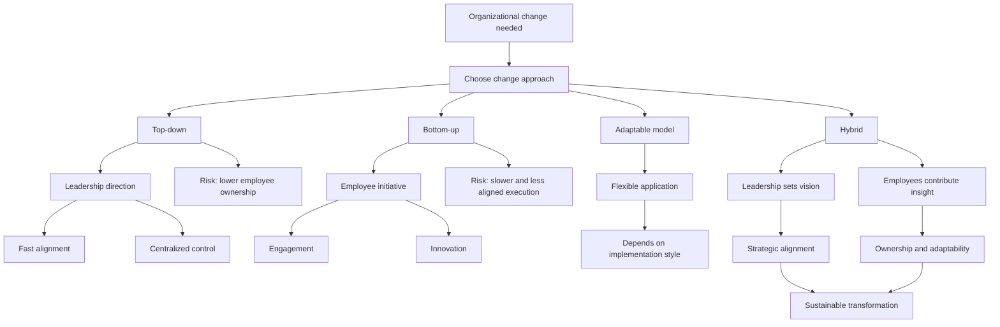

# Change Management Models: Classification, Logic, and Practical Use

## 1. Core idea in one sentence

**Change management models are structured frameworks that help organizations move through transition by balancing direction, adoption, alignment, and sustainability.**

---

## 2. Ultra-short memory anchors

Use these as **mental hooks**:

* **Change model = structured transition logic**
* **Top-down = leadership-led change**
* **Bottom-up = employee-driven change**
* **Some models are flexible**
* **Hybrid = direction + ownership**
* **Good change is not only designed well — it is absorbed well**

---

## 3. Smart synthesis

This paragraph expands the earlier introduction by giving a more complete map of **change management models** and how they are typically classified. The central message is that organizational change is not random: it can be guided through models that offer a **repeatable logic** for leading people, processes, and culture through transition. 

The text organizes the landscape into **three major categories**:

1. **Top-down models**
2. **Bottom-up models**
3. **Models adaptable to both approaches**

Then it concludes with the practical reality that many organizations achieve the strongest results through a **hybrid approach**, where leadership provides strategic direction and employees contribute insight, adaptation, and ownership. 

This is the real concept to fix in memory:

**There is no single “best” change model in absolute terms. The right model depends on the organization’s structure, culture, speed requirements, and type of change.**

That idea is extremely useful in interviews because it sounds mature and non-dogmatic.

---

## 4. The big classification logic

| Category      | Core logic                                              | Typical strength                    | Typical limitation                        |
| ------------- | ------------------------------------------------------- | ----------------------------------- | ----------------------------------------- |
| **Top-down**  | Leadership defines and drives the change                | Speed, control, alignment           | Lower ownership from employees            |
| **Bottom-up** | Employees initiate and shape improvements               | Engagement, creativity, buy-in      | Slower pace, weaker strategic consistency |
| **Adaptable** | Model can be used in either direction                   | Flexibility                         | Requires thoughtful application           |
| **Hybrid**    | Combines leadership direction and employee contribution | Balance, resilience, sustainability | More coordination required                |

### Memory sentence

**The classification of a model matters because it tells you who drives the change, how people engage with it, and where the risks are.**

---

## 5. What change management models really do

| Function                   | Meaning                                                | Why it matters                            |
| -------------------------- | ------------------------------------------------------ | ----------------------------------------- |
| **Guide transition**       | Provide a roadmap through change                       | Avoids improvisation                      |
| **Reduce uncertainty**     | Creates structure during disruption                    | Helps people understand what is happening |
| **Support adoption**       | Helps people move from old habits to new ones          | Improves sustainability                   |
| **Align effort**           | Connects change activities to organizational direction | Prevents fragmentation                    |
| **Increase effectiveness** | Makes change more coordinated and repeatable           | Improves long-term outcomes               |

### Memory sentence

**A model gives change a shape, a sequence, and a better chance of sticking.**

---

## 6. Top-down change management models

### Key idea

Top-down models are led primarily by **senior leadership**. They are especially useful when the organization needs **rapid, large-scale, coordinated change**.

### Why organizations use them

* They create **clear direction**
* They centralize accountability
* They help align functions and regions quickly
* They are useful when consistency matters more than experimentation

### Top-down model logic

```text
Leadership defines the need
→ leadership sets direction
→ leadership mobilizes the organization
→ change is implemented at scale
→ leadership reinforces the new state
```

### Strengths of top-down models

| Strength                 | Meaning                                   |
| ------------------------ | ----------------------------------------- |
| **Strategic alignment**  | Change supports organizational goals      |
| **Fast execution**       | Centralized decisions accelerate movement |
| **Clear accountability** | Leadership ownership is visible           |
| **Consistency**          | Common direction across the enterprise    |

### Risks of top-down models

| Risk                         | Meaning                                       |
| ---------------------------- | --------------------------------------------- |
| **Lower emotional buy-in**   | People may comply without truly committing    |
| **Resistance**               | Employees may feel change is imposed          |
| **Missed frontline insight** | Leadership may overlook operational realities |

### Memory sentence

**Top-down models are strong at enterprise alignment, but they must be humanized to avoid passive resistance.**

---

## 7. The four top-down models to remember

### 7.1 Lewin’s Change Management Model

Lewin’s model is one of the most classic frameworks and is built on **three phases**:

* **Unfreeze**
* **Change**
* **Refreeze**

#### Practical meaning

| Phase        | Meaning                                                     |
| ------------ | ----------------------------------------------------------- |
| **Unfreeze** | Prepare the organization and disrupt the current status quo |
| **Change**   | Introduce new behaviors, processes, or ways of working      |
| **Refreeze** | Stabilize the new state so it becomes part of the culture   |

#### Why it is top-down

Leadership is especially central in the **Unfreeze** stage because senior management must create awareness, explain why change is necessary, and prepare the organization psychologically and operationally. 

#### What to remember

**Lewin = prepare → move → stabilize**

#### Interview phrasing

> “Lewin’s model is powerful because it reminds us that successful change is not only about implementation, but also about preparing people before the shift and stabilizing the new behaviors afterward.”

---

### 7.2 Kotter’s 8-Step Change Model

Kotter’s model is more detailed and action-oriented. The eight steps are:

1. **Establish a sense of urgency**
2. **Create a guiding coalition**
3. **Develop a vision and strategy**
4. **Communicate the vision**
5. **Empower broad-based action**
6. **Generate short-term wins**
7. **Consolidate gains**
8. **Anchor new approaches in the culture**

#### Why it is top-down

The model depends on strong leadership to define urgency, build the coalition, shape the vision, and drive momentum across the organization. 

#### What to remember

**Kotter = mobilize people around a vision and keep momentum visible**

#### Interview phrasing

> “Kotter’s model is particularly strong when transformation requires visible leadership sponsorship, clear communication, and staged momentum through short-term wins.”

---

### 7.3 McKinsey 7-S Framework

The McKinsey 7-S Framework focuses on aligning seven interconnected elements:

* **Strategy**
* **Structure**
* **Systems**
* **Shared Values**
* **Style**
* **Staff**
* **Skills**

#### Why it is top-down

Because leadership must ensure that all seven elements support the broader strategy. It is a systemic alignment model, and leadership decisions affect every element. 

#### What to remember

**McKinsey 7-S = change is sustainable only if the organization is aligned internally**

#### Ultra-short memory schema

```text
7-S
= Strategy
+ Structure
+ Systems
+ Shared Values
+ Style
+ Staff
+ Skills
```

#### Interview phrasing

> “The McKinsey 7-S Framework is useful when change cannot be isolated to process alone, because it forces leaders to align structure, people, culture, and capabilities with the strategic direction.”

---

### 7.4 ADKAR Model (Prosci)

ADKAR stands for:

* **Awareness**
* **Desire**
* **Knowledge**
* **Ability**
* **Reinforcement**

#### Why it is treated here as top-down

Even though it focuses on **individual change**, leadership remains responsible for creating awareness, enabling desire, providing resources and knowledge, supporting capability development, and reinforcing the new behaviors across the organization. 

#### What to remember

**ADKAR = individual adoption sequence**

#### Interview phrasing

> “ADKAR is especially valuable because it translates organizational change into the individual journey people must go through before the transformation becomes real.”

---

## 8. Bottom-up change management models

### Key idea

Bottom-up models are driven more by **employees, teams, and grassroots insight**. They are useful when an organization wants to unlock practical knowledge, innovation, and ownership from the people closest to daily operations.

### Why organizations use them

* They increase engagement
* They surface real operational issues
* They create ownership
* They are effective for continuous improvement cultures

### Bottom-up model logic

```text
Employees observe inefficiencies
→ employees propose improvements
→ ideas are tested or adopted
→ management supports and enables
→ change grows through participation
```

### Strengths of bottom-up models

| Strength               | Meaning                                      |
| ---------------------- | -------------------------------------------- |
| **Ownership**          | People support what they help shape          |
| **Innovation**         | Useful ideas emerge from operational reality |
| **Engagement**         | Employees feel heard and involved            |
| **Sustainable buy-in** | Resistance tends to be lower                 |

### Risks of bottom-up models

| Risk                         | Meaning                                       |
| ---------------------------- | --------------------------------------------- |
| **Slower implementation**    | Consensus and iteration take time             |
| **Fragmentation**            | Many local ideas may lack common direction    |
| **Weak strategic alignment** | Improvements may not connect to broader goals |

### Memory sentence

**Bottom-up models are strong at adoption and innovation, but they need structure to scale well.**

---

## 9. The three bottom-up models to remember

### 9.1 Kaizen

Kaizen means **continuous improvement**. Its principle is that many small improvements can create significant long-term impact.

#### Why it is bottom-up

Employees at all levels identify inefficiencies and suggest practical improvements in day-to-day work. Management supports, but the energy for change comes from the workforce. 

#### What to remember

**Kaizen = small changes, continuous gains**

#### Interview phrasing

> “Kaizen is powerful because it turns improvement into a daily habit rather than a one-time transformation program.”

---

### 9.2 Lean Change Management

Lean Change Management combines **Lean** and **Agile** principles. It focuses on:

* experimentation
* feedback
* iteration
* incremental improvement

#### Why it is bottom-up

Employees are empowered to test and implement small changes with limited top-down control, while leadership acts more as facilitator than director. 

#### What to remember

**Lean Change = test small, learn fast, improve continuously**

#### Interview phrasing

> “Lean Change Management is useful in uncertain environments because it treats change as a sequence of experiments rather than a fixed master plan.”

---

### 9.3 Participative Management

Participative Management emphasizes joint decision-making between employees and management.

#### Why it is bottom-up

Employees actively contribute ideas and influence how change is designed and implemented, which increases inclusion and ownership. 

#### What to remember

**Participative Management = voice creates buy-in**

#### Interview phrasing

> “Participative Management is especially effective in collaborative cultures because it transforms change from something communicated to employees into something co-created with them.”

---

## 10. Models adaptable to both approaches

### Key idea

Some models are not rigidly top-down or bottom-up. Their classification depends on **how they are applied**.

This is a subtle but very important concept:

**A model is not only defined by its theory, but by the leadership behavior and implementation pattern around it.**

---

### 10.1 Bridge’s Transition Model

Bridge’s model focuses on the **psychological experience of change**, with three stages:

* **Ending**
* **Neutral Zone**
* **New Beginning**

#### Why it is adaptable

Leadership can guide people through these stages in a top-down way, or employees can take greater ownership of the transition while leaders provide support. The model is flexible because it focuses on human transition rather than only structural execution. 

#### What to remember

**Bridges = change is external, transition is internal**

#### Interview phrasing

> “Bridge’s Transition Model is valuable because it reminds us that organizational change succeeds only when people are helped through the psychological journey of letting go, navigating uncertainty, and embracing a new beginning.”

---

### 10.2 Nudge Theory

Nudge Theory suggests that behavior can be influenced through **small positive reinforcements** rather than command or force.

#### Why it is adaptable

Leaders can design environments that guide behavior, or employees can influence one another informally toward new habits. 

#### What to remember

**Nudge = influence behavior gently, not coercively**

#### Interview phrasing

> “Nudge Theory is useful when organizations want to shape behavior intelligently without relying only on formal directives or heavy control mechanisms.”

---

## 11. Hybrid approach

### Key idea

A hybrid approach combines:

* **top-down strategic direction**
* **bottom-up contribution, innovation, and feedback**

This is presented as the most balanced approach because it allows organizations to remain strategically coherent while also benefiting from employee engagement. 

### Why hybrid often works best

| Hybrid advantage             | Meaning                                                  |
| ---------------------------- | -------------------------------------------------------- |
| **Direction + ownership**    | Leadership sets goals, employees help realize them       |
| **Control + creativity**     | Strategy stays clear while ideas stay alive              |
| **Alignment + adaptability** | The organization moves together but can still learn      |
| **Durability**               | Change is more likely to last because people participate |

### Memory sentence

**Hybrid change is often strongest because it combines executive intent with operational intelligence.**

---

## 12. TechInnovate scenario — why hybrid fits best

The scenario shows TechInnovate growing rapidly and facing several simultaneous change initiatives:

* **structural change** through management hierarchy restructuring
* **technological change** through project management software adoption
* **people-centric change** through a more engagement-focused culture

This mix already tells you something important:

**When change affects structure, technology, and culture at the same time, a purely rigid model is rarely enough.**

### Why hybrid is appropriate

| Need at TechInnovate      | Why hybrid helps                              |
| ------------------------- | --------------------------------------------- |
| **Strategic consistency** | Leadership sets the transformation vision     |
| **Process improvement**   | Employees contribute real operational insight |
| **Cultural shift**        | Engagement cannot simply be imposed           |
| **Sustainable adoption**  | Ownership improves long-term success          |

### Interview phrasing

> “TechInnovate is a strong example of why hybrid change works well in complex transformation: leadership provides strategic coherence, while employees strengthen execution quality, creativity, and long-term adoption.”

---

## 13. Cause-effect map



---

## 14. Comparison table — all models at a glance

| Model                         | Category                 | Core idea                                          | Best remembered as                  |
| ----------------------------- | ------------------------ | -------------------------------------------------- | ----------------------------------- |
| **Lewin**                     | Top-down                 | Prepare, implement, stabilize                      | **Unfreeze → Change → Refreeze**    |
| **Kotter**                    | Top-down                 | Mobilize change through eight leadership-led steps | **Urgency + vision + momentum**     |
| **McKinsey 7-S**              | Top-down                 | Align seven organizational elements                | **Internal alignment for strategy** |
| **ADKAR**                     | Top-down in this reading | Drive individual adoption step by step             | **Personal change sequence**        |
| **Kaizen**                    | Bottom-up                | Continuous incremental improvement                 | **Small daily gains**               |
| **Lean Change Management**    | Bottom-up                | Experiment, learn, iterate                         | **Agile change loop**               |
| **Participative Management**  | Bottom-up                | Co-create decisions with employees                 | **Voice drives buy-in**             |
| **Bridge’s Transition Model** | Adaptable                | Manage psychological transition                    | **Human side of change**            |
| **Nudge Theory**              | Adaptable                | Influence behavior through small cues              | **Gentle behavioral steering**      |

---

## 15. NLP-style phrases for interviews

These phrases help you sound stronger and more senior:

* **match the change model to the organizational context**
* **balance strategic direction with employee ownership**
* **translate change into adoption, not only execution**
* **combine enterprise alignment with grassroots insight**
* **support both structural and psychological transition**
* **create sustainable change through participation and reinforcement**
* **avoid one-size-fits-all transformation logic**
* **adapt the model to culture, speed, and complexity**

---

## 16. How to map this to your own experience

This section is important for interviews because you do not want to sound theoretical only.

| Concept                      | How you can map it to experience                                                                          |
| ---------------------------- | --------------------------------------------------------------------------------------------------------- |
| **Top-down change**          | Corporate initiatives, compliance-driven transformation, leadership-led roadmap changes                   |
| **Bottom-up change**         | Process improvements identified by operational, technical, or support teams                               |
| **Hybrid change**            | Programs where direction was defined centrally but delivery quality depended on cross-functional feedback |
| **ADKAR logic**              | Situations where adoption depended on awareness, training, support, and reinforcement                     |
| **McKinsey 7-S thinking**    | Cases where structure, people, process, and capabilities all had to align                                 |
| **Kaizen / Lean logic**      | Continuous improvement of workflows, governance, release processes, or collaboration patterns             |
| **Bridge’s transition lens** | Moments where people had to emotionally detach from old ways before embracing the new one                 |

### Interview bridge

> “In my experience, the most effective transformations are rarely purely directive or purely emergent. They usually require a strong strategic frame from leadership and continuous input from the teams closest to operations.”

### Stronger senior bridge

> “I tend to view change models as operating lenses rather than rigid formulas. The real challenge is selecting the right level of leadership control, employee participation, and behavioral support based on the complexity and nature of the change.”

---

## 17. What to remember before a colloquium

Memorize this sequence:

```text id="7r4vjx"
Change models differ by who drives the change.
Top-down gives speed, control, and alignment.
Bottom-up gives ownership, innovation, and engagement.
Some models are flexible.
Hybrid often works best in complex organizations.
The right model depends on structure, culture, and change type.
```

---

## 18. 30-second recap

Change management models help organizations navigate transition in a structured way. Some models are **top-down**, where leadership drives alignment, speed, and control. Others are **bottom-up**, where employees generate ideas, ownership, and innovation. Some models, like **Bridge’s Transition Model** and **Nudge Theory**, can be adapted to either direction. In complex environments, a **hybrid approach** is often the most effective because it combines strategic clarity with employee participation and long-term adoption. 

---

## 19. Flashcards — Senior Level

### Flashcard 1

**Q:** What is the most important criterion for choosing a change management model?
**A:** The fit between the model and the organization’s structure, culture, speed requirements, and type of change.

### Flashcard 2

**Q:** Why are top-down models effective in large-scale transformation?
**A:** Because they provide centralized direction, faster decision-making, consistent execution, and strong alignment with strategic goals.

### Flashcard 3

**Q:** What is the main trade-off of top-down change?
**A:** Greater speed and control often come at the cost of lower employee ownership and weaker grassroots insight.

### Flashcard 4

**Q:** Why are bottom-up models valuable in dynamic environments?
**A:** Because they leverage frontline knowledge, encourage innovation, and create stronger engagement through participation.

### Flashcard 5

**Q:** What makes Lewin’s model fundamentally useful despite its simplicity?
**A:** It highlights that change requires preparation before action and stabilization after action.

### Flashcard 6

**Q:** What makes Kotter’s model especially persuasive for senior leaders?
**A:** It combines urgency, coalition-building, communication, momentum, and cultural anchoring into a visible leadership roadmap.

### Flashcard 7

**Q:** Why is the McKinsey 7-S Framework powerful for organizational transformation?
**A:** Because it treats change as a system problem, not just a process problem, requiring alignment across strategy, people, structure, and culture.

### Flashcard 8

**Q:** Why can ADKAR be strategically useful even though it focuses on individuals?
**A:** Because large-scale transformation succeeds only when individuals move through awareness, desire, knowledge, ability, and reinforcement.

### Flashcard 9

**Q:** What is the core insight behind Bridge’s Transition Model?
**A:** Organizational change is external, but successful transition depends on how people psychologically process endings, uncertainty, and new beginnings.

### Flashcard 10

**Q:** What is the strongest argument for a hybrid approach?
**A:** It combines strategic leadership with employee engagement, making change both aligned and adoptable.

---

Send me the next paragraph file and I’ll continue with the **same Markdown structure, same tone, and same interview-oriented depth**.
