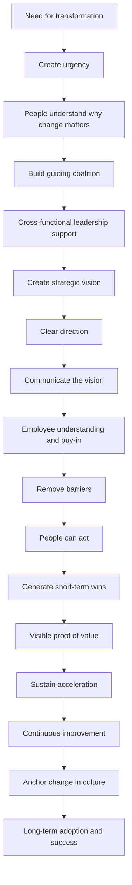

# Kotter’s 8-Step Change Model

## 1. Core idea in one sentence

**Kotter’s 8-Step Change Model is a structured roadmap for leading organizational change from initial urgency to long-term cultural adoption.**

---

## 2. Ultra-short memory anchors

Use these as **mental hooks**:

* **Kotter = change with sequence**
* **Urgency starts movement**
* **Coalition creates power**
* **Vision creates direction**
* **Communication creates buy-in**
* **Barrier removal enables action**
* **Short-term wins protect momentum**
* **Culture makes change last**

---

## 3. Smart synthesis

This paragraph introduces **Kotter’s 8-Step Change Model** as one of the clearest leadership-led frameworks for managing transformation. Its strength is not only that it explains *what* to do, but that it gives organizations a **logical sequence** for making change understandable, actionable, and sustainable. 

The model begins with **creating urgency** and ends with **embedding new practices into culture**. Between those two points, Kotter builds a disciplined progression: leadership mobilizes support, creates a vision, communicates it consistently, removes obstacles, generates momentum, and then turns early success into lasting transformation. 

The deeper lesson is this:

**Change fails less often because the idea is wrong, and more often because the organization does not create enough urgency, alignment, communication, support, and reinforcement.**

That is why Kotter is so useful in interviews: it sounds operational, strategic, and people-aware at the same time.

---

## 4. The core logic of the model

| Phase logic                  | Meaning                                       | Why it matters                       |
| ---------------------------- | --------------------------------------------- | ------------------------------------ |
| **Create urgency**           | Make people understand why change cannot wait | Generates movement                   |
| **Build leadership support** | Form a coalition that can drive the effort    | Creates credibility and coordination |
| **Set direction**            | Define a clear strategic vision               | Gives meaning to the transformation  |
| **Communicate widely**       | Keep dialogue open and transparent            | Builds trust and buy-in              |
| **Enable action**            | Remove barriers and support employees         | Turns intent into execution          |
| **Show progress**            | Generate visible early successes              | Protects momentum                    |
| **Keep improving**           | Use feedback and build on gains               | Prevents stagnation                  |
| **Anchor in culture**        | Make the new ways part of daily life          | Ensures sustainability               |

### Memory sentence

**Kotter works because it treats change as a process of mobilizing, enabling, and embedding.**

---

## 5. Why Kotter is powerful

| Strength                    | Explanation                                         |
| --------------------------- | --------------------------------------------------- |
| **Clear sequence**          | People know what comes first, what follows, and why |
| **Leadership focus**        | Change is visibly sponsored and coordinated         |
| **Employee engagement**     | Communication and support reduce disconnection      |
| **Momentum logic**          | Short-term wins make change feel real               |
| **Cultural sustainability** | The model does not stop at implementation           |

### Memory sentence

**Kotter is not just about launching change — it is about making change stick.**

---

## 6. The 8 steps at a glance

| Step                             | Core purpose                            | Best remembered as                   |
| -------------------------------- | --------------------------------------- | ------------------------------------ |
| **1. Create urgency**            | Show why change is necessary now        | **Wake the organization up**         |
| **2. Build a guiding coalition** | Gather influential sponsors and leaders | **Create change leadership power**   |
| **3. Form a strategic vision**   | Define where the organization is going  | **Give people a destination**        |
| **4. Communicate the vision**    | Explain and reinforce the direction     | **Repeat until it becomes shared**   |
| **5. Remove barriers**           | Eliminate obstacles blocking adoption   | **Make change executable**           |
| **6. Generate short-term wins**  | Deliver visible early progress          | **Prove the change works**           |
| **7. Sustain acceleration**      | Build on success and keep moving        | **Do not declare victory too early** |
| **8. Institute change**          | Embed new practices in culture          | **Turn change into normality**       |

---

## 7. Step 1 — Create a sense of urgency

### Key idea

The organization must feel that change is necessary, relevant, and time-sensitive.

In the TechInnovate example, leaders show market data, competitive pressure, and rising demand for AI and IoT solutions. This makes the risk of inaction visible. 

### What to remember

* Urgency is not panic
* Urgency creates energy and attention
* People move when they understand the cost of staying still

### Interview phrasing

> “The first leadership task in transformation is making the case for change compelling enough that people see action as necessary, not optional.”

---

## 8. Step 2 — Form a guiding coalition

### Key idea

A transformation cannot depend on one leader alone. It needs a **credible coalition** with enough influence to drive change across functions.

In the scenario, TechInnovate includes department heads from Product Development, IT, and HR. This ensures cross-functional representation and alignment. 

### What to remember

* The coalition gives the change legitimacy
* It coordinates effort across departments
* It helps solve problems and maintain alignment

### Memory sentence

**Urgency starts the engine; the coalition keeps it moving.**

### Interview phrasing

> “A guiding coalition matters because transformation requires more than sponsorship — it requires coordinated influence across the organization.”

---

## 9. Steps 3 and 4 — Create the vision and communicate it

### Key idea

Once the coalition exists, change needs a **clear direction** and **repeated communication**.

At TechInnovate, the vision focuses on using agile methods and emerging technologies to deliver innovative solutions faster and remain competitive. Leadership then reinforces that vision through open dialogue, workshops, and progress updates. 

### Why these steps are inseparable

| Element           | Role                                                    |
| ----------------- | ------------------------------------------------------- |
| **Vision**        | Tells people where the organization is going            |
| **Communication** | Helps people understand, trust, and support the journey |

### What to remember

* A vision without communication stays abstract
* Communication without vision becomes noise
* Buy-in grows when people hear consistency, clarity, and honesty

### Interview phrasing

> “In practice, vision creation and communication must work together: people support change more readily when they understand both the destination and the reason behind it.”

---

## 10. Step 5 — Remove barriers

### Key idea

Once people are aligned, the organization must make change **possible in practice**.

In the scenario, TechInnovate identifies two kinds of barriers:

* **outdated technology**
* **employee resistance**

Leadership responds with:

* additional training
* upgraded tools
* coaching for struggling teams 

### What to remember

* Barriers are not only technical
* They can be structural, emotional, skill-based, or cultural
* Removing barriers is what turns change from theory into workable reality

### Memory sentence

**If people cannot act, communication alone will not save the change.**

### Interview phrasing

> “A mature change effort does not assume resistance is only emotional; it also checks whether people have the right tools, skills, support, and operating conditions to succeed.”

---

## 11. Step 6 — Generate short-term wins

### Key idea

Transformation needs visible proof that effort is producing results.

At TechInnovate, an upgraded feature receives positive feedback, creating a concrete sign that the new way of working is delivering value. Leadership celebrates these wins to reinforce confidence and motivation. 

### Why short-term wins matter

| Benefit         | Explanation                                        |
| --------------- | -------------------------------------------------- |
| **Motivation**  | People see progress and stay engaged               |
| **Credibility** | The change effort becomes more believable          |
| **Momentum**    | Success creates energy for the next steps          |
| **Support**     | Skeptics become more open when results are visible |

### Interview phrasing

> “Short-term wins are important because they convert abstract promises into concrete evidence that the transformation is working.”

---

## 12. Steps 7 and 8 — Sustain acceleration and anchor the change in culture

### Key idea

Kotter’s model does not treat change as a one-time event. It assumes that early success must be expanded, reinforced, and normalized.

At TechInnovate, the guiding coalition uses feedback from early successes to improve future initiatives, while leadership models the desired behaviors and integrates the new practices into daily operations. This is how change becomes part of culture rather than a temporary program. 

### What to remember

* Do not stop after the first visible success
* Early wins are fuel, not the finish line
* Culture is the final lock-in mechanism

### Memory sentence

**Change becomes real only when new behaviors survive after the launch phase.**

### Interview phrasing

> “The final maturity of a transformation is not measured by rollout completion, but by whether the new behaviors are reinforced, repeated, and culturally embedded.”

---

## 13. Cause-effect map



---

## 14. Simple schema to memorize

```text
Kotter
= urgency
+ coalition
+ vision
+ communication
+ barrier removal
+ short-term wins
+ sustained momentum
+ cultural anchoring
```

---

## 15. What this paragraph is really teaching

| Surface concept         | Deeper meaning                                        |
| ----------------------- | ----------------------------------------------------- |
| Kotter has 8 steps      | Change needs sequence, not improvisation              |
| Urgency matters         | People rarely change without a reason that feels real |
| Coalition matters       | Leadership must be distributed, not isolated          |
| Vision matters          | Change needs a destination                            |
| Communication matters   | Buy-in grows through transparency                     |
| Barrier removal matters | Adoption depends on practical enablement              |
| Wins matter             | Early proof sustains motivation                       |
| Culture matters         | Lasting change must become habitual                   |

---

## 16. NLP-style phrases for interviews

These phrases will help you sound more senior and convincing:

* **create a compelling case for change**
* **build cross-functional sponsorship**
* **translate transformation into a shared vision**
* **maintain transparency through continuous communication**
* **remove structural and behavioral blockers**
* **generate visible wins to reinforce momentum**
* **turn early adoption into long-term cultural shift**
* **anchor change in day-to-day operating practices**

---

## 17. How to map this to your own experience

| Kotter element              | How you can connect it to real work                                                                          |
| --------------------------- | ------------------------------------------------------------------------------------------------------------ |
| **Urgency**                 | Showing stakeholders why a migration, release, compliance initiative, or transformation could not be delayed |
| **Guiding coalition**       | Coordinating sponsors, managers, technical leads, and functional stakeholders                                |
| **Vision**                  | Translating complex transformation into a clear target state                                                 |
| **Communication**           | Running alignment meetings, workshops, updates, and stakeholder messaging                                    |
| **Barrier removal**         | Solving tooling gaps, training needs, process blockers, resistance, or dependency issues                     |
| **Short-term wins**         | Highlighting milestone completions, successful releases, fast fixes, or early operational improvements       |
| **Sustaining acceleration** | Using lessons learned to improve the next waves of rollout                                                   |
| **Cultural anchoring**      | Embedding new practices into routines, governance, or delivery standards                                     |

### Interview bridge

> “What I appreciate in Kotter’s model is that it reflects what happens in real transformation work: you need to create urgency, align the right people, keep communication alive, remove blockers, and reinforce progress until the new way of working becomes normal.”

### Stronger senior bridge

> “In complex environments, I have seen that transformation succeeds when leadership combines strategic urgency with practical enablement. Kotter’s model captures that well because it links vision and communication to execution support and cultural reinforcement.”

---

## 18. What to remember before a colloquium

Memorize this sequence:

```text
Kotter starts by making change feel necessary.
Then it builds leadership alignment.
Then it creates and communicates direction.
Then it removes obstacles.
Then it proves progress.
Then it keeps improving.
Finally, it makes change part of the culture.
```

---

## 19. 30-second recap

Kotter’s 8-Step Change Model is a leadership-led framework that helps organizations manage transformation in a structured and sustainable way. It begins by creating urgency, then builds a guiding coalition, defines a strategic vision, communicates it clearly, removes barriers, generates short-term wins, sustains momentum, and finally embeds the new practices into culture. The real strength of the model is that it connects leadership, communication, execution, and cultural reinforcement into one coherent change journey. 

---

## 20. Flashcards — Senior Level

### Flashcard 1

**Q:** Why is urgency the first step in Kotter’s model?
**A:** Because without a credible reason to change, people tend to preserve the status quo and treat transformation as optional.

### Flashcard 2

**Q:** What is the strategic role of a guiding coalition?
**A:** It provides cross-functional leadership, credibility, influence, and coordinated sponsorship for the change effort.

### Flashcard 3

**Q:** Why are vision and communication treated as separate but interdependent steps?
**A:** Because vision defines direction, while communication turns that direction into shared understanding and commitment.

### Flashcard 4

**Q:** What kinds of barriers must leaders remove during change?
**A:** Technical, structural, skill-based, emotional, cultural, and process-related barriers.

### Flashcard 5

**Q:** Why are short-term wins essential in long transformations?
**A:** Because they create visible proof of progress, increase confidence, and prevent fatigue or skepticism.

### Flashcard 6

**Q:** What is the risk of stopping after the first visible success?
**A:** The organization may celebrate too early, lose momentum, and fail to complete deeper behavioral or structural change.

### Flashcard 7

**Q:** What does it mean to anchor change in culture?
**A:** It means integrating new behaviors, practices, and values into daily routines so the change survives beyond the formal program.

### Flashcard 8

**Q:** Why is Kotter considered more than a communication model?
**A:** Because it links communication to governance, enablement, execution, reinforcement, and culture-building.

### Flashcard 9

**Q:** In practical terms, what makes Kotter effective for PMO-led transformation?
**A:** Its sequence provides a clear roadmap for aligning stakeholders, managing adoption, reducing disruption, and sustaining long-term change.

### Flashcard 10

**Q:** What is the strongest senior-level insight behind Kotter’s model?
**A:** Successful transformation requires not only a strategic vision, but also a disciplined progression from urgency to cultural integration.

Send the next paragraph file and I’ll continue with the same structure.
