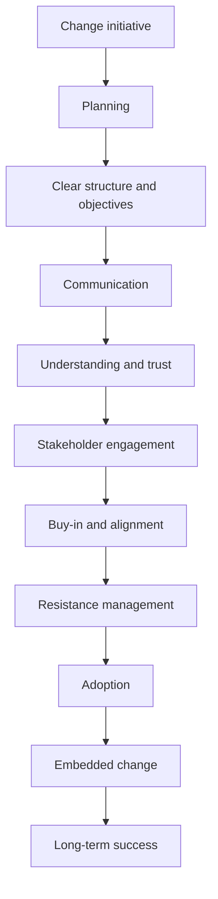

# Executing and Managing Change (Practical Framework)

## 1. Core idea in one sentence

**Executing change means translating strategy into adoption through planning, communication, stakeholder management, and resistance handling—until the change becomes part of the culture.**

---

## 2. Ultra-short memory anchors

* **Execution = plan + communicate + engage + support**
* **Change fails in execution, not in strategy**
* **Stakeholders decide success**
* **Resistance is natural, not a problem**
* **Adoption > implementation**
* **Culture is the final goal**

---

## 3. Smart synthesis

This paragraph shifts from *models* to *execution*. The key message is:

> **Knowing a change model is not enough — success depends on how well you execute it in practice.** 

Execution is described as a **structured operational discipline** built on four pillars:

1. **Planning the change**
2. **Communicating effectively**
3. **Managing stakeholders**
4. **Overcoming resistance**

The real insight:

**Change is successful only when people adopt it and continue using it—not when it is simply launched.**

---

## 4. The execution framework

| Step                       | Purpose                                | Outcome                 |
| -------------------------- | -------------------------------------- | ----------------------- |
| **Planning**               | Define objectives, timeline, resources | Clarity and structure   |
| **Communication**          | Explain why, how, and impact           | Trust and alignment     |
| **Stakeholder management** | Engage and align key actors            | Buy-in and support      |
| **Resistance management**  | Address fears and barriers             | Adoption and continuity |

### Memory sentence

**Execution turns change from idea → action → habit.**

---

## 5. Step 1 — Planning the change

### Key idea

A change initiative must start with a **clear and structured plan**.

At TechInnovate, the plan includes:

* clear objectives (agile adoption, efficiency, speed)
* defined timelines
* resource allocation
* success metrics
* risk anticipation (e.g., resistance, skill gaps) 

### What to remember

* Break transformation into **manageable steps**
* Define **measurable outcomes**
* Anticipate **risks and contingencies**
* Prepare **training and support**

### Memory sentence

**A vague change creates confusion; a structured plan creates direction.**

### Interview phrasing

> “Effective change execution starts with a structured plan that translates strategic intent into actionable steps, timelines, and measurable outcomes.”

---

## 6. Step 2 — Communicating during change

### Key idea

Communication is the **primary driver of adoption**.

At TechInnovate:

* Leadership shares the **strategic vision**
* Managers explain **operational impact**
* Communication is **frequent, clear, and two-way** 

### Key principles of effective communication

| Principle       | Meaning                       |
| --------------- | ----------------------------- |
| **Clarity**     | No jargon, easy to understand |
| **Consistency** | Same message across levels    |
| **Frequency**   | Regular updates               |
| **Two-way**     | Encourage feedback            |

### What to remember

* Explain **why, how, and what changes**
* Reduce uncertainty
* Build trust through transparency

### Memory sentence

**If people don’t understand the change, they won’t adopt it.**

### Interview phrasing

> “Communication is not a one-time activity; it must be continuous, transparent, and interactive to sustain engagement and trust.”

---

## 7. Step 3 — Stakeholder management

### Key idea

Stakeholders are the **real drivers of success or failure**.

At TechInnovate:

* Employees are primary stakeholders
* Influencers are engaged early
* Communication is tailored based on impact and influence 

### Stakeholder management process

| Step                     | Meaning                          |
| ------------------------ | -------------------------------- |
| **Identify**             | Who is impacted                  |
| **Assess**               | Level of influence and impact    |
| **Engage early**         | Build support from the beginning |
| **Tailor communication** | Adapt approach to each group     |

### What to remember

* Not all stakeholders are equal
* Influence matters as much as impact
* Engagement must be proactive

### Memory sentence

**Stakeholders don’t just receive change—they shape its success.**

### Interview phrasing

> “Successful change requires early stakeholder engagement, with tailored communication based on influence, impact, and level of support.”

---

## 8. Step 4 — Overcoming resistance

### Key idea

Resistance is **normal and expected**, not an exception.

At TechInnovate, resistance comes from:

* comfort with existing processes
* fear of new skills (agile)
* uncertainty about the future 

### Root causes of resistance

* fear of incompetence
* fear of change
* loss of control
* uncertainty

### Strategies to overcome resistance

| Strategy                | Meaning              |
| ----------------------- | -------------------- |
| **Understand concerns** | Identify root causes |
| **Training & support**  | Build confidence     |
| **Change champions**    | Use influencers      |
| **Reward adoption**     | Reinforce behavior   |

### Role of change agents

* bridge between leadership and employees
* identify issues early
* support adoption

### Memory sentence

**Resistance is not opposition—it is a signal that support is needed.**

### Interview phrasing

> “Managing resistance effectively means understanding its root causes and addressing them through communication, training, and targeted support.”

---

## 9. Cause-effect map



---

## 10. Simple schema to memorize

```text
Execution of change
= Planning
+ Communication
+ Stakeholder management
+ Resistance handling
= Adoption + Sustainability
```

---

## 11. What this paragraph is really teaching

| Surface concept     | Deeper meaning                    |
| ------------------- | --------------------------------- |
| Plan the change     | Strategy must become actionable   |
| Communicate         | Adoption depends on understanding |
| Manage stakeholders | People determine success          |
| Handle resistance   | Emotions must be managed          |
| Embed change        | Sustainability is the real goal   |

---

## 12. NLP-style phrases for interviews

* **translate strategy into execution**
* **drive adoption through structured communication**
* **proactively engage stakeholders**
* **anticipate and mitigate resistance**
* **enable change through training and support**
* **build trust through transparency**
* **create alignment across functions**
* **embed change into daily operations**

---

## 13. How to map this to your experience

| Area                       | Your real-world mapping                         |
| -------------------------- | ----------------------------------------------- |
| **Planning**               | Defining roadmap, milestones, governance        |
| **Communication**          | Aligning IT, business, compliance, stakeholders |
| **Stakeholder management** | Coordinating cross-functional teams             |
| **Resistance handling**    | Managing adoption issues, training needs        |
| **Execution discipline**   | Ensuring delivery continuity during change      |
| **Embedding change**       | Integrating processes into operations           |

### Interview bridge

> “In my experience, the success of a transformation depends less on the model chosen and more on how effectively the change is executed through planning, communication, stakeholder alignment, and resistance management.”

### Stronger senior bridge

> “I see change execution as an operational discipline: translating strategy into adoption by aligning stakeholders, enabling people, and reinforcing behaviors until the new way becomes standard.”

---

## 14. What to remember before a colloquium

```text
A good model is not enough.
You must plan the change.
You must communicate it clearly.
You must engage stakeholders.
You must manage resistance.
Only then does change become real.
```

---

## 15. 30-second recap

Executing change means turning strategy into real adoption. This requires a structured plan, continuous communication, active stakeholder management, and effective handling of resistance. The goal is not just to implement change, but to ensure it is adopted and embedded into the organization’s culture for long-term success. 

---

## 16. Flashcards — Senior Level

### Flashcard 1

**Q:** What is the real goal of change execution?
**A:** Adoption and long-term embedding, not just implementation.

### Flashcard 2

**Q:** Why is planning critical in change execution?
**A:** It translates strategy into actionable steps, timelines, and measurable outcomes.

### Flashcard 3

**Q:** What is the biggest communication mistake in change management?
**A:** Failing to explain why the change is needed and how it impacts employees.

### Flashcard 4

**Q:** Why is stakeholder management essential?
**A:** Because stakeholders influence adoption, resistance, and overall success.

### Flashcard 5

**Q:** What is the most common cause of resistance?
**A:** Fear of uncertainty, lack of skills, or disruption of routines.

### Flashcard 6

**Q:** How can resistance be reduced effectively?
**A:** Through communication, training, support, and involvement.

### Flashcard 7

**Q:** What is the role of change agents?
**A:** To bridge leadership and employees and support adoption.

### Flashcard 8

**Q:** Why is two-way communication important?
**A:** It allows concerns to surface and builds trust.

### Flashcard 9

**Q:** What differentiates implementation from adoption?
**A:** Implementation is launching change; adoption is people using it consistently.

### Flashcard 10

**Q:** What is the strongest insight about managing change?
**A:** Change succeeds when people are supported through the transition and the new behaviors are reinforced over time.

---

Se vuoi, possiamo ora fare una cosa molto potente 👉
trasformare **tutti questi moduli (Lewin + Kotter + Execution)** in una **risposta unica da colloquio “wow” da 2 minuti** 💥

