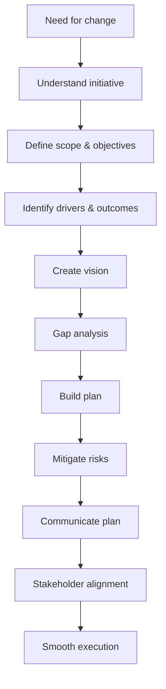

# Planning for Change (Deep-Dive Framework)

## 1. Core idea in one sentence

**Planning for change is the structured process of defining the transformation, aligning stakeholders, identifying gaps, and building a roadmap that guides the organization from its current state to a desired future state.**

---

## 2. Ultra-short memory anchors

* **Planning = foundation of change**
* **No plan = chaos**
* **Current state ≠ Future state → gap**
* **Vision gives direction**
* **Objectives give measurability**
* **Plan = timeline + resources + ownership**
* **Good planning reduces resistance before it appears**

---

## 3. Smart synthesis

This paragraph goes deeper into the **first and most critical phase of change execution: planning**.

The key idea is:

> **A well-structured change plan is the cornerstone of a successful transformation because it reduces uncertainty, aligns stakeholders, and anticipates risks.** 

Planning is not just “preparation”—it is a **strategic activity** that connects:

* business goals
* operational execution
* people impact

The process includes:

1. Understanding the change initiative
2. Defining scope and objectives
3. Identifying drivers and outcomes
4. Establishing a vision
5. Conducting a gap analysis
6. Building a detailed change plan
7. Mitigating risks
8. Communicating the plan

The real insight:

**Good planning does not eliminate change complexity — it makes it manageable.**

---

## 4. The planning framework

| Step                          | Purpose                             | Output                   |
| ----------------------------- | ----------------------------------- | ------------------------ |
| **Understand change**         | Clarify why and what                | Strategic clarity        |
| **Define scope & objectives** | Set boundaries and goals            | Measurable targets       |
| **Identify drivers**          | Understand why change is needed     | Prioritization           |
| **Define vision**             | Describe future state               | Direction and motivation |
| **Gap analysis**              | Compare current vs future           | Action roadmap           |
| **Build plan**                | Define actions, timeline, ownership | Execution structure      |
| **Mitigate risks**            | Anticipate issues                   | Resilience               |
| **Communicate**               | Align stakeholders                  | Adoption readiness       |

### Memory sentence

**Planning connects strategy → execution → adoption.**

---

## 5. Step 1 — Understanding the change initiative

### Key idea

Before planning, you must fully understand:

* **why the change is needed**
* **what it impacts**
* **what risks it introduces**

At TechInnovate:

* Agile transformation is not just technical
* It impacts processes, teams, and structure 

### Key questions

* Why is this change necessary?
* Who is impacted?
* What risks exist?

### Memory sentence

**If you don’t understand the change, you can’t plan it effectively.**

### Interview phrasing

> “The first step in planning is building a clear understanding of the change drivers, impact, and risks to ensure alignment with strategic objectives.”

---

## 6. Step 2 — Defining scope and objectives

### Key idea

You must define:

* **how big the change is (scope)**
* **what success looks like (objectives)**

### Components

| Element        | Meaning                     |
| -------------- | --------------------------- |
| **Scope**      | Breadth and depth of change |
| **Objectives** | Clear goals                 |
| **Metrics**    | How success is measured     |

### Example (TechInnovate)

* Reduce cycle time by **25% in 6 months** using agile 

### What to remember

* Use **SMART objectives**
* Align with **business strategy**

### Memory sentence

**What is not measurable cannot be managed.**

### Interview phrasing

> “Clear scope and measurable objectives ensure that the transformation is aligned, trackable, and outcome-driven.”

---

## 7. Step 3 — Identifying drivers and expected outcomes

### Key idea

Change must be linked to **real drivers**, not abstract goals.

### Typical drivers

* Market competition
* Customer expectations
* Technology evolution
* Operational inefficiencies 

### Expected outcomes

* Faster delivery
* Better collaboration
* Improved customer satisfaction

### Memory sentence

**Drivers explain why; outcomes explain value.**

### Interview phrasing

> “Understanding both drivers and expected outcomes ensures that change is not only justified but also value-driven.”

---

## 8. Step 4 — Establishing a clear vision

### Key idea

A strong vision answers:

> **“Where are we going and why does it matter?”**

At TechInnovate:

* Vision = more agile, innovative, responsive organization 

### Vision principles

* Inspiring but realistic
* Aligned with strategy
* Consistently communicated

### Memory sentence

**Vision gives meaning to effort.**

### Interview phrasing

> “A clear vision aligns stakeholders and provides a shared direction for the transformation.”

---

## 9. Step 5 — Gap analysis (critical step)

### Key idea

Gap analysis identifies:

**Current state → Desired state → What is missing**

### Components

| Step              | Meaning             |
| ----------------- | ------------------- |
| **Current state** | Where we are today  |
| **Future state**  | Where we want to be |
| **Gap**           | What must change    |

### Example (TechInnovate)

* Some teams know Agile → others don’t
* Tools not fully compatible
* Skills gaps identified 

### Memory sentence

**The gap defines the work.**

### Interview phrasing

> “Gap analysis is critical because it translates strategic intent into concrete actions and capability requirements.”

---

## 10. Step 6 — Building the change plan

### Key idea

The plan operationalizes the transformation.

### Components

| Element              | Meaning                      |
| -------------------- | ---------------------------- |
| **Timelines**        | Phases and deadlines         |
| **Resources**        | People, budget, tools        |
| **Responsibilities** | Ownership and accountability |

### Example (TechInnovate)

* Phase 1: Training
* Phase 2: Implementation
* PMO leads execution 

### Memory sentence

**A plan without ownership is just intention.**

### Interview phrasing

> “A robust change plan defines timelines, allocates resources, and assigns clear ownership to ensure execution discipline.”

---

## 11. Step 7 — Risk mitigation

### Key idea

Every transformation has risks:

* resistance
* budget overruns
* delays

### Actions

* Identify risks early
* Build contingency plans
* Monitor and adapt 

### Memory sentence

**Anticipated risks are manageable; ignored risks are dangerous.**

### Interview phrasing

> “Proactive risk management ensures that transformation remains controlled and adaptable despite uncertainties.”

---

## 12. Step 8 — Communicating the plan

### Key idea

A plan only works if people understand it.

### Principles

* Regular updates
* Clear messaging
* Consistency
* Feedback channels 

### Memory sentence

**Communication turns planning into alignment.**

### Interview phrasing

> “Clear and consistent communication ensures alignment, reduces uncertainty, and strengthens stakeholder commitment.”

---

## 13. Cause-effect map



---

## 14. Simple schema to memorize

```text
Planning for change
= Understand change
+ Define scope & objectives
+ Identify drivers
+ Create vision
+ Gap analysis
+ Build plan (time/resources/ownership)
+ Risk mitigation
+ Communication
```

---

## 15. What this paragraph is really teaching

| Surface concept | Deeper meaning                          |
| --------------- | --------------------------------------- |
| Planning phase  | Change must be designed, not improvised |
| Objectives      | Success must be measurable              |
| Vision          | People need direction                   |
| Gap analysis    | Strategy must translate into actions    |
| Plan            | Execution requires structure            |
| Risk management | Uncertainty must be controlled          |
| Communication   | Alignment drives adoption               |

---

## 16. NLP-style phrases for interviews

* **translate strategy into a structured roadmap**
* **align stakeholders around a shared vision**
* **bridge the gap between current and future state**
* **define measurable success criteria**
* **anticipate and mitigate transformation risks**
* **ensure execution through clear ownership**
* **drive alignment through transparent communication**
* **enable a smooth transition through structured planning**

---

## 17. How to map this to your experience

| Area                      | Real-world mapping                        |
| ------------------------- | ----------------------------------------- |
| **Understanding change**  | Analyzing transformation drivers          |
| **Scope & objectives**    | Defining roadmap and KPIs                 |
| **Gap analysis**          | Identifying capability gaps               |
| **Planning**              | Structuring delivery phases               |
| **Stakeholder alignment** | Coordinating cross-functional teams       |
| **Risk management**       | Handling delays, resistance, dependencies |
| **Communication**         | Aligning business and IT                  |

### Interview bridge

> “In my experience, strong planning is what differentiates successful transformations from failed ones, because it aligns strategy, execution, and stakeholder expectations from the beginning.”

### Stronger senior bridge

> “I approach change planning as a strategic discipline: understanding the gap between current and future state, structuring execution, and aligning stakeholders to ensure sustainable transformation.”

---

## 18. What to remember before a colloquium

```text
Understand the change
Define scope and objectives
Identify drivers
Create a vision
Analyze the gap
Build a plan
Mitigate risks
Communicate clearly
```

---

## 19. 30-second recap

Planning for change is the foundation of any successful transformation. It involves understanding the initiative, defining clear objectives, identifying drivers, establishing a vision, conducting a gap analysis, and building a structured plan with timelines, resources, and responsibilities. By anticipating risks and communicating effectively, organizations can reduce uncertainty, align stakeholders, and ensure a smoother transition toward the desired future state. 

---

## 20. Flashcards — Senior Level

### Flashcard 1

**Q:** Why is planning critical in change management?
**A:** It aligns stakeholders, reduces uncertainty, and creates a structured path for execution.

### Flashcard 2

**Q:** What is the role of scope in change planning?
**A:** It defines the extent and boundaries of the transformation.

### Flashcard 3

**Q:** Why are SMART objectives important?
**A:** They ensure the change is measurable and trackable.

### Flashcard 4

**Q:** What is the purpose of gap analysis?
**A:** To identify the differences between current and future state and define required actions.

### Flashcard 5

**Q:** What are typical drivers of change?
**A:** Market pressure, technology evolution, customer demand, inefficiencies.

### Flashcard 6

**Q:** What makes a vision effective?
**A:** It is clear, aligned, inspiring, and realistic.

### Flashcard 7

**Q:** Why is assigning responsibility critical?
**A:** Because execution requires clear ownership.

### Flashcard 8

**Q:** What is the biggest risk in poor planning?
**A:** Misalignment, resistance, and execution failure.

### Flashcard 9

**Q:** Why must risks be identified early?
**A:** To enable proactive mitigation and avoid disruption.

### Flashcard 10

**Q:** What is the strongest insight about planning for change?
**A:** It transforms strategy into a structured, actionable, and sustainable transformation path.

---

Se vuoi, ora possiamo fare il livello successivo 🔥
👉 **costruire una risposta unica da colloquio (PM senior) che unisce: Lewin + Kotter + Planning + Execution** in 2 minuti perfetti.
