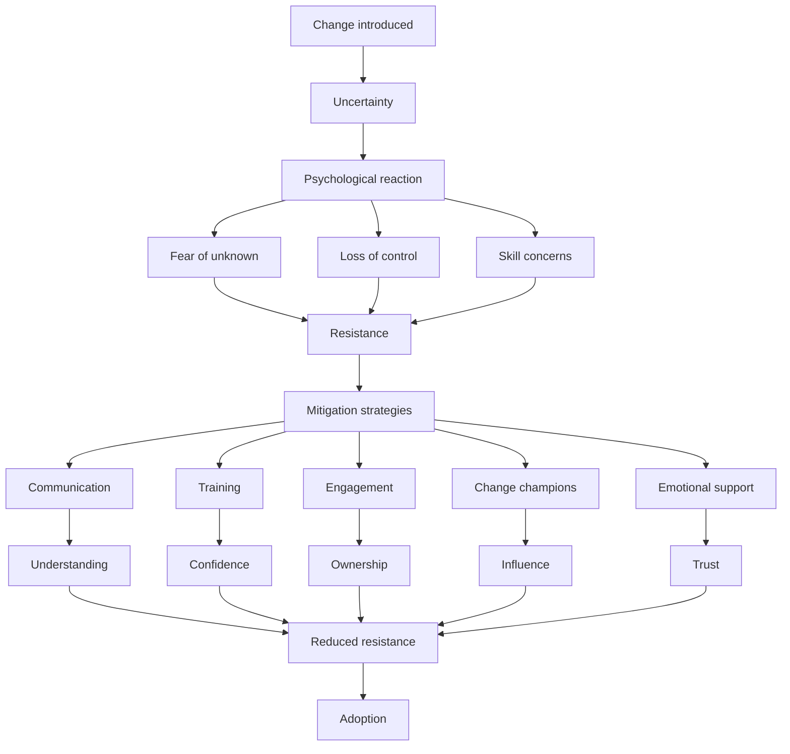

# Managing Resistance to Change (Psychological & Practical Framework)

## 1. Core idea in one sentence

**Resistance to change is a natural human reaction driven by uncertainty and fear, and effective leaders manage it through understanding, communication, support, and involvement.**

---

## 2. Ultra-short memory anchors

* **Resistance = normal**
* **Fear drives resistance**
* **Uncertainty creates anxiety**
* **Involvement reduces resistance**
* **Support builds confidence**
* **Empathy accelerates adoption**
* **You don’t eliminate resistance — you manage it**

---

## 3. Smart synthesis

This paragraph focuses on one of the most critical aspects of change management:

> **Resistance is not an exception — it is an expected part of any transformation.** 

The key shift in mindset is powerful:

* Resistance is **not a problem to fight**
* It is a **signal to understand and manage**

The content highlights three core dimensions:

1. **Why resistance happens (root causes)**
2. **How to mitigate it (practical strategies)**
3. **The psychology behind it (emotional dimension)**

The real insight:

**Change fails when leaders ignore emotions and focus only on processes.**

---

## 4. The resistance framework

| Dimension                 | Focus                        | Outcome            |
| ------------------------- | ---------------------------- | ------------------ |
| **Causes**                | Understand why people resist | Awareness          |
| **Mitigation strategies** | Apply practical actions      | Reduced resistance |
| **Psychological factors** | Address emotions and fears   | Adoption and trust |

### Memory sentence

**Understanding resistance transforms it from a barrier into a lever for change.**

---

## 5. Why resistance happens

### Key idea

People resist change because it disrupts:

* **certainty**
* **control**
* **competence**

### Main causes

| Cause                          | Meaning                            |
| ------------------------------ | ---------------------------------- |
| **Fear of the unknown**        | Uncertainty about what will happen |
| **Loss of control**            | Feeling decisions are imposed      |
| **Skill gaps**                 | Doubt about ability to adapt       |
| **Job/security concerns**      | Fear of negative impact            |
| **Comfort with current state** | Preference for familiar routines   |

At TechInnovate, resistance emerges when employees:

* are used to traditional PM methods
* fear Agile complexity
* worry about performance or workload 

### Memory sentence

**People don’t resist change — they resist losing stability.**

### Interview phrasing

> “Resistance typically arises from uncertainty, perceived loss of control, and concerns about capability or job impact.”

---

## 6. Psychological dimension (most important insight)

### Key idea

Resistance is not only rational — it is **emotional**.

People are “hardwired” to seek:

* stability
* predictability
* security

Change triggers:

* anxiety
* fear of failure
* identity disruption

### What to remember

* Change challenges **professional identity**
* It creates **emotional discomfort**
* It requires **psychological adaptation**

### Memory sentence

**Change is logical for the organization but emotional for people.**

### Interview phrasing

> “Managing change effectively requires addressing not only operational challenges but also the psychological impact on individuals.”

---

## 7. Strategies to mitigate resistance

### Key idea

Resistance decreases when people feel:

* informed
* capable
* involved
* supported

---

### 7.1 Communication

* Explain **why the change is needed**
* Clarify **how it will happen**
* Share **expected outcomes**

👉 Reduces uncertainty and builds trust 

**Memory:**
*Clarity reduces fear.*

---

### 7.2 Training and support

* Provide **training programs**
* Offer **coaching**
* Build **confidence**

👉 Addresses skill gaps and fear of incompetence 

**Memory:**
*Confidence reduces resistance.*

---

### 7.3 Involvement and engagement

* Involve employees in planning
* Encourage feedback
* Create ownership

👉 Increases buy-in and commitment 

**Memory:**
*People support what they help build.*

---

### 7.4 Change champions

* Use influential employees
* Promote positive behavior
* Inspire others

👉 Accelerates cultural adoption 

**Memory:**
*Peers influence more than hierarchy.*

---

### 7.5 Acknowledging concerns

* Create open forums
* Listen actively
* validate concerns

👉 Builds trust and reduces pushback 

**Memory:**
*Listening reduces resistance more than convincing.*

---

## 8. Cause-effect map



---

## 9. Simple schema to memorize

```text
Resistance
= fear + uncertainty + loss of control

Mitigation
= communication
+ training
+ involvement
+ champions
+ empathy

Result
= trust + adoption
```

---

## 10. What this paragraph is really teaching

| Surface concept   | Deeper meaning                         |
| ----------------- | -------------------------------------- |
| Resistance exists | Change affects emotions                |
| Fear of unknown   | People need clarity                    |
| Skill gaps        | People need support                    |
| Engagement        | People need ownership                  |
| Communication     | People need understanding              |
| Psychology        | Change is human before being technical |

---

## 11. NLP-style phrases for interviews

* **address the root causes of resistance**
* **reduce uncertainty through transparent communication**
* **build confidence through training and support**
* **create ownership through involvement**
* **leverage change champions to influence adoption**
* **acknowledge emotional responses to change**
* **balance rational and psychological aspects of transformation**
* **turn resistance into engagement**

---

## 12. How to map this to your experience

| Area                       | Real-world mapping                          |
| -------------------------- | ------------------------------------------- |
| **Resistance causes**      | Teams hesitant to adopt new tools/processes |
| **Communication**          | Explaining transformation clearly           |
| **Training**               | Supporting capability building              |
| **Stakeholder engagement** | Involving key players early                 |
| **Change champions**       | Leveraging influencers                      |
| **Emotional management**   | Handling concerns and fears                 |

### Interview bridge

> “In my experience, resistance is not something to eliminate but to understand. When you address its root causes through communication, training, and involvement, it naturally decreases.”

### Stronger senior bridge

> “I see resistance as a signal rather than a barrier. It highlights where the organization needs more clarity, support, or engagement to make the transformation successful.”

---

## 13. What to remember before a colloquium

```text
Resistance is natural
It comes from fear and uncertainty
You must understand it
You must address it
You must support people
Then adoption happens
```

---

## 14. 30-second recap

Resistance to change is a natural reaction driven by uncertainty, fear, and perceived loss of control. It can be effectively managed by understanding its root causes and applying strategies such as clear communication, training, employee involvement, and the use of change champions. By addressing both the practical and psychological aspects of change, leaders can reduce resistance and increase the likelihood of successful adoption. 

---

## 15. Flashcards — Senior Level

### Flashcard 1

**Q:** Why is resistance to change inevitable?
**A:** Because change disrupts stability, control, and familiarity.

### Flashcard 2

**Q:** What are the main drivers of resistance?
**A:** Fear of the unknown, loss of control, skill gaps, and job concerns.

### Flashcard 3

**Q:** Why is resistance not necessarily negative?
**A:** It signals where support, clarity, or engagement is needed.

### Flashcard 4

**Q:** What is the most effective way to reduce resistance?
**A:** Combine communication, training, and involvement.

### Flashcard 5

**Q:** Why is communication critical in managing resistance?
**A:** It reduces uncertainty and builds trust.

### Flashcard 6

**Q:** What role do change champions play?
**A:** They influence peers and promote positive adoption behaviors.

### Flashcard 7

**Q:** Why is psychological awareness important in change management?
**A:** Because change triggers emotional responses that affect behavior.

### Flashcard 8

**Q:** What is the impact of involving employees in change?
**A:** It increases ownership and reduces resistance.

### Flashcard 9

**Q:** Why is training essential during change?
**A:** It builds confidence and reduces fear of incompetence.

### Flashcard 10

**Q:** What is the strongest insight about resistance?
**A:** It should be managed, not eliminated, by addressing both rational and emotional factors.

---

Se vuoi chiudiamo il cerchio 🔥
👉 Ti costruisco **la risposta perfetta da colloquio (PM Senior / Program Manager)** che integra TUTTO:
Lewin + Kotter + Planning + Execution + Resistance (2 minuti, super impattante)
