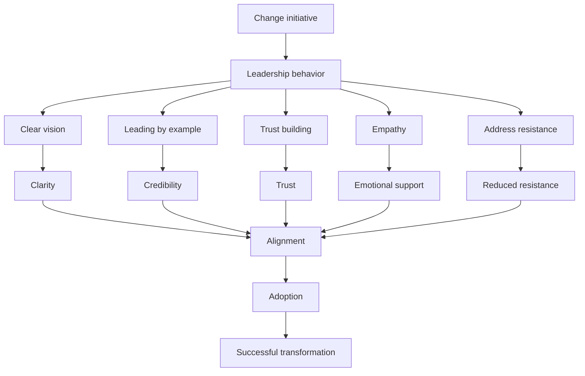

# Leadership in Managing Resistance to Change

## 1. Core idea in one sentence

**Leaders play a decisive role in change success by shaping how employees perceive, react to, and ultimately adopt change through vision, behavior, trust, empathy, and direct action.**

---

## 2. Ultra-short memory anchors

* **Leadership = perception of change**
* **Vision creates direction**
* **Behavior creates credibility**
* **Trust enables adoption**
* **Empathy reduces fear**
* **Ignoring resistance = failure**
* **Leaders don’t just manage change — they embody it**

---

## 3. Smart synthesis

This paragraph elevates the discussion from *process* to *leadership impact*.

The key idea is:

> **Change success is not only about models and execution — it is strongly influenced by leadership behavior and credibility.** 

Leaders influence:

* how change is **understood**
* how it is **emotionally perceived**
* how it is **accepted or resisted**

The framework introduces a **5-step leadership model**:

1. Set a clear vision
2. Lead by example
3. Build trust
4. Show empathy and support
5. Address resistance directly

The deeper insight:

**People don’t follow change plans — they follow leaders.**

---

## 4. The leadership framework

| Step        | Leader action                    | Impact                |
| ----------- | -------------------------------- | --------------------- |
| **Vision**  | Define and communicate direction | Clarity and alignment |
| **Example** | Model behaviors                  | Credibility           |
| **Trust**   | Be transparent and consistent    | Psychological safety  |
| **Empathy** | Support people emotionally       | Reduced resistance    |
| **Action**  | Address resistance directly      | Adoption              |

### Memory sentence

**Leadership turns change from a mandate into a movement.**

---

## 5. Step 1 — Set a clear vision

### Key idea

Employees must understand:

* **what is changing**
* **why it matters**

At TechInnovate:

* Vision focuses on Agile transformation
* Benefits: efficiency, innovation, customer value 

### What to remember

* Vision creates meaning
* Communication must be continuous
* Transparency builds trust

### Memory sentence

**Without vision, change feels random.**

### Interview phrasing

> “A clear and consistently communicated vision aligns employees and gives meaning to the transformation effort.”

---

## 6. Step 2 — Lead by example

### Key idea

Leaders must **demonstrate the change**, not just promote it.

At TechInnovate:

* Leaders participate in agile practices
* Show openness and adaptability
* Learn alongside teams 

### What to remember

* Behavior > communication
* Employees mirror leadership
* Credibility comes from action

### Memory sentence

**People follow what leaders do, not what they say.**

### Interview phrasing

> “Leaders must embody the change to build credibility and drive real adoption.”

---

## 7. Step 3 — Build trust

### Key idea

Trust is the **foundation of acceptance**.

### How trust is built

* Transparency
* Consistency
* Honesty
* Delivering on commitments

At TechInnovate:

* Leaders acknowledge challenges
* Avoid overpromising
* Follow through on actions 

### What to remember

* Trust reduces resistance
* Credibility increases buy-in

### Memory sentence

**No trust = no change.**

### Interview phrasing

> “Trust is critical in transformation because employees are more likely to support change when they believe in leadership credibility and transparency.”

---

## 8. Step 4 — Show empathy and support

### Key idea

Change creates **emotional reactions**, not just operational challenges.

At TechInnovate:

* Leaders listen to concerns
* Provide reassurance
* Offer training and support 

### What to remember

* People need to feel understood
* Emotional support reduces anxiety
* Empathy increases openness

### Memory sentence

**People accept change when they feel supported.**

### Interview phrasing

> “Empathy is essential because it helps address the emotional impact of change, making employees more receptive and engaged.”

---

## 9. Step 5 — Address resistance directly

### Key idea

Resistance must be:

* identified early
* understood
* addressed proactively

At TechInnovate:

* Leaders adjust workloads
* Provide training
* Encourage open dialogue 

### What to remember

* Ignored resistance spreads
* Addressed resistance decreases
* Dialogue is critical

### Memory sentence

**Unaddressed resistance becomes organizational friction.**

### Interview phrasing

> “Effective leaders proactively identify and address resistance by understanding its root causes and responding with targeted support.”

---

## 10. Cause-effect map



---

## 11. Simple schema to memorize

```text id="mkfs0g"
Leadership in change
= Vision
+ Example
+ Trust
+ Empathy
+ Action on resistance
= Adoption
```

---

## 12. What this paragraph is really teaching

| Surface concept       | Deeper meaning              |
| --------------------- | --------------------------- |
| Leaders manage change | Leaders shape perception    |
| Vision                | People need direction       |
| Example               | Behavior builds credibility |
| Trust                 | Enables acceptance          |
| Empathy               | Addresses emotions          |
| Resistance handling   | Protects execution          |

---

## 13. NLP-style phrases for interviews

* **shape perception of change through leadership behavior**
* **build trust through transparency and consistency**
* **lead by example to reinforce credibility**
* **address emotional aspects of transformation**
* **create a supportive environment for adoption**
* **proactively manage resistance**
* **align teams through clear vision**
* **enable sustainable change through leadership**

---

## 14. How to map this to your experience

| Area                      | Real-world mapping                              |
| ------------------------- | ----------------------------------------------- |
| **Vision**                | Aligning stakeholders on transformation goals   |
| **Leading by example**    | Participating in initiatives directly           |
| **Trust building**        | Transparent communication                       |
| **Empathy**               | Managing team concerns                          |
| **Resistance management** | Addressing blockers and adoption issues         |
| **Leadership role**       | Acting as bridge between strategy and execution |

### Interview bridge

> “In my experience, leadership plays a critical role in change success because employees take cues from how leaders behave, communicate, and support them throughout the transition.”

### Stronger senior bridge

> “I see leadership as the key enabler of change adoption. Beyond defining strategy, leaders must build trust, model behaviors, and actively support teams to make transformation sustainable.”

---

## 15. What to remember before a colloquium

```text id="uihso5"
Leaders define vision
Leaders show behavior
Leaders build trust
Leaders support people
Leaders address resistance
→ Then change works
```

---

## 16. 30-second recap

Leaders play a critical role in managing resistance and ensuring successful change. By setting a clear vision, leading by example, building trust, showing empathy, and addressing resistance directly, they shape how employees perceive and adopt change. Effective leadership transforms change from a directive into a supported and sustainable process. 

---

## 17. Flashcards — Senior Level

### Flashcard 1

**Q:** Why is leadership critical in managing change?
**A:** Because leaders influence how employees perceive and react to change.

### Flashcard 2

**Q:** What is the first responsibility of a leader in change?
**A:** To set and communicate a clear vision.

### Flashcard 3

**Q:** Why is leading by example important?
**A:** It builds credibility and reinforces expected behaviors.

### Flashcard 4

**Q:** How is trust built during change?
**A:** Through transparency, consistency, and delivering on commitments.

### Flashcard 5

**Q:** Why is empathy important in change management?
**A:** Because change creates emotional responses that must be addressed.

### Flashcard 6

**Q:** What happens if resistance is ignored?
**A:** It spreads and undermines the change initiative.

### Flashcard 7

**Q:** How can leaders reduce resistance effectively?
**A:** By understanding root causes and providing support.

### Flashcard 8

**Q:** What is the link between trust and adoption?
**A:** Higher trust leads to higher acceptance of change.

### Flashcard 9

**Q:** What is the biggest leadership mistake in change?
**A:** Focusing only on strategy without supporting people.

### Flashcard 10

**Q:** What is the strongest insight about leadership in change?
**A:** Leaders don’t just manage change—they shape how it is experienced.

---

🔥 Ora hai TUTTO il framework completo.

Se vuoi facciamo l’ultimo step “game changer” 👉
**risposta da colloquio perfetta (2 minuti) che unisce TUTTO il corso** (ti cambia davvero il livello).
