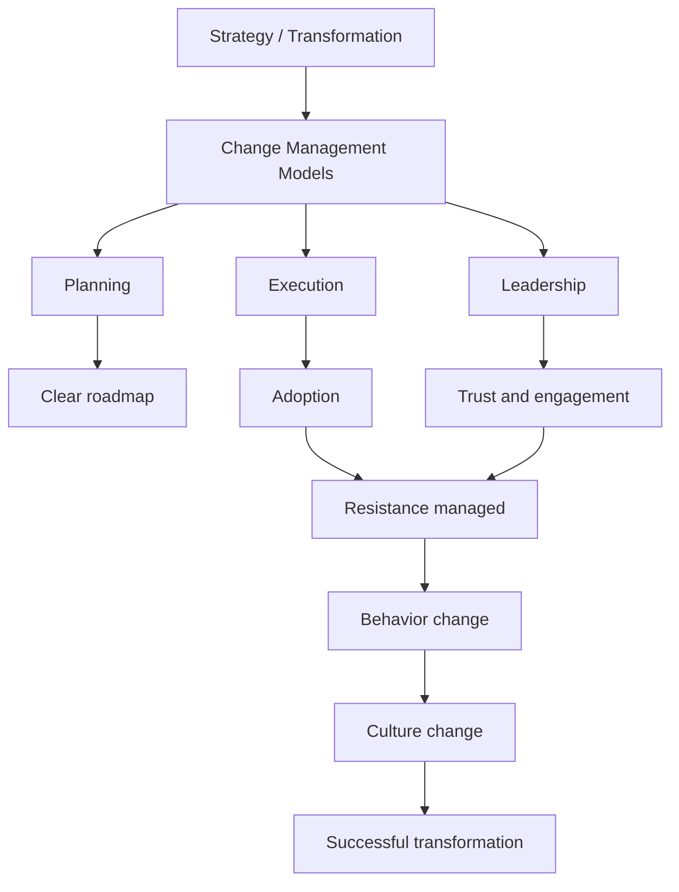

# Change Management — Final Synthesis (PMO Perspective)

## 1. Core idea in one sentence

**Change management in a PMO context is the discipline of aligning strategy, execution, and people to ensure that organizational changes are successfully adopted and sustained over time.**

---

## 2. Ultra-short memory anchors

* **Change = incremental**
* **Transformation = radical shift**
* **PMO = enabler of change**
* **Hybrid model = best balance**
* **Execution > theory**
* **Adoption = success**
* **People decide everything**

---

## 3. Smart synthesis

This final module ties everything together and highlights the **real role of change management in a PMO environment**:

> **Managing change is not just about frameworks—it is about aligning strategy, execution, and people to deliver sustainable outcomes.** 

### Key distinction

| Concept            | Meaning                                  |
| ------------------ | ---------------------------------------- |
| **Change**         | Incremental improvements (short-term)    |
| **Transformation** | Fundamental shift (long-term, strategic) |

👉 Questo è IMPORTANTISSIMO per i colloqui.

---

## 4. The PMO role in change

The PMO acts as:

* **governance layer**
* **alignment engine**
* **execution coordinator**
* **change facilitator**

### Core responsibilities

* Align projects with strategy
* Standardize processes
* Support transformation initiatives
* Ensure value delivery

### Memory sentence

**PMO = structure + alignment + execution + value**

---

## 5. Models recap (big picture)

| Category          | Models                             |
| ----------------- | ---------------------------------- |
| **Top-down**      | Lewin, Kotter, McKinsey 7-S, ADKAR |
| **Bottom-up**     | Kaizen, Lean Change, Participative |
| **Flexible**      | Bridges, Nudge                     |
| **Best approach** | **Hybrid**                         |

👉 Key insight:

**Hybrid = direction (top-down) + adoption (bottom-up)** 

---

## 6. Execution pillars (what really matters)

| Pillar                     | Why it matters   |
| -------------------------- | ---------------- |
| **Planning**               | Gives structure  |
| **Communication**          | Builds trust     |
| **Stakeholder management** | Drives alignment |
| **Resistance management**  | Enables adoption |

👉 This is where most transformations fail.

---

## 7. Planning logic (strategic backbone)

* Understand the change
* Define scope & objectives
* Identify drivers
* Create vision
* Conduct gap analysis
* Build roadmap (time/resources/ownership)
* Mitigate risks
* Communicate

👉 **Planning = bridge between strategy and execution**

---

## 8. Resistance & psychology

Key insight:

> **Resistance is not a problem—it is a natural reaction to uncertainty.** 

### Drivers of resistance

* fear
* uncertainty
* loss of control
* skill gaps

### Solution

* communication
* training
* involvement
* empathy

---

## 9. Leadership impact (critical)

Leaders must:

1. Set vision
2. Lead by example
3. Build trust
4. Show empathy
5. Address resistance

👉 **People follow leaders, not frameworks**

---

## 10. Resilience & flexibility (advanced concept)

### Resilience

* recover from setbacks
* maintain direction

### Flexibility

* adapt plans
* respond to change

👉 Together they enable **effective program leadership** 

---

## 11. Cause-effect master map

---

## 12. What this module is REALLY teaching

| Surface    | Deep meaning             |
| ---------- | ------------------------ |
| Models     | Provide structure        |
| Planning   | Creates direction        |
| Execution  | Enables adoption         |
| Resistance | Reveals human factors    |
| Leadership | Drives perception        |
| PMO        | Connects everything      |
| Hybrid     | Best real-world solution |

---

# 🚀 FINAL STEP — PERFECT INTERVIEW ANSWER (2 MIN)

Usala così. È **livello Senior PM / Program Manager**.

---

### 🎤 Answer

> “In my experience, successful change management is about aligning three key dimensions: strategy, execution, and people.
>
> From a strategic perspective, I typically rely on structured models like Lewin or Kotter to create a clear roadmap—from preparing the organization to embedding change into the culture.
>
> However, what really makes the difference is execution. That means strong planning, clear communication, proactive stakeholder engagement, and continuous management of resistance. I’ve seen that many transformations fail not because of poor strategy, but because adoption is not effectively managed.
>
> A key aspect I always focus on is resistance. I consider it a natural reaction rather than a problem. By addressing its root causes—like uncertainty or skill gaps—through communication, training, and involvement, it becomes much easier to drive adoption.
>
> Leadership also plays a critical role. Leaders need to set a clear vision, lead by example, and build trust. People don’t follow frameworks—they follow behaviors.
>
> That’s why I strongly believe in a hybrid approach: combining top-down strategic direction with bottom-up engagement. This ensures alignment while also leveraging the insights and ownership of the teams.
>
> Ultimately, the goal is not just to implement change, but to make it sustainable by embedding it into daily operations and organizational culture.”

---

## 💥 Versione ultra breve (30 sec)

> “I approach change management by combining structured models like Kotter or Lewin with strong execution practices—planning, communication, stakeholder alignment, and resistance management. I focus on adoption rather than just implementation, treating resistance as a natural signal to address. I also believe leadership behavior is critical, so I emphasize trust, transparency, and leading by example. In complex transformations, I typically use a hybrid approach to balance strategic alignment with employee engagement and ensure sustainable results.”

---

Se vuoi, al prossimo step possiamo fare la cosa più potente di tutte 👉
**simulazione colloquio reale (ti faccio domande + ti correggo come un hiring manager)** 🎯
