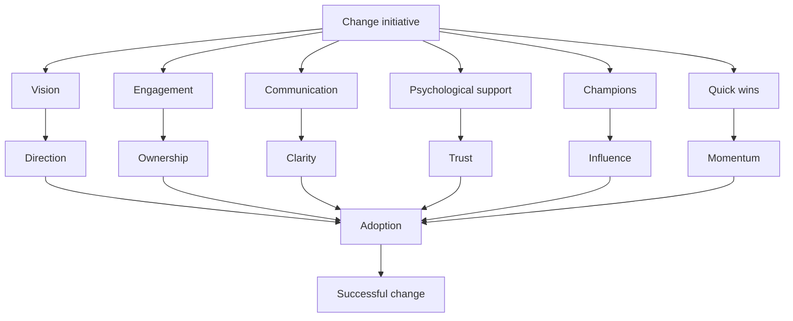

# Practical Tips for Effective Change Management

## 1. Core idea in one sentence

**Effective change management is about guiding people through transition with vision, communication, engagement, and emotional support to ensure real adoption.**

---

## 2. Ultra-short memory anchors

* **Vision gives direction**
* **Engagement builds ownership**
* **Communication reduces fear**
* **Psychology drives behavior**
* **Champions accelerate change**
* **Quick wins sustain momentum**
* **Support = adoption**

---

## 3. Smart synthesis

Questo contenuto è la versione **“real-world”** del change management.

> **Non basta sapere modelli → devi saper guidare le persone nel cambiamento.** 

Le leve chiave sono sempre le stesse, ma qui diventano **azioni concrete**:

1. Vision
2. Stakeholder engagement
3. Psychological awareness
4. Communication
5. Change champions
6. Short-term wins

👉 Questo è esattamente quello che un hiring manager vuole sentire.

---

## 4. The execution toolkit (practical layer)

| Lever             | What you do                         | Impact              |
| ----------------- | ----------------------------------- | ------------------- |
| **Vision**        | Define and communicate future state | Direction & purpose |
| **Engagement**    | Involve stakeholders early          | Ownership           |
| **Psychology**    | Address fears and emotions          | Trust               |
| **Communication** | Keep people informed constantly     | Alignment           |
| **Champions**     | Use influencers                     | Faster adoption     |
| **Quick wins**    | Show early results                  | Momentum            |

### Memory sentence

**Change succeeds when people understand it, believe in it, and feel supported.**

---

## 5. Tip 1 — Create a compelling vision

### Key idea

People need to understand:

* where we are going
* why it matters

👉 Vision reduces resistance because it gives **purpose** 

### Memory

**No vision = no direction**

### Interview phrase

> “A compelling vision helps align stakeholders and gives meaning to the transformation.”

---

## 6. Tip 2 — Engage stakeholders early

### Key idea

Don’t communicate change → **co-create it**

### Actions

* workshops
* meetings
* feedback sessions

👉 Builds trust and ownership 

### Memory

**Involvement reduces resistance**

### Interview phrase

> “Early stakeholder engagement is critical to build ownership and reduce resistance.”

---

## 7. Tip 3 — Understand the psychological impact

### Key idea

Change = emotional reaction

* anxiety
* uncertainty
* fear

👉 Leaders must respond with empathy and support 

### Memory

**Change is emotional before being operational**

### Interview phrase

> “Understanding the psychological impact of change helps leaders manage resistance more effectively.”

---

## 8. Tip 4 — Communicate clearly and consistently

### Key idea

Communication must be:

* frequent
* clear
* multi-channel

👉 Reduces fear and builds alignment 

### Tools

* emails
* meetings
* town halls

### Memory

**Silence creates resistance**

### Interview phrase

> “Consistent and transparent communication is essential to maintain alignment and reduce uncertainty.”

---

## 9. Tip 5 — Use change champions

### Key idea

People trust peers more than hierarchy

👉 Champions:

* influence others
* model behaviors
* support adoption 

### Memory

**Peers drive adoption faster than leaders**

### Interview phrase

> “Identifying and empowering change champions accelerates adoption and strengthens engagement.”

---

## 10. Tip 6 — Create short-term wins

### Key idea

People need to see progress

👉 Wins:

* build confidence
* maintain momentum
* reduce skepticism 

### Memory

**Visible progress builds belief**

### Interview phrase

> “Short-term wins are critical to maintain momentum and demonstrate the value of change.”

---

## 11. Cause-effect map



---

## 12. Simple schema to memorize

```text
Effective change
= Vision
+ Engagement
+ Communication
+ Psychological support
+ Champions
+ Quick wins
= Adoption
```

---

## 13. What this paragraph is REALLY teaching

| Surface       | Deep meaning          |
| ------------- | --------------------- |
| Vision        | People need purpose   |
| Engagement    | People need ownership |
| Communication | People need clarity   |
| Psychology    | People need support   |
| Champions     | People follow peers   |
| Wins          | People need proof     |

---

## 14. NLP-style phrases for interviews

* **create a compelling vision for change**
* **engage stakeholders early to build ownership**
* **address the emotional impact of transformation**
* **ensure continuous and transparent communication**
* **leverage change champions to influence adoption**
* **build momentum through short-term wins**
* **reduce resistance through clarity and support**
* **drive sustainable change through engagement**

---

## 15. How to map this to your experience

| Area              | Mapping                                |
| ----------------- | -------------------------------------- |
| **Vision**        | Aligning teams on transformation goals |
| **Engagement**    | Involving stakeholders early           |
| **Communication** | Keeping teams aligned                  |
| **Psychology**    | Managing resistance/emotions           |
| **Champions**     | Using key influencers                  |
| **Wins**          | Highlighting milestones                |

---

## 16. What to remember before a colloquium

```text
Create a vision
Engage people
Communicate clearly
Support emotionally
Use champions
Show results
→ Then change works
```

---

## 17. 30-second recap

Effective change management relies on practical actions such as creating a compelling vision, engaging stakeholders early, understanding the psychological impact of change, communicating clearly, leveraging change champions, and generating short-term wins. These elements help reduce resistance, build trust, and ensure successful and sustainable adoption of change. 

---

# 🔥 FINAL INSIGHT (IMPORTANTISSIMO)

Se devi ricordare UNA cosa da tutto il modulo:

> **Change management is not about implementing change — it’s about making people adopt it.**

---

👉 Se vuoi al prossimo step facciamo:

* simulazione colloquio reale (io HR + te candidata)
* oppure ti costruisco **risposte personalizzate sul tuo CV Sisal (DEVOPS/PM)** 🎯
