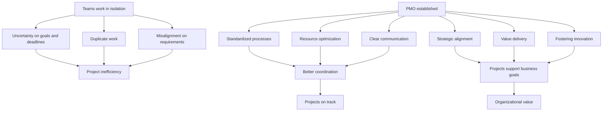
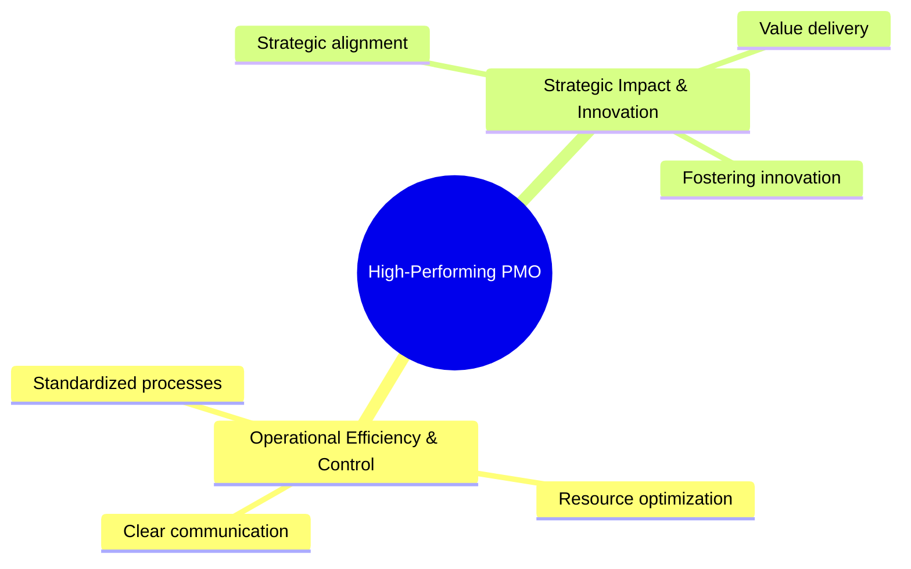
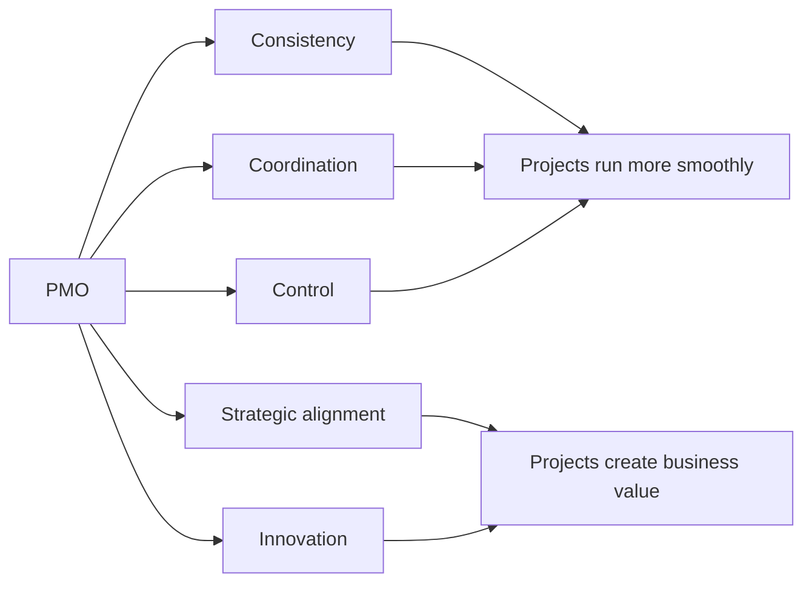

1. [§1 — What is PMO](#§1—what-is-pmo)

---

# §1 — What is PMO

## 1) Sintesi smart

Il **PMO (Project Management Office)** è una funzione centrale che definisce standard, metodi e coordinamento per la gestione dei progetti all’interno dell’organizzazione.

Il suo scopo è evitare che i team lavorino in modo isolato, ridurre confusione su obiettivi e scadenze, prevenire duplicazioni e mantenere tutti allineati ai requisiti progettuali e agli obiettivi aziendali.

Un **PMO ad alte prestazioni** opera su due grandi aree:

* **Operational Efficiency & Control**
  rende i progetti più ordinati, prevedibili ed efficienti tramite processi standard, uso ottimale delle risorse e comunicazione chiara.

* **Strategic Impact & Innovation**
  garantisce che i progetti supportino la strategia aziendale, producano valore concreto e favoriscano il miglioramento continuo e l’innovazione.

In sintesi, il PMO è il **backbone del project management**: porta coerenza, controllo, allineamento e valore.

---

## 2) Note esplicative molto brevi

### PMO

Struttura centrale che governa il modo in cui i progetti vengono gestiti.

### Standardized processes

Procedure e framework comuni che permettono ai team di lavorare con regole condivise.

### Resource optimization

Uso efficace di tempo, budget e competenze per ottenere il massimo risultato.

### Clear communication

Canali chiari e costanti per aggiornare team e stakeholder, riducendo incomprensioni.

### Strategic alignment

Ogni progetto deve contribuire agli obiettivi più ampi dell’organizzazione.

### Value delivery

Il progetto deve produrre benefici misurabili: risparmio, ricavi, efficienza o altri KPI.

### Fostering innovation

Il PMO non controlla soltanto: crea anche le condizioni per migliorare processi e soluzioni.

---

## 3) Mappa causa-effetto

### Problema senza PMO

* Team in isolamento
* Obiettivi e scadenze poco chiari
* Lavoro duplicato
* Requisiti non allineati
* Stakeholder poco coinvolti

### Effetti negativi

* Ritardi
* Spreco di risorse
* Confusione operativa
* Decisioni incoerenti
* Rischio di insuccesso del progetto

### Intervento del PMO

* Standardizza i processi
* Coordina i team
* Ottimizza le risorse
* Struttura la comunicazione
* Allinea i progetti alla strategia

### Risultati

* Più controllo
* Più efficienza
* Più coerenza
* Più valore per l’organizzazione
* Maggiore capacità di innovare

---

## 4) Diagrammi utili alla sintesi

### Diagramma 1 — Dal problema alla soluzione

---

### Diagramma 2 — Le 2 macro-categorie del PMO

---

### Diagramma 3 — Logica essenziale del PMO

---

## 5) Versione ultra-compatta da appunti

### What is PMO — condensed notes

The **PMO** is a centralized function that defines standards, coordination methods, and governance for projects.
Its purpose is to avoid siloed work, reduce uncertainty, prevent duplication, and keep teams aligned with project requirements and business goals.

A high-performing PMO works across two dimensions:

1. **Operational Efficiency & Control**

   * standardized processes
   * resource optimization
   * clear communication

2. **Strategic Impact & Innovation**

   * strategic alignment
   * value delivery
   * fostering innovation

Overall, the PMO ensures consistency, improves execution, supports decision-making, and helps projects deliver measurable organizational value.

---

## 6) Mini flash takeaway

**Idea chiave:**
Il PMO non serve solo a “controllare i progetti”, ma a **farli funzionare in modo coerente, efficiente e strategicamente utile**.

**Formula mentale rapida:**
**PMO = standard + coordination + alignment + value**

---

## 7) Quiz fissaggio rapido

**Domanda:**
Qual è una caratteristica del PMO nella categoria *Operational Efficiency & Control*?

**Risposta:**
**Standardized processes**

**Perché:**
Perché assicurano coerenza, aspettative chiare e maggiore efficienza tra team e progetti.

---

Se vuoi, nel prossimo messaggio posso trasformare questo stesso contenuto in un formato ancora più bello per repository, con queste sezioni fisse:

**Summary | Key Notes | Cause-Effect Map | Mermaid Diagrams | Flashcards | Exam-ready takeaway**

---

# §1 — What is PMO

## 1) Smart Summary

A **Project Management Office (PMO)** is a centralized function that defines standards, methods, and coordination practices for managing projects across an organization.

Its purpose is to prevent teams from working in isolation, reduce uncertainty around goals and deadlines, avoid duplicated effort, and keep everyone aligned with project requirements and broader business objectives.

A **high-performing PMO** operates across two major areas:

* **Operational Efficiency & Control**
  It improves project execution through standardized processes, better use of resources, and clear communication.

* **Strategic Impact & Innovation**
  It ensures that projects support business strategy, deliver measurable value, and encourage continuous improvement and innovation.

In short, the PMO acts as the **backbone of project management**, bringing consistency, control, alignment, and value.

---

## 2) Very Short Explanatory Notes

### PMO

A central structure that governs how projects are managed.

### Standardized processes

Shared procedures and frameworks that allow teams to work with common rules and expectations.

### Resource optimization

The effective use of time, budget, and talent to achieve the best possible results.

### Clear communication

Consistent communication channels that keep teams and stakeholders informed and aligned.

### Strategic alignment

Each project should support the organization’s broader goals.

### Value delivery

Projects should generate measurable benefits, such as cost savings, revenue, efficiency, or KPI improvement.

### Fostering innovation

The PMO does not only control projects; it also creates the conditions for improvement and new ideas.

---

## 3) Cause–Effect Map

### Without a PMO

* Teams work in isolation
* Goals and deadlines are unclear
* Work is duplicated
* Requirements become misaligned
* Stakeholders are not properly engaged

### Negative effects

* Delays
* Waste of resources
* Operational confusion
* Inconsistent decisions
* Higher risk of project failure

### PMO intervention

* Standardizes processes
* Coordinates teams
* Optimizes resources
* Structures communication
* Aligns projects with strategy

### Results

* More control
* Greater efficiency
* Better consistency
* Higher organizational value
* Stronger capacity for innovation

---

## 4) Useful Synthesis Diagrams

### Diagram 1 — From problem to solution

### Diagram 2 — The two macro-dimensions of a high-performing PMO

### Diagram 3 — Essential PMO logic

---

## 5) Ultra-Compact Notes Version

### What is PMO — Condensed Notes

A **PMO** is a centralized function that defines standards, coordination methods, and governance practices for projects.
Its main role is to avoid siloed work, reduce uncertainty, prevent duplication, and keep teams aligned with project requirements and business objectives.

A high-performing PMO works across two dimensions:

1. **Operational Efficiency & Control**

   * standardized processes
   * resource optimization
   * clear communication

2. **Strategic Impact & Innovation**

   * strategic alignment
   * value delivery
   * fostering innovation

Overall, the PMO creates consistency, improves execution, supports decision-making, and helps projects deliver measurable value to the organization.

---

## 6) Mini Takeaway

**Core idea:**
A PMO does not only “control projects.” It helps projects run in a **consistent, efficient, and strategically valuable** way.

**Mental formula:**
**PMO = standards + coordination + alignment + value**

---

## 7) Quick Knowledge Check

**Question:**
Which of the following is a characteristic of a high-performing PMO under **Operational Efficiency and Control**?

**Answer:**
**Standardized processes**

**Why:**
Because they create consistency, clarify expectations, and improve efficiency across teams and projects.

